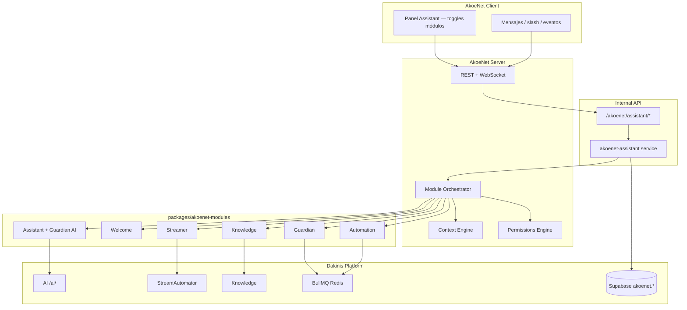

# AkoeNet Assistant — Arquitectura modular

> **Julio 2026** · Los bots no son apps externas: son módulos nativos de Dakinis AI Platform con contexto del servidor.  
> SQL → [`032`](./supabase/migrations/032_akoenet_assistant_modules.sql) · [`033`](./supabase/migrations/033_akoenet_assistant_expansion.sql)  
> Contrato → [`contracts/akoenet-assistant.json`](./contracts/akoenet-assistant.json)  
> Setup → [`PLATFORM-SETUP-STEPS.md`](./archive/PLATFORM-SETUP-STEPS.md)

**Mensaje:** *"Discord tiene bots. AkoeNet tiene un asistente."*

---

## Opinión estratégica

La propuesta es **correcta y es la única forma de competir sin copiar Discord**. No invitas diez bots (Dyno + MEE6 + Carl + StreamElements…). Activas módulos en un panel:

```
AkoeNet Assistant
├── 🛡 Moderation      (Guardian)
├── 🤖 AI Assistant    (Copilot + Knowledge)
├── 👋 Community       (Welcome, Reaction Roles, Niveles)
├── 📺 Stream          (StreamAutomator nativo)
├── 🎵 Music           (solo status — sin player DMCA)
├── 💼 Business        (CRM, tickets — Core)
├── 👨‍💻 Developer       (GitHub, Railway, Supabase)
├── 🎫 Tickets         (Support)
├── 📅 Events
├── ⚙️ Automation      (Cuando X → haz Y)
└── 🧠 Knowledge
```

**Ventajas insuperables vs Discord:**

| | Discord | AkoeNet |
|--|---------|---------|
| Arquitectura | Bot externo | Nativo + contexto servidor |
| IA | OpenAI caro por bot | Dakinis AI Platform |
| Streaming | StreamElements bot | StreamAutomator integrado |
| Empresas | Casi nada | Core + Billing + tickets |
| Moderación | Reglas estáticas | Reglas + **IA contextual** |

**Evitar:** música con reproducción (DMCA). **Priorizar Fase 1:** Guardian + Welcome + AI + Streamer + Knowledge.

---

## Arquitectura técnica



### Componentes implementados

| Componente | Ubicación | Responsabilidad |
|------------|-----------|-----------------|
| **Catálogo módulos** | `packages/akoenet-orchestrator/src/catalog.js` | 5 categorías + system bots |
| **Module Orchestrator** | `packages/akoenet-orchestrator/src/orchestrator.js` | Routing por `capability`, enrich context |
| **Context Engine** | `packages/akoenet-orchestrator/src/context.js` | Cache Redis + contexto IA |
| **Permissions Engine** | `packages/akoenet-orchestrator/src/permissions.js` | RBAC owner / super admin / roles |
| **Event Bus contract** | `packages/akoenet-orchestrator/src/events.js` | Tipos evento + dispatch |
| **Module handlers** | `packages/akoenet-modules/src/handlers.js` | Scaffolds Fase 1 (event-aware) |
| **Internal API** | `internal/src/services/akoenet-assistant.js` | DB + route command/event |
| **AkoeNet backend proxy** | `apps/akoenet/Server/src/services/assistant-modules.service.js` | Toggles `GET/PUT /servers/:id/assistant/modules` |
| **Event bridge** | `apps/akoenet/Server/src/services/assistant-events.service.js` | `message.created` / `member.joined` → Internal API; `@AI` → `ai.ask` |
| **Cliente UI** | `apps/akoenet/Client/src/components/ServerSettingsAssistantPanel.jsx` | Toggles + i18n EN/ES (`serverAssistant.modules.*`) |
| **Vendored (deploy)** | `internal/packages/akoenet-*` | Sync: `node scripts/sync-akoenet-packages.mjs` |

---

## Categorías de módulos

### 1. Moderación — Guardian (MVP 🔴)

Equivalente Carl-bot / Dyno / MEE6. **Imprescindible para lanzar.**

| Capability | Función |
|------------|---------|
| `moderation.automod` | Spam, flood, links, invites |
| `moderation.anti_raid` | Join threshold + captcha |
| `moderation.ban/kick/mute/warn` | Comandos slash |
| `moderation.logs` | Canales: usuarios, roles, mensajes, voz |

### 2. Comunidad (MVP + Growth)

| Módulo | Capability | Fase |
|--------|------------|------|
| Welcome | `community.welcome`, `community.captcha` | MVP |
| Reaction Roles | `community.reaction_roles` | Growth |
| Niveles | `community.xp`, `community.leaderboard` | Growth |
| Economy | `games.economy` | Future |
| Polls | `community.poll`, `community.giveaway` | Growth |

### 3. Entretenimiento (selectivo)

- **Polls/sorteos** → Growth (alto uso, bajo coste)
- **Juegos** → Future
- **Music** → Future, solo `music.spotify_status` (sin player)

### 4. Streamers — Streamer (MVP 🔴 ventaja clave)

Integración nativa **StreamAutomator**:

```
stream.started → POST /internal/akoenet/servers/:id/assistant/events
              → módulo streamer → anuncio canal + ping rol
```

Capabilities: `stream.notify`, `stream.schedule`, `stream.clip`, alertas Twitch/YouTube.

### 5. IA — Dakinis AI Platform (MVP 🔴 diferenciador)

| Módulo | Capability | Diferencia |
|--------|------------|------------|
| Assistant | `ai.ask`, `ai.summarize`, `ai.translate` | @AI copilot |
| Guardian AI | `ai.moderate` | Contexto, no solo palabras |
| Knowledge | `knowledge.search`, `knowledge.faq` | Docs del servidor |
| Translator | `ai.translate_auto` | Growth |
| Meeting AI | `ai.meeting_summary` | Future (voz) |
| Developer AI | `ai.code`, `ai.logs` | Growth |

**Killer feature:** moderación contextual — "este puto juego" = frustración, no insulto.

### 6–8. Business, Developer, Automation

| Categoría | Módulos | Integración |
|-----------|---------|-------------|
| Business | business, support | Core CRM, Billing |
| Developer | developer | GitHub, Railway, Supabase webhooks |
| Automation | automation | `akoenet.automations` — trigger → actions |

---

## API Internal (service-to-service)

Autenticación: `Authorization: Bearer <DAKINIS_INTERNAL_SERVICE_KEY>`

| Método | Ruta | Uso |
|--------|------|-----|
| GET | `/akoenet/assistant/modules` | Catálogo global |
| GET | `/akoenet/servers/:serverId/modules` | Módulos del servidor |
| PUT | `/akoenet/servers/:serverId/modules/:moduleKey` | `{ "enabled": true, "config": {} }` |
| POST | `/akoenet/servers/:serverId/assistant/command` | `{ "action": "ai.ask", "userId", "payload" }` |
| POST | `/akoenet/servers/:serverId/assistant/events` | `{ "type": "stream.started", "payload" }` |

### Ejemplo: StreamAutomator → AkoeNet

```http
POST https://api.dakinissystems.com/internal/akoenet/servers/42/assistant/events
Authorization: Bearer <INTERNAL_SERVICE_KEY>
Content-Type: application/json

{
  "type": "stream.started",
  "source": "streamautomator",
  "payload": {
    "platform": "twitch",
    "username": "christiandvillar",
    "title": "Building AkoeNet",
    "url": "https://twitch.tv/..."
  }
}
```

### Ejemplo: @AI en canal

```http
POST /internal/akoenet/servers/42/assistant/command
{
  "action": "ai.ask",
  "userId": "uuid",
  "channelId": "123",
  "payload": { "message": "¿Cómo configuro reaction roles?" }
}
```

Respuesta: sync vía `processAssistantAiAsk`, o async (`background.enqueue` → cola `dakinis.ai` → `worker:assistant`) cuando `DAKINIS_EVENT_BUS=bullmq`.

---

## Schema Supabase

| Tabla | Uso |
|-------|-----|
| `akoenet.assistant_modules` | Catálogo global |
| `akoenet.server_modules` | ON/OFF + config por servidor |
| `akoenet.automations` | Flujos Cuando → Entonces |
| `akoenet.automation_runs` | Ejecuciones |
| `akoenet.moderation_logs` | Auditoría moderación |
| `akoenet.assistant_usage` | Tokens IA / billing |
| `akoenet.assistant_events` | Log eventos (033) |

---

## Flujos detallados

### Slash `/ban`

1. AkoeNet valida permiso `server:moderate`
2. Internal API `routeAssistantCommand` → capability `moderation.ban`
3. Orchestrator → módulo `guardian`
4. Guardian ejecuta + `moderation_logs`
5. Evento `moderation.action` → canal logs

### AutoMod (mensaje)

1. AkoeNet publica `message.created` → `/assistant/events`
2. `resolveModulesForEvent` → `guardian`, `guardian_ai`
3. Guardian: reglas (spam, flood, links)
4. Guardian AI: cola `akoenet:moderation-ai` si enabled

### Member join

1. `member.joined` → `welcome` (mensaje + rol) + `guardian` (anti-raid)

---

## Plan de implementación

### Fase 1 — MVP (~16 días)

| 🔴 | Entregable |
|----|------------|
| Guardian | AutoMod + /ban /kick /mute /warn + logs |
| Welcome | Mensaje + canal + rol |
| Assistant | @AI + resúmenes |
| Guardian AI | Toxicidad contextual |
| Streamer | Webhook StreamAutomator |
| Knowledge | FAQ search |

### Fase 2 — Growth

Automation visual · Developer webhooks · Niveles/XP · Events/RSVP · Reaction roles UI · Traductor

### Fase 3 — Escala

Business (CRM/tickets) · Meeting AI · Games/economía

---

## Uso en código

```javascript
import { createDefaultOrchestrator } from "@dakinis/akoenet-orchestrator";
import { invokeModule } from "@dakinis/akoenet-modules";

const orchestrator = createDefaultOrchestrator();
orchestrator.setActiveModules(["guardian", "assistant", "streamer"]);

const result = await orchestrator.route(
  {
    action: "ai.ask",
    serverId: "42",
    userId: "uuid",
    payload: { message: "¿Cómo invito miembros?" },
  },
  invokeModule
);
```

---

## Próximos pasos (Fase 1 MVP)

| Estado | Entregable |
|--------|------------|
| ✅ | Panel UI servidor — toggles `server_modules` (cliente + proxy backend) |
| ✅ | i18n módulos EN/ES en cliente (`assistantModuleI18n.js`) |
| ✅ | Event bridge — `message.created` / `member.joined` → Internal API |
| ✅ | Trigger `@AI` en chat → `POST .../assistant/command` (`ai.ask`) |
| ✅ | Path sync `@AI` → canal (`processAssistantAiAsk` en Internal) |
| ✅ | Migr. `032`–`033` en Supabase prod (jul 2026) |
| ✅ | Código worker BullMQ cola `dakinis.ai` (`internal` `npm run worker:assistant` + `railway.worker.toml`) |
| ⬜ | **Deploy** servicio Railway Internal worker + `DAKINIS_EVENT_BUS=bullmq` + `REDIS_URL` |
| ⬜ | Worker `akoenet:moderation-ai` (Guardian AI) |
| ⬜ | Verificar `@AI` &lt;30s en prod (async o sync) |
| ⬜ | Webhook StreamAutomator → eventos `stream.*` |
| ⬜ | Slash commands → `assistant/command` |
| ⬜ | AutoMod con acción real (no solo scaffold `allowed: true`) |

---

*Actualizar al cerrar Fase 1 MVP en `akoenet-backend`.*
