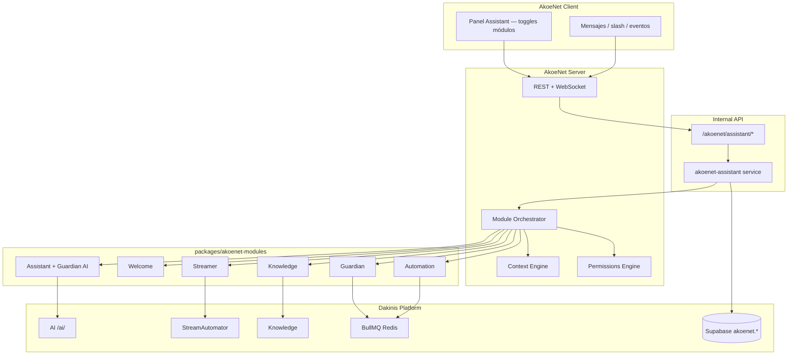

# AkoeNet Assistant — Arquitectura modular

> **Nota de producto** (Eng) · estado vivo → [`STATUS.md`](./STATUS.md) · mapa → [`SYSTEMS.md`](./SYSTEMS.md)  
> SQL → [`032`](./supabase/migrations/032_akoenet_assistant_modules.sql) · [`033`](./supabase/migrations/033_akoenet_assistant_expansion.sql)  
> Contrato → [`contracts/akoenet-assistant.json`](./contracts/akoenet-assistant.json)

**Mensaje:** *"Discord tiene bots. AkoeNet tiene un asistente."*

---

## Arquitectura técnica


```mermaid
flowchart TB
  subgraph client [AkoeNet Client]
    UI[Panel Assistant — toggles módulos]
    CHAT[Mensajes / slash / eventos]
  end

  subgraph akoenet_api [AkoeNet Server]
    API[REST + WebSocket]
    ORCH[Module Orchestrator]
    CTX[Context Engine]
    PERM[Permissions Engine]
  end

  subgraph internal [Internal API]
    ASST["/akoenet/assistant/*"]
    SVC[akoenet-assistant service]
  end

  subgraph modules [packages/akoenet-modules]
    G[Guardian]
    W[Welcome]
    AI[Assistant + Guardian AI]
    ST[Streamer]
    K[Knowledge]
    AU[Automation]
  end

  subgraph platform [Dakinis Platform]
    AIP[AI /ai/]
    SA[StreamAutomator]
    KB[Knowledge]
    BUS[BullMQ Redis]
    DB[(Supabase akoenet.*)]
  end

  UI --> API
  CHAT --> API
  API --> ASST
  ASST --> SVC
  SVC --> ORCH
  ORCH --> CTX
  ORCH --> PERM
  ORCH --> G
  ORCH --> W
  ORCH --> AI
  ORCH --> ST
  ORCH --> K
  ORCH --> AU
  AI --> AIP
  ST --> SA
  K --> KB
  G --> BUS
  AU --> BUS
  SVC --> DB
```

### Componentes implementados

| Componente | Ubicación | Responsabilidad |
|------------|-----------|-----------------|
| **Catálogo módulos** | `packages/akoenet-orchestrator/src/catalog.js` | Categorías + system bots |
| **Module Orchestrator** | `packages/akoenet-orchestrator/src/orchestrator.js` | Routing por `capability`, enrich context |
| **Context Engine** | `packages/akoenet-orchestrator/src/context.js` | Cache Redis + contexto IA |
| **Permissions Engine** | `packages/akoenet-orchestrator/src/permissions.js` | RBAC owner / super admin / roles |
| **Event Bus contract** | `packages/akoenet-orchestrator/src/events.js` | Tipos evento + dispatch |
| **Module handlers** | `packages/akoenet-modules/src/handlers.js` | Handlers event-aware |
| **Internal API** | `internal/src/services/akoenet-assistant.js` | DB + route command/event |
| **AkoeNet backend proxy** | `apps/akoenet/Server/src/services/assistant-modules.service.js` | Toggles `GET/PUT /servers/:id/assistant/modules` |
| **Event bridge** | `apps/akoenet/Server/src/services/assistant-events.service.js` | `message.created` / `member.joined` → Internal; `@AI` → `ai.ask` |
| **Cliente UI** | `apps/akoenet/Client/src/components/ServerSettingsAssistantPanel.jsx` | Toggles + i18n EN/ES |
| **Vendored (deploy)** | `internal/packages/akoenet-*` | Sync: `node scripts/sync-akoenet-packages.mjs` |

---

## Flujos vivos

### Slash `/ban`

1. AkoeNet valida permiso `server:moderate`
2. Internal API `routeAssistantCommand` → capability `moderation.ban`
3. Orchestrator → módulo `guardian`
4. Guardian ejecuta + `moderation_logs`

### AutoMod (mensaje)

1. AkoeNet publica `message.created` → `/assistant/events`
2. `resolveModulesForEvent` → `guardian`, `guardian_ai`
3. Guardian: reglas (spam, flood, links)
4. Guardian AI: cola `akoenet.moderation-ai` si enabled

### Member join

1. `member.joined` → `welcome` (mensaje + rol) + `guardian` (anti-raid)

### Streamer

`stream.started` → Internal events → módulo streamer → anuncio canal (cuando webhook SA esté cableado; ver [`STATUS.md`](./STATUS.md)).

---

## Uso en código

```javascript
import { createDefaultOrchestrator } from "@dakinis/akoenet-orchestrator";
import { invokeModule } from "@dakinis/akoenet-modules";

const orchestrator = createDefaultOrchestrator();
orchestrator.setActiveModules(["guardian", "assistant", "streamer"]);

const result = await orchestrator.route(
  {
    action: "ai.ask",
    serverId: "42",
    userId: "uuid",
    payload: { message: "¿Cómo invito miembros?" },
  },
  invokeModule
);
```

Pendientes de producto → [`STATUS.md`](./STATUS.md).
