# Análisis de código y mejoras — Dakinis Systems (julio 2026, feedback consolidado)

> **Tipo:** ADR de evolución arquitectónica (no backlog ciego)  
> **Fecha:** 16 jul 2026 · **Revisión:** v2 (segunda ronda de feedback)  
> **Entrada:** análisis arquitecto + código Fase 2 + revisión crítica del propio documento  
> **Estado real:** Hub SSO 3/3 · invite accept + automation runs **live** · `049` + seed score · billing E2E **2ª prioridad**  
> **Relacionado:** [`ARCHITECTURE.md`](./ARCHITECTURE.md) · [`STATUS.md`](./STATUS.md) · [`DAKINIS-SISTEMA-COMPLETO-TEMP.md`](./DAKINIS-SISTEMA-COMPLETO-TEMP.md)

**Valoración del documento como propuesta de evolución:** ~9.8/10. El salto ya no es “añadir funcionalidades”, sino **reducir acoplamiento**. Riesgo principal: que SDK y buses se conviertan en God Objects — cada módulo pequeño, una responsabilidad, componible.

---

## 1. Feedback vs realidad (con tracking)

| Dimensión | Feedback | Realidad 16 jul | Delta / siguiente paso | Esfuerzo | Owner |
|-----------|----------|-----------------|------------------------|----------|-------|
| Foundation SDK / buses | Modular, no monolito | Fase 2 live + Phase A | Paquetes `@dakinis/sdk-*` + reexport | 1–2 sem | Platform |
| Hub Mi día / timeline | live | `stub=false`, score 72 | Cache tags Redis + invalidación | ~3h | Internal |
| Invite accept | hardening | **live** + domain facade | SM + `FOR UPDATE` + Policy | ~3h | Internal |
| Automation runs | observabilidad | **049 + UI live** | Logs estructurados; **nodos diferidos** | ~4h | SA |
| Domain layer | faltante | **`@dakinis/domain` live** (`c35a014`) | Ampliar aggregates | ~1 sem | Platform |
| Billing E2E | alto negocio | 2ª prioridad explícita | Cuando haya cliente | ~4h | Billing |
| OTel | deseable | Sentry cubre hoy | **Fase C** (clientes + workers) | ~1 sem | Platform |
| Automation nodes | futuro | IF/THEN OK | Solo si aparecen loops/branches/multi-trigger | 2+ sem | SA |

**Conclusión:** el mayor apalancamiento es `@dakinis/domain` (agregados + VOs + políticas + eventos versionados), no más microservicios ni reescritura Sequelize.

---

## 2. Qué mantener, cambiar, eliminar y añadir

### 2.1 Mantener (decisiones maduras)

- Enfoque **incremental** — no rehacer auth → API → BD → frontend de golpe.
- No separar Internal en microservicios el mes 1.
- No bloquear piloto comercial.
- No reescribir Sequelize antes de facades de dominio.
- **Domain Layer** como pieza central.
- **PlatformContext** (`saveLayout(ctx)` en lugar de 6 parámetros sueltos).
- **DomainEvent** enriquecido (`aggregateId`, `traceId`, `workspaceId`, …).

### 2.2 Cambiar respecto a v1 del documento

| Antes (v1) | Ahora (v2) |
|------------|------------|
| Un SDK gigante con 15 módulos inline | **SDK modular** (`@dakinis/sdk-auth`, `sdk-workspace`, …) + `@dakinis/sdk` reexporta |
| QueryBus con cache/invalidate/prefetch/stream | QueryBus solo `execute()`; capacidades vía **decoradores** (`CachedQuery`, `StreamQuery`, …) |
| CommandBus con pipeline fijo en el bus | **Middleware chain** (`Validation → Permissions → Audit → Handler`) |
| Event Consumer como superficie separada | **Módulo** dentro de Internal API (mismo proceso) |
| BackgroundTask capa gruesa | API mínima: `enqueue()` / `schedule()` / `cancel()` sobre BullMQ |
| OTel en Fase 2 | **Fase C** — Sentry basta de momento |
| Automation nodes en roadmap cercano | **Diferido** hasta que IF/THEN no alcance |

### 2.3 Eliminar / no hacer aún

- **Event Consumer** como servicio o capa desplegable aparte.
- **OpenTelemetry** end-to-end antes de clientes reales y varios equipos.
- **Automation node engine** mientras no haya loops, branches o múltiples triggers en producción.
- Canvas n8n visual antes de logs estructurados + SM de runs.

### 2.4 Añadir (huecos detectados en v2)

| Pieza | Propósito |
|-------|-----------|
| **Policy Engine** | Más que permisos: `canDeleteWorkspace()`, `canPublishStream()`, reglas de negocio |
| **Versionado de dominio** | Eventos y agregados con `v1` / `v2` explícitos |
| **Value Objects** | `WorkspaceId`, `Email`, `Money`, `StreamId` — menos bugs de primitivos |
| **DTO Generator** | Una fuente → tipos frontend, SDK, OpenAPI, Zod, mappers |
| **Tests de dominio** | Mayor cobertura en `@dakinis/domain` (lógica pura) |
| **`platform.metrics()`** | Llamadas SDK, errores, latencia, retries, cache hits |

---

## 3. Mapa de destino (v2)

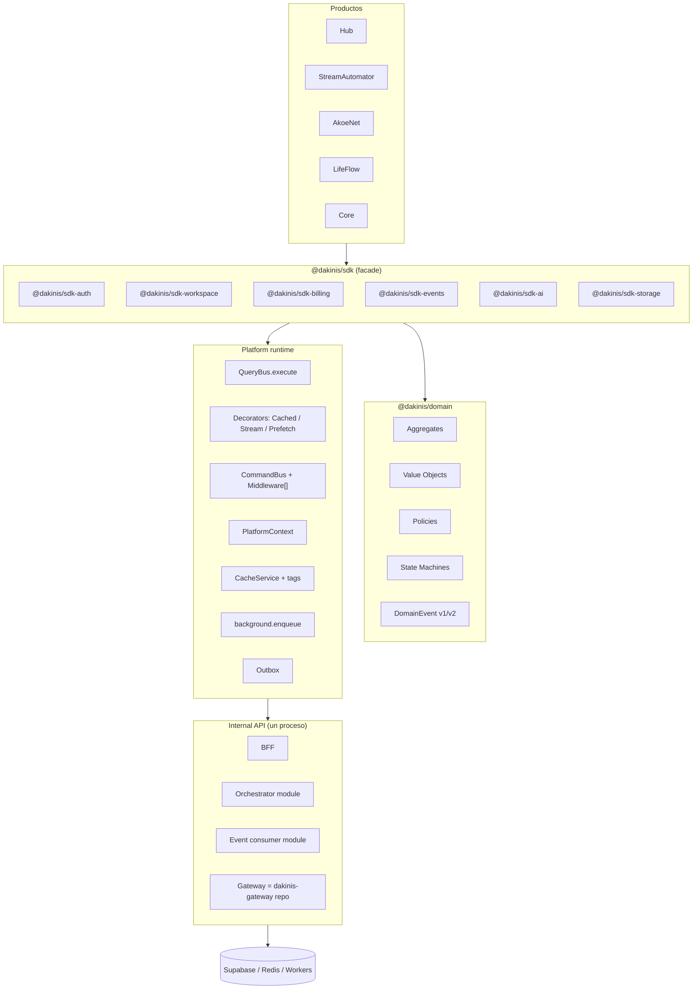

---

## 4. Cambios por capa (detalle)

### 4.1 SDK modular — evitar God Object

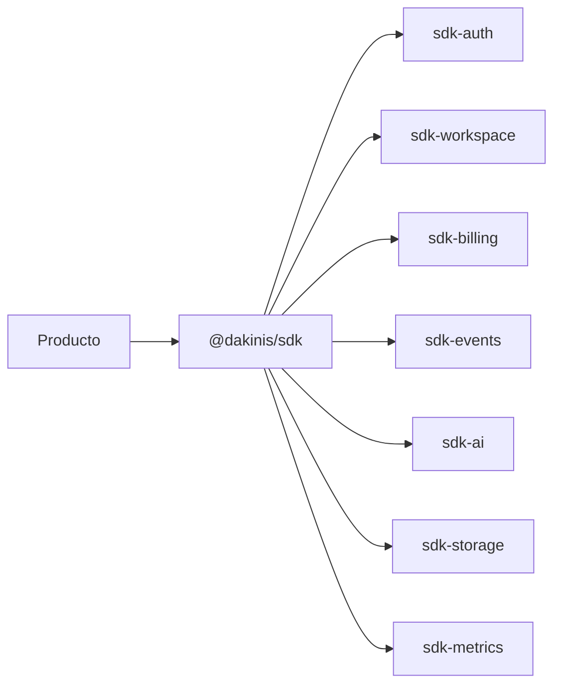

- Cada paquete evoluciona y versiona solo.
- `createDakinisPlatform(config)` construye `PlatformContext` y expone módulos con **lazy getters**.
- Ningún producto llama REST directo al Gateway/Internal.
- **Events:** `on` / `once` / `off` / `emit` (+ query histórica); transporte WS/Redis detrás del módulo.
- **Métricas:** `platform.metrics()` — calls, errors, latency, retries, cache hits.

```typescript
// Patrón facade (resumen)
export function createDakinisPlatform(config: PlatformConfig) {
  const ctx = buildPlatformContext(config);
  return {
    get auth() { return getAuthModule(ctx); },
    get workspace() { return getWorkspaceModule(ctx); },
    get events() { return getEventsModule(ctx); },
    get metrics() { return getMetricsModule(ctx); },
    query: queryBus,
    command: commandBus,
  } as const;
}
```

---

### 4.2 `@dakinis/domain` — estructura y primer agregado

```text
packages/domain/
├── aggregates/       # Workspace, WorkspaceInvite, AutomationRule, DirectorSession, …
├── value-objects/    # Email, WorkspaceId, Money, InviteRole, …
├── domain-events/    # versionados: invite.accepted.v1
├── commands/
├── queries/
├── policies/           # canInviteMember, canPublishStream, …
├── state-machines/
├── exceptions/
└── index.ts            # barrel público; package.json "exports" estrictos
```

**Agregado piloto recomendado:** `WorkspaceInvite` (ya hay accept live en infra — extraer lógica a dominio).

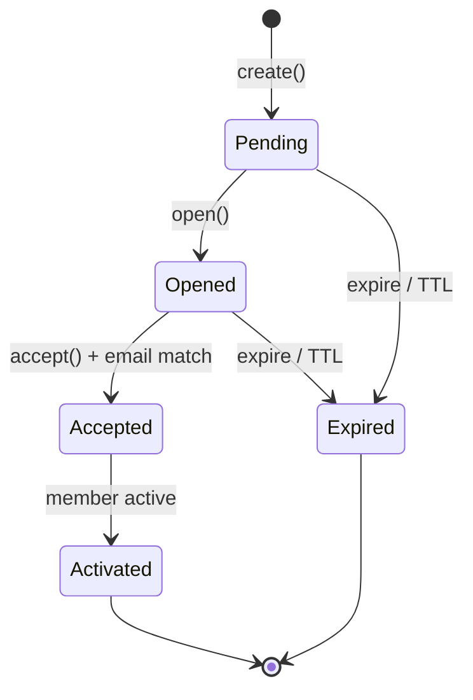

Comportamiento en agregado (no en `if` del controller):

- `WorkspaceInvite.create()` → `InviteCreated.v1`
- `open()` → `InviteOpened.v1`
- `accept(userId, email)` → valida SM + `InviteAccepted.v1`
- Repositorio en infra (`PostgresWorkspaceInviteRepository`) + outbox para eventos.

**Facades thin:** solo orquestan `repo.find → aggregate.method → repo.save → eventBus.publish`.

---

### 4.3 Policy Engine (además de permissions)

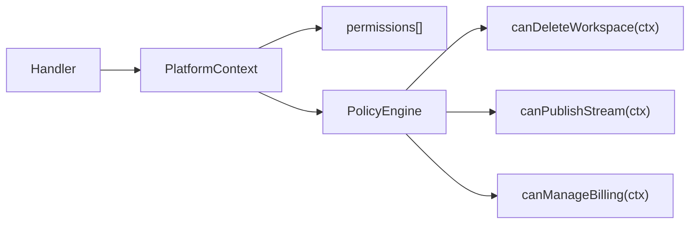

Permisos = capacidad coarse (`workspace:invite`). Políticas = reglas de negocio compuestas (plan, rol, estado del agregado).

---

### 4.4 DomainEvent — contrato versionado

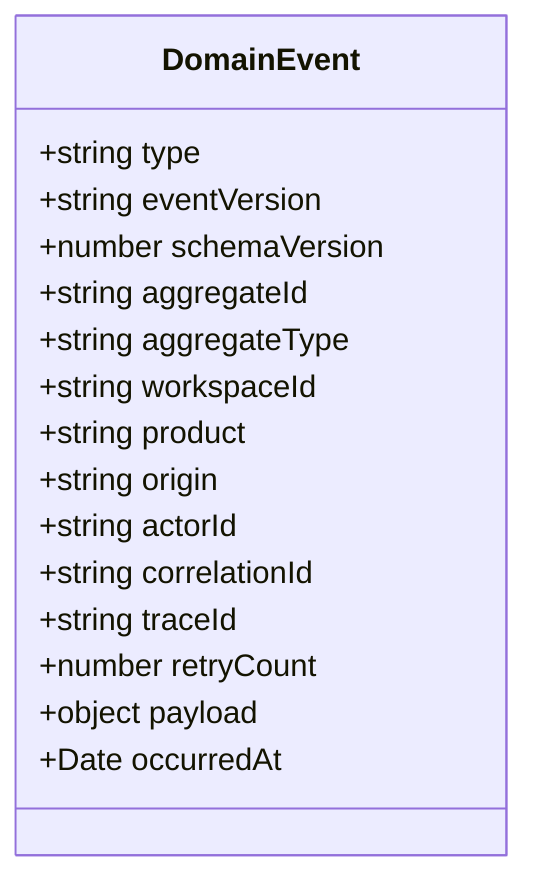

Serialización robusta; preparado para event sourcing ligero opcional más adelante.

---

### 4.5 QueryBus y CommandBus — composición, no God Bus

**QueryBus** — una responsabilidad:

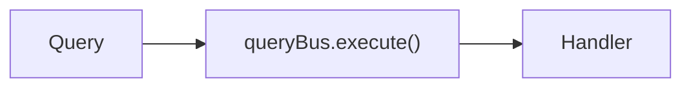

Decoradores / wrappers (no métodos en el bus):

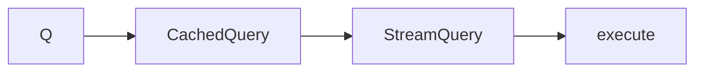

**CommandBus** — pipeline de middlewares:

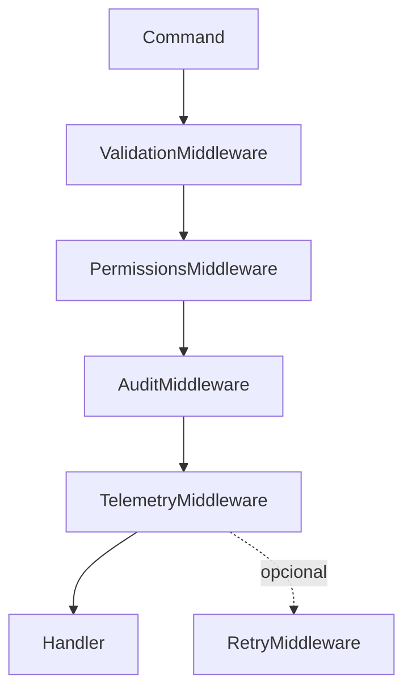

Command state para ops largas (`pending → processing → completed|failed`) + `waitForCompletion` vía Redis/BullMQ — como **middleware o handler wrapper**, no lógica embebida en el bus.

---

### 4.6 PlatformContext (ampliado)

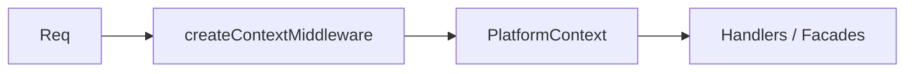

| Campo | Uso |
|-------|-----|
| `workspace`, `user` | Identidad |
| `permissions`, `can()` | Autorización coarse |
| `policies` | Reglas de negocio |
| `locale`, `timezone` | i18n / fechas |
| `product` | Hub, SA, Core, … |
| `featureFlags` | Flags resueltos para el request |
| `requestId`, `traceId` | Correlación |
| `requestStart`, `clientVersion`, `device` | SLA, compat, analytics |
| `cache`, `logger`, `telemetry` | Servicios inyectados |

Uso objetivo: `saveLayout(ctx)` en lugar de firmas con 6+ parámetros primitivos.

---

### 4.7 Internal API — módulos, no microservicios

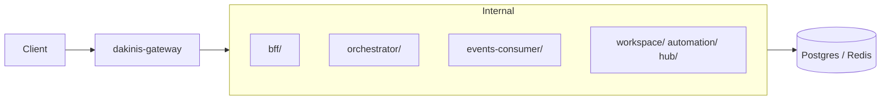

Gateway sigue en repo `dakinis-systems/gateway`. Event consumer = carpeta/módulo, **no** despliegue separado en Fase A–B.

---

### 4.8 Cache con tags

Sin cambio de idea; alta prioridad táctica.

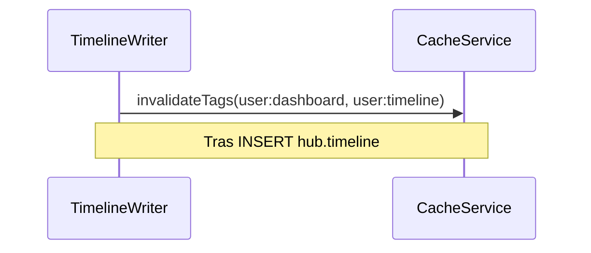

---

### 4.9 Background jobs — API mínima

```typescript
// No nueva capa enorme — wrapper sobre BullMQ existente
background.enqueue(name, payload, opts?);
background.schedule(name, payload, runAt, opts?);
background.cancel(jobId);
```

Productos no importan BullMQ directamente.

---

### 4.10 Automation — IF/THEN ahora; nodos después

**Hoy (mantener):** reglas planas + `AutomationRuns` + logs estructurados + timeline.

**Disparador para nodos:** loops, branches, múltiples triggers, o builder visual que lo exija.

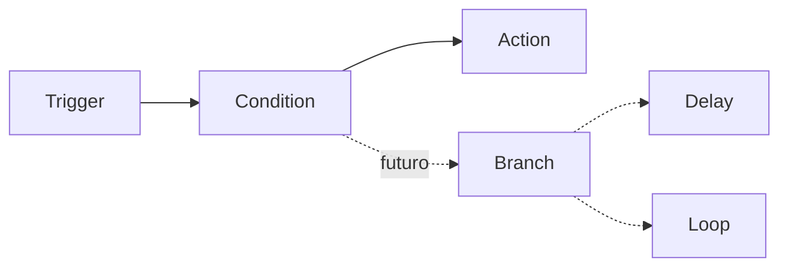

---

### 4.11 DTO Generator y contratos

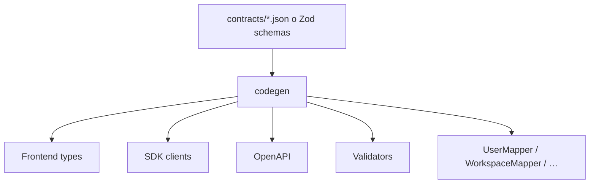

Evita `res.json(model)` sin mapping explícito en cada endpoint.

---

### 4.12 Observabilidad — fases

| Fase | Qué | Cuándo |
|------|-----|--------|
| Ahora | Sentry + `telemetry.track()` + logs estructurados | Ya |
| B | `platform.metrics()` en SDK | Con SDK modular |
| C | OpenTelemetry (`span`, `trace` compartido Hub→Worker) | Clientes + varios workers/equipos |

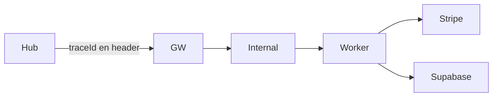

---

## 5. Mejoras tácticas (tabla priorizada)

| # | Iniciativa | Impacto | Esfuerzo | Depende de | Owner | Estado base |
|---|------------|---------|----------|------------|-------|-------------|
| 1 | QueryMap tipado (inferencia) | Alto | 2h | — | Platform | Parcial |
| 2 | Cache tags + invalidación timeline | Alto | 3h | — | Internal | Manual |
| 3 | Invite SM + `FOR UPDATE` + policies | Alto | 3h | domain scaffold | Internal | Accept live |
| 4 | Rate limit granular (public/bff/admin/events) | Medio | 2h | — | Gateway | Global |
| 5 | **Scaffold `@dakinis/domain`** | Crítico | 5d | — | Platform | **Done** (`c35a014`) |
| 6 | PlatformContext middleware | Alto | 4h | — | Platform | **Done** Phase A |
| 7 | SDK modular + `events.subscribe` | Alto | 1w | domain events | Platform | **In progress** (`sdk-*`) |
| 8 | CommandBus middleware pipeline | Alto | 3d | — | Internal | **Done** Phase A |
| 9 | DTO Generator (primera pasada) | Medio | 3d | contratos | Platform | **v1** (`scripts/generate-dto.mjs`) |
| 10 | Smokes modulares (Jest + helpers) | Medio | 4h | — | DX | PS1 |
| 11 | Automation logs estructurados + UI stream | Medio | 4h | — | SA | Runs live |
| 12 | SDK metrics | Medio | 2d | SDK modular | Platform | **Done** (`@dakinis/sdk-metrics`) |
| 13 | Automation node engine | Alto | 2w | domain | SA | **Diferido** |
| 14 | OTel end-to-end | Medio | 1w | escala | Platform | **Fase C** |
| 15 | Billing E2E | Alto negocio | 4h | cliente | Billing | 2ª prioridad |

---

## 6. Roadmap por fases (orden acordado v2)


### Prioridad de negocio (sin cambios)

1. **Piloto** — invite real end-to-end + demo Hub→Core  
2. **Fase A** — domain + context + facades (no bloquea piloto)  
3. **Fase B** — SDK modular + buses limpios + cache tags  
4. **Fase C** — SM completas, nodos automation, OTel  
5. **Billing E2E** — cuando negocio reactive (2ª prioridad)

---

## 7. Organización por dominio (no por capa técnica)

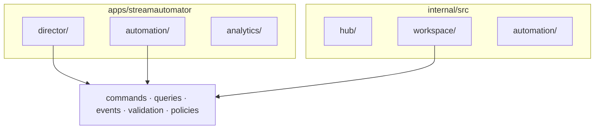

Eje: **agregado**, no `controllers / services / routes` como carpeta raíz.

---

## 8. Criterios de aceptación

| Iniciativa | Done when |
|------------|-----------|
| `@dakinis/domain` | Invite + AutomationRule con tests >80% en domain; APIs solo adaptan |
| Value Objects | No `string` suelto para `Email` / `WorkspaceId` en dominio nuevo |
| Policy Engine | `canAcceptInvite(ctx)` vive en domain, no en controller |
| SDK modular | Producto importa `@dakinis/sdk`; ningún `fetch` directo a Internal |
| QueryBus | Solo `execute`; cache vía `CachedQuery` decorator |
| CommandBus | Nuevo middleware añadible sin editar el bus |
| Cache tags | Write timeline → dashboard no stale > TTL configurado |
| Invite SM | Estados en admin; expired no aceptable |
| Automation nodes | Solo cuando exista regla con branch en prod |
| OTel | Trace compartido Hub→worker (Fase C) |

---

## 9. Anti-objetivos

- No God Object SDK ni God Bus (módulos y middlewares pequeños).
- No reescribir Sequelize completo antes de facades.
- No microservicios Internal el mes 1.
- No Event Consumer como servicio separado (aún).
- No canvas n8n antes de logs + SM.
- No OTel antes de escala real (Sentry suficiente hoy).
- No automation nodes mientras IF/THEN crezca bien.
- No billing E2E como P0 sin cliente.
- No bloquear piloto por Module Federation u OTel.

---

## 10. Resumen ejecutivo

**Ya live (jul 2026):** invite accept · automation runs + UI · SSO 3/3 · Hub Mi día real · timeline writer · `049` + score 72.

**Segunda ronda de feedback refina v1:** menos ambición en buses/SDK monolítico; más énfasis en **domain**, **policies**, **VOs**, **composición** y **incrementalismo**.

**Orden de impacto:**

1. **Fase A** — `@dakinis/domain` + PlatformContext + facades + policies  
2. **Fase B** — SDK modular + Query/CommandBus limpios + cache tags + DTO gen  
3. **Fase C** — state machines maduras, automation nodes si hace falta, OTel  

El punto de inflexión entre “app grande” y “plataforma mantenible” es que la lógica viva en dominio compartido, no repartida en services que cada producto reinterpreta.

---

## Anexo A — Patrones de código (referencia breve)

### A.1 CacheService con tags (Redis)

```typescript
async set(key, value, ttlSeconds, tags = []) {
  await redis.setex(key, ttlSeconds, JSON.stringify(value));
  for (const tag of tags) await redis.sAdd(`cache:tag:${tag}`, key);
}
async invalidateTag(tag) {
  const keys = await redis.sMembers(`cache:tag:${tag}`);
  if (keys.length) await redis.del(...keys);
  await redis.del(`cache:tag:${tag}`);
}
```

### A.2 State machine ligera (invite)

```typescript
// packages/domain/src/shared/state-machine.ts — sin XState hasta Fase C si hace falta
transition(event): boolean  // false = transición inválida
can(event): boolean
```

### A.3 Events module (SDK)

```typescript
platform.events.on('invite.accepted.v1', handler);
platform.events.once('director.started.v1', handler);
platform.events.emit(domainEvent);
```

### A.4 Tests de dominio (prioridad máxima)

```typescript
// packages/domain/src/invite/__tests__/workspace-invite.spec.ts
it('rejects accept when email mismatch', () => { … });
it('expires pending invite after TTL', () => { … });
```

---

*Actualizar al cerrar filas de §5 o al completar hitos del Gantt. Próxima revisión: tras SDK modular en productos o primer piloto con invite real.*
