# Análisis de código y mejoras — Dakinis Systems (julio 2026, feedback consolidado)

> **Tipo:** ADR de evolución arquitectónica (no backlog ciego)  
> **Fecha:** 16 jul 2026 · **Revisión:** v2.2 (feedback post-implementación: plataforma → foco producto)  
> **Entrada:** análisis arquitecto + código Fase 2 + revisión crítica + **segunda valoración externa** (scores + 20/80 producto)  
> **Estado real:** Fase A ✅ · Fase B ✅ · Fase C parcial · QueryMap + rate-limit ✅ · **piloto comercial = P0** · billing E2E 2ª prioridad · nodos/OTel diferidos · **17 jul:** Hub `hub.dashboard` vía platform client · worker Internal `dakinis.ai` + `background.enqueue` en `ai.ask` · SA `getPlatform()` (copilot)  
> **Relacionado:** [`ARCHITECTURE.md`](./ARCHITECTURE.md) · [`STATUS.md`](./STATUS.md) · [`OPERATIONS.md`](./OPERATIONS.md)

**Valoración externa del sistema (16 jul):** Arquitectura 9.7 · Escalabilidad 9.5 · Separación 9.5 · Madurez producto 8.5 · Comercializar 8.5 · Docs 10 · **global ~8.9**. Lectura clave: *ya no es un conjunto de proyectos personales — es una plataforma*. Riesgo principal ahora: **exceso de infraestructura** y falta de validación con clientes, no deuda técnica crítica.

---

## 1. Feedback vs realidad (con tracking)

| Dimensión | Feedback | Realidad 16 jul | Delta / siguiente paso | Esfuerzo | Owner |
|-----------|----------|-----------------|------------------------|----------|-------|
| Foundation SDK / buses | Modular, no monolito | **`@dakinis/sdk-*` + QueryMap + middleware** | Adopción gradual en productos (menos `fetch` directo) | 1–2 sem | Platform |
| Hub Mi día / timeline | live | `stub=false` + **cache tags** + outbox→timeline | Piloto invite real en demo | — | Internal |
| Invite accept | hardening | **SM + FOR UPDATE + policies + create outbox** | Demo comercial end-to-end | ~1h ops | Internal |
| Automation runs | observabilidad | **049 + UI + AutomationRun SM** | Logs stream UI; **nodos diferidos** | ~4h | SA |
| Domain layer | faltante | **`@dakinis/domain` live** (invite/director/run/rule) | Más facades SA/Core | continuo | Platform |
| QueryMap / rate limit | quick wins | **Done** | Redeploy Gateway edge | ops | Gateway |
| CommandBus invites | HTTP → bus | **Done** (`workspace.invite.create|accept`) | Ampliar otros commands | — | Internal |
| BackgroundTask | enqueue API | **Done** (`shared-platform/background`) | Migrar jobs BullMQ sueltos | continuo | Platform |
| Billing dry-run | staging weekly | **Done** (`smoke-billing-dry-run.ps1`) | Dry-run semanal | ops | Billing |
| SDK migration guide | cutover | **Done** (`packages/sdk/migration-guide.md`) | Hub/SA cutover | 1–2 sem | Platform |
| Billing E2E | alto negocio | 2ª prioridad | Dry-run OK; E2E cuando haya cliente | ~4h | Billing |
| OTel | deseable | Sentry cubre hoy | **Diferido** hasta escala | ~1 sem | Platform |
| Automation nodes | futuro | IF/THEN + Run SM OK | Solo si loops/branches/multi-trigger | 2+ sem | SA |

**Conclusión:** Fases A/B y quick wins **cerrados en código**. El apalancamiento restante es **producto + piloto + adopción SDK**, no más scaffolding de runtime. Cambio de foco acordado: **~20% arquitectura / ~80% producto**.

---

## 1.1 Feedback v2.2 — valoración post-plataforma (16 jul)

### Scores

| Dimensión | Score | Nota |
|-----------|-------|------|
| Arquitectura | 9.7 | Identidad Platform → SDK → Products |
| Escalabilidad | 9.5 | Eventos + outbox + tiers rate-limit |
| Separación de responsabilidades | 9.5 | Domain / Internal BFF / productos |
| Madurez del producto | 8.5 | Falta validación con usuarios de pago |
| Preparación comercial | 8.5 | Demo 5 min posible; billing E2E pendiente |
| Documentación | 10 | TEMP + este ADR como fuente de verdad |
| Global (otras lecturas) | 8.4–8.9 | Subida vs ~7.2 anteriores |

### Sobresaliente (mantener)

1. **Arquitectura con identidad** — Auth/Billing/AI/… → SDK → productos (no apps sueltas).  
2. **`@dakinis/domain`** — aggregates, VOs, policies, eventos, SM.  
3. **Internal API** — BFF + orchestrator + cache + QueryMap + commands + consumer.  
4. **SDK modular** — `sdk-auth|workspace|billing|events|metrics`.  
5. **Workspace OS** — diferenciador (addons / escritorio; no Discord/Slack clone).  
6. **Cadena de eventos** — Outbox → BullMQ → DomainEvents → Timeline → Widgets.

### Mejorar (sin volver a “infra forever”)

| Tema | Acción |
|------|--------|
| Demasiados conceptos / `shared-*` | Congelar nuevos packages; fusionar UI/brand/ux a medio plazo |
| Plumbing > negocio | Capar trabajo de buses/facades; priorizar demos |
| Adopción SDK / CommandBus | Cutover gradual Hub/SA → Core/LifeFlow; nuevos endpoints solo SDK |
| DTO Generator solo v1 | v2 como entrada de endpoints nuevos (~2d) |
| Tests de dominio | Ya hay `packages/domain/test/*`; ampliar cobertura y visibilidad en CI |
| BackgroundTask | Migrar BullMQ directo restante a `background.enqueue()` |
| Billing | Dry-run semanal staging; E2E completo en 2ª prioridad |
| Gateway | Redeploy edge **antes del piloto** |

### Onboarding estimado (señal positiva)

| Tiempo | Nivel |
|--------|-------|
| 1 semana | Estructura general |
| 2–3 semanas | Productivo en un área |
| 1–2 meses | Dominio de la plataforma |

### Comparativa junio → julio 2026

| Dimensión | Junio | Julio | Δ |
|-----------|-------|-------|---|
| Arquitectura | 4 capas + packages | Domain + SDK modular | ⬆️⬆️ |
| Hub | Launcher | Mi día + timeline + invites | ⬆️⬆️ |
| Invites | Pendiente | Domain + UI + outbox live | ⬆️⬆️ |
| Automation | IF/THEN | Runs + UI + SM | ⬆️ |
| Billing | Checkout | Unificado SA; E2E 2ª prio | ⬆️ |
| DX | Repos sueltos | QueryMap + SDK + DTO | ⬆️⬆️ |
| Estado | Prometedor | **Listo para piloto** | ⬆️⬆️ |

---

## 2. Qué mantener, cambiar, eliminar y añadir

### 2.1 Mantener (decisiones maduras)

- Enfoque **incremental** — no rehacer auth → API → BD → frontend de golpe.
- No separar Internal en microservicios el mes 1.
- No bloquear piloto comercial.
- No reescribir Sequelize antes de facades de dominio.
- **Domain Layer** como pieza central.
- **PlatformContext** (`saveLayout(ctx)` en lugar de 6 parámetros sueltos).
- **DomainEvent** enriquecido (`aggregateId`, `traceId`, `workspaceId`, …).

### 2.2 Cambiar respecto a v1 del documento

| Antes (v1) | Ahora (v2) |
|------------|------------|
| Un SDK gigante con 15 módulos inline | **SDK modular** (`@dakinis/sdk-auth`, `sdk-workspace`, …) + `@dakinis/sdk` reexporta |
| QueryBus con cache/invalidate/prefetch/stream | QueryBus solo `execute()`; capacidades vía **decoradores** (`CachedQuery`, `StreamQuery`, …) |
| CommandBus con pipeline fijo en el bus | **Middleware chain** (`Validation → Permissions → Audit → Handler`) |
| Event Consumer como superficie separada | **Módulo** dentro de Internal API (mismo proceso) |
| BackgroundTask capa gruesa | API mínima: `enqueue()` / `schedule()` / `cancel()` sobre BullMQ |
| OTel en Fase 2 | **Fase C** — Sentry basta de momento |
| Automation nodes en roadmap cercano | **Diferido** hasta que IF/THEN no alcance |

### 2.3 Eliminar / no hacer aún

- **Event Consumer** como servicio o capa desplegable aparte.
- **OpenTelemetry** end-to-end antes de clientes reales y varios equipos.
- **Automation node engine** mientras no haya loops, branches o múltiples triggers en producción.
- Canvas n8n visual antes de logs estructurados + SM de runs.

### 2.4 Añadir (huecos detectados en v2) — estado

| Pieza | Propósito | Estado 16 jul |
|-------|-----------|---------------|
| **Policy Engine** | `canAcceptInvite`, reglas de negocio | ✅ invite; ampliar otros agregados |
| **Versionado de dominio** | Eventos `v1` / `v2` | ✅ `invite.*.v1` + outbox map |
| **Value Objects** | `WorkspaceId`, `Email`, … | ✅ en `@dakinis/domain` |
| **DTO Generator** | Una fuente → tipos/SDK/OpenAPI | **v1** (`scripts/generate-dto.mjs`) |
| **Tests de dominio** | Cobertura lógica pura | ✅ ampliado + CI (`packages/domain/test`) |
| **`platform.metrics()`** | Latencia, errores, cache | ✅ `@dakinis/sdk-metrics` |
| **QueryMap tipado** | Inferencia params/response | ✅ `query-map.js` + `.d.ts` |
| **Rate limit granular** | public/bff/admin/events | ✅ código; **redeploy GW pendiente** |
| **`background.enqueue`** | Jobs sin BullMQ en productos | ✅ `@dakinis/shared-platform/background` |
| **CommandBus invites** | HTTP vía bus | ✅ create + accept |
| **SDK migration guide** | Cutover fetch→SDK | ✅ `packages/sdk/migration-guide.md` |
| **Billing dry-run** | Staging sin checkout | ✅ `scripts/smoke-billing-dry-run.ps1` |

---

## 3. Mapa de destino (v2)

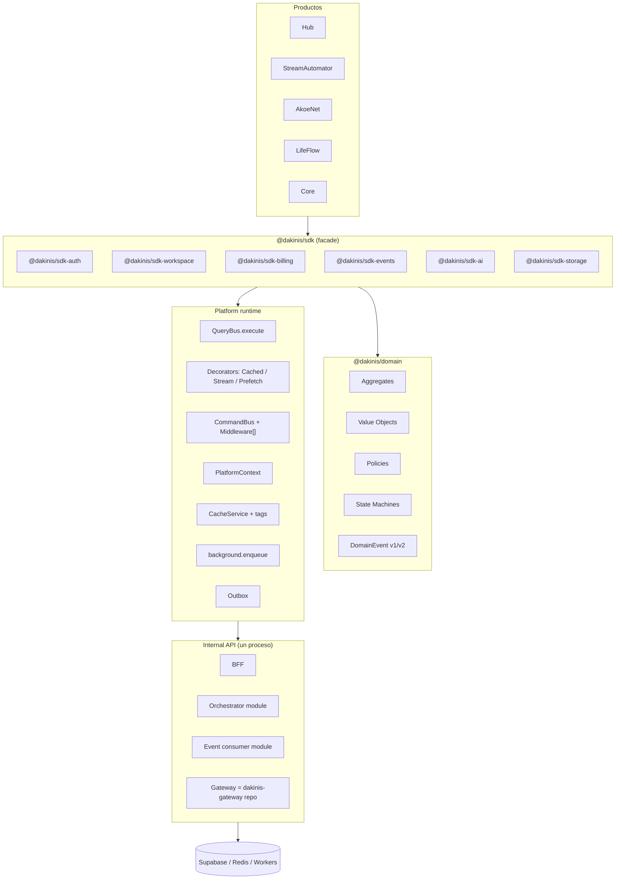

---

## 4. Cambios por capa (detalle)

### 4.1 SDK modular — evitar God Object

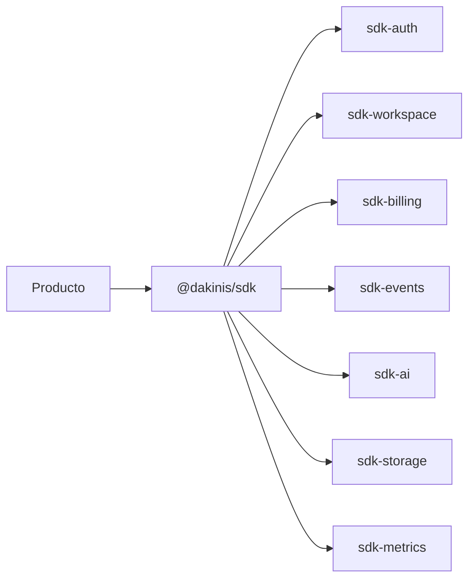

- Cada paquete evoluciona y versiona solo.
- `createDakinisPlatform(config)` construye `PlatformContext` y expone módulos con **lazy getters**.
- Ningún producto llama REST directo al Gateway/Internal.
- **Events:** `on` / `once` / `off` / `emit` (+ query histórica); transporte WS/Redis detrás del módulo.
- **Métricas:** `platform.metrics()` — calls, errors, latency, retries, cache hits.

```typescript
// Patrón facade (resumen)
export function createDakinisPlatform(config: PlatformConfig) {
  const ctx = buildPlatformContext(config);
  return {
    get auth() { return getAuthModule(ctx); },
    get workspace() { return getWorkspaceModule(ctx); },
    get events() { return getEventsModule(ctx); },
    get metrics() { return getMetricsModule(ctx); },
    query: queryBus,
    command: commandBus,
  } as const;
}
```

---

### 4.2 `@dakinis/domain` — estructura y primer agregado

```text
packages/domain/
├── aggregates/       # Workspace, WorkspaceInvite, AutomationRule, DirectorSession, …
├── value-objects/    # Email, WorkspaceId, Money, InviteRole, …
├── domain-events/    # versionados: invite.accepted.v1
├── commands/
├── queries/
├── policies/           # canInviteMember, canPublishStream, …
├── state-machines/
├── exceptions/
└── index.ts            # barrel público; package.json "exports" estrictos
```

**Agregado piloto recomendado:** `WorkspaceInvite` (ya hay accept live en infra — extraer lógica a dominio).

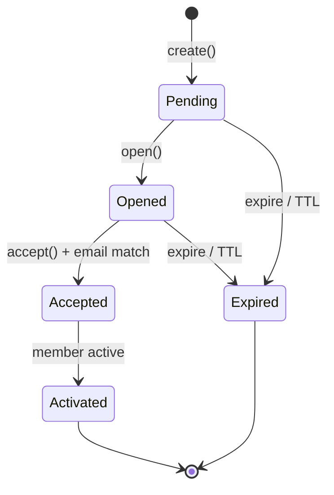

Comportamiento en agregado (no en `if` del controller):

- `WorkspaceInvite.create()` → `InviteCreated.v1`
- `open()` → `InviteOpened.v1`
- `accept(userId, email)` → valida SM + `InviteAccepted.v1`
- Repositorio en infra (`PostgresWorkspaceInviteRepository`) + outbox para eventos.

**Facades thin:** solo orquestan `repo.find → aggregate.method → repo.save → eventBus.publish`.

---

### 4.3 Policy Engine (además de permissions)

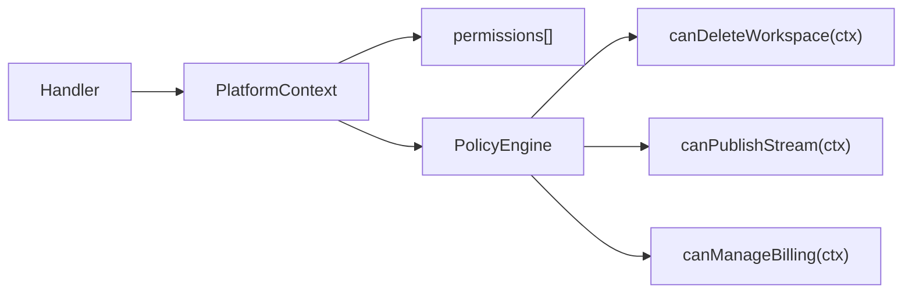

Permisos = capacidad coarse (`workspace:invite`). Políticas = reglas de negocio compuestas (plan, rol, estado del agregado).

---

### 4.4 DomainEvent — contrato versionado

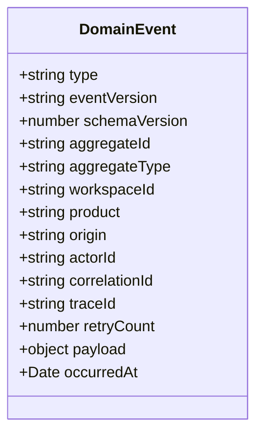

Serialización robusta; preparado para event sourcing ligero opcional más adelante.

---

### 4.5 QueryBus y CommandBus — composición, no God Bus

**QueryBus** — una responsabilidad:

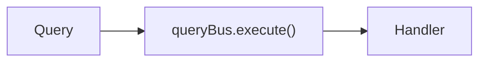

Decoradores / wrappers (no métodos en el bus):

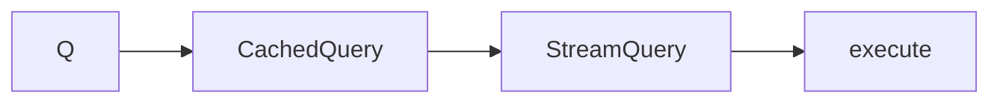

**CommandBus** — pipeline de middlewares:

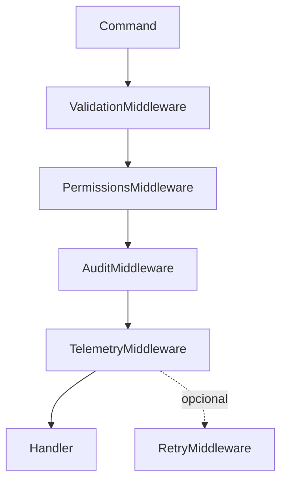

Command state para ops largas (`pending → processing → completed|failed`) + `waitForCompletion` vía Redis/BullMQ — como **middleware o handler wrapper**, no lógica embebida en el bus.

---

### 4.6 PlatformContext (ampliado)

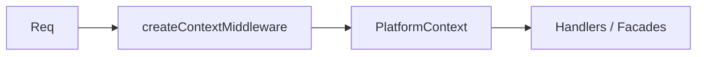

| Campo | Uso |
|-------|-----|
| `workspace`, `user` | Identidad |
| `permissions`, `can()` | Autorización coarse |
| `policies` | Reglas de negocio |
| `locale`, `timezone` | i18n / fechas |
| `product` | Hub, SA, Core, … |
| `featureFlags` | Flags resueltos para el request |
| `requestId`, `traceId` | Correlación |
| `requestStart`, `clientVersion`, `device` | SLA, compat, analytics |
| `cache`, `logger`, `telemetry` | Servicios inyectados |

Uso objetivo: `saveLayout(ctx)` en lugar de firmas con 6+ parámetros primitivos.

---

### 4.7 Internal API — módulos, no microservicios

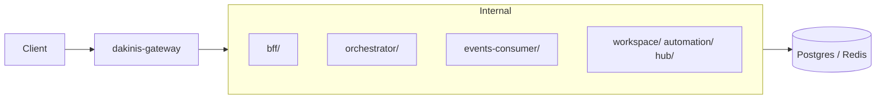

Gateway sigue en repo `dakinis-systems/gateway`. Event consumer = carpeta/módulo, **no** despliegue separado en Fase A–B.

---

### 4.8 Cache con tags

**Done** — Redis `sAdd`/`sMembers` + invalidación en timeline / invite accept.

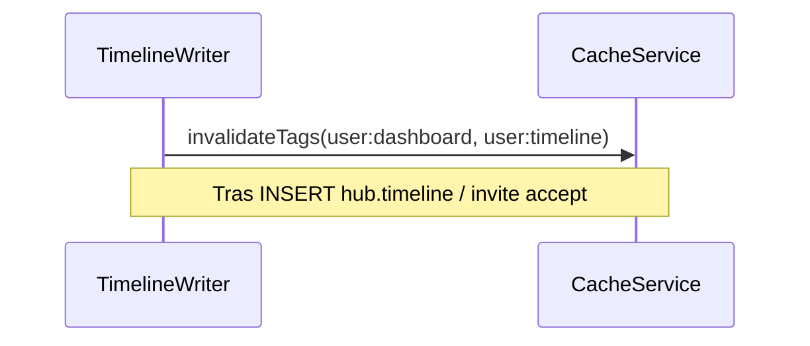

---

### 4.9 Background jobs — API mínima

```typescript
// No nueva capa enorme — wrapper sobre BullMQ existente
background.enqueue(name, payload, opts?);
background.schedule(name, payload, runAt, opts?);
background.cancel(jobId);
```

Productos no importan BullMQ directamente.

---

### 4.10 Automation — IF/THEN ahora; nodos después

**Hoy (mantener):** reglas planas + `AutomationRuns` + logs estructurados + timeline.

**Disparador para nodos:** loops, branches, múltiples triggers, o builder visual que lo exija.

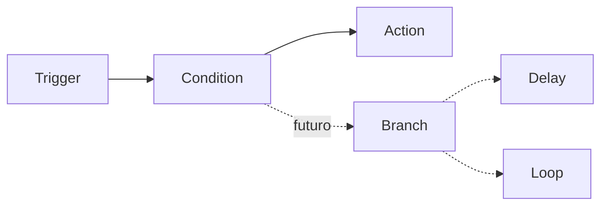

---

### 4.11 DTO Generator y contratos

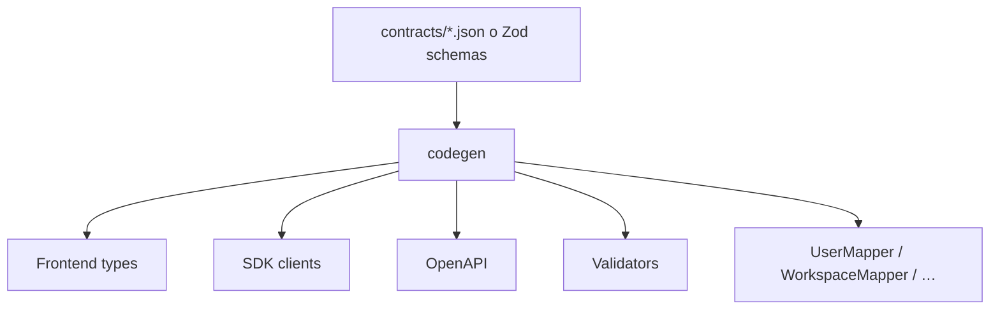

Evita `res.json(model)` sin mapping explícito en cada endpoint.

---

### 4.12 Observabilidad — fases

| Fase | Qué | Cuándo |
|------|-----|--------|
| Ahora | Sentry + `telemetry.track()` + logs estructurados | Ya |
| B | `platform.metrics()` en SDK | Con SDK modular |
| C | OpenTelemetry (`span`, `trace` compartido Hub→Worker) | Clientes + varios workers/equipos |

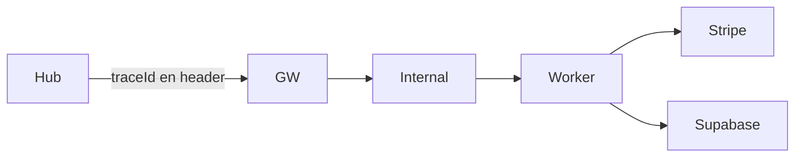

---

## 5. Mejoras tácticas (tabla priorizada)

| # | Iniciativa | Impacto | Esfuerzo | Depende de | Owner | Estado base |
|---|------------|---------|----------|------------|-------|-------------|
| 1 | QueryMap tipado (inferencia) | Alto | 2h | — | Platform | **Done** (`query-map.js` + `.d.ts`) |
| 2 | Cache tags + invalidación timeline | Alto | 3h | — | Internal | **Done** (Redis tags + timeline invalidate) |
| 3 | Invite SM + `FOR UPDATE` + policies | Alto | 3h | domain scaffold | Internal | **Done** (create+accept+outbox+timeline) |
| 4 | Rate limit granular (public/bff/admin/events) | Medio | 2h | — | Gateway | **Done** (nginx zones + Internal tiers) |
| 5 | **Scaffold `@dakinis/domain`** | Crítico | 5d | — | Platform | **Done** (`c35a014`) |
| 6 | PlatformContext middleware | Alto | 4h | — | Platform | **Done** Phase A |
| 7 | SDK modular + `events.subscribe` | Alto | 1w | domain events | Platform | **Done** (`72b094a` + Hub client) |
| 8 | CommandBus middleware pipeline | Alto | 3d | — | Internal | **Done** Phase A |
| 9 | DTO Generator (primera pasada) | Medio | 3d | contratos | Platform | **Done v1** (`scripts/generate-dto.mjs`) |
| 10 | Smokes modulares (Jest + helpers) | Medio | 4h | — | DX | PS1 (Jest diferido) |
| 11 | Automation logs estructurados + UI stream | Medio | 4h | — | SA | Runs live + Run SM |
| 12 | SDK metrics | Medio | 2d | SDK modular | Platform | **Done** (`@dakinis/sdk-metrics`) |
| 13 | Automation node engine | Alto | 2w | domain | SA | **Diferido** |
| 14 | OTel end-to-end | Medio | 1w | escala | Platform | **Diferido** |
| 15 | Billing E2E | Alto negocio | 4h | cliente | Billing | 2ª prioridad |
| 16 | DirectorSession SM en SA | Alto | 4h | domain | SA | **Done** (`8a7ea33`) |
| 17 | Domain events → outbox + consumer | Alto | 1d | domain | Platform | **Done** (invite + director) |

---

## 6. Roadmap por fases (orden acordado v2)

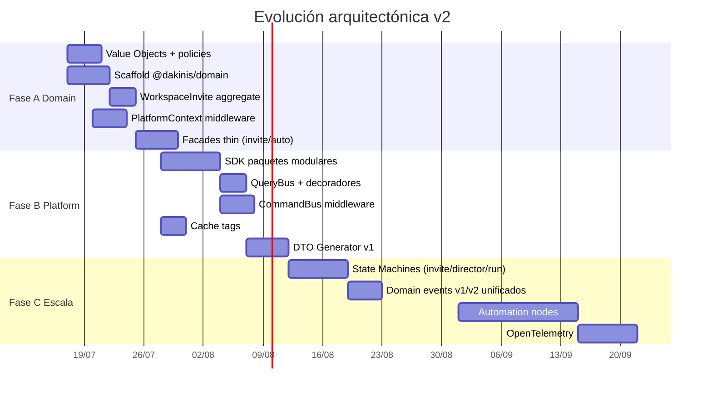

### Prioridad de negocio (v2.2 — 20% arch / 80% producto)

1. **Piloto** — invite real + demo Hub→Mi día→SSO→valor en 5 min  
2. **Ops** — redeploy Gateway (rate-limit edge) + billing dry-run staging  
3. **Producto** — Hub puerta de entrada · Workspace consolidado · IA donde aporte valor  
4. **Adopción** — SDK/QueryMap en Hub o SA; luego Core/LifeFlow  
5. **Billing E2E** — cuando negocio reactive (2ª prioridad; dry-run semanal mientras tanto)  
6. **Arquitectura residual (~20%)** — DTO gen v2, más tests dominio, `background.enqueue`, SM solo si desbloquea producto  
7. **Diferido** — OTel, automation nodes, fusionar `shared-*` UI

**Anti-patrón v2.2:** seis meses más de plumbing. La pregunta clave: *¿puedes mostrar valor a un cliente potencial en 5 minutos?*


---

## 7. Organización por dominio (no por capa técnica)

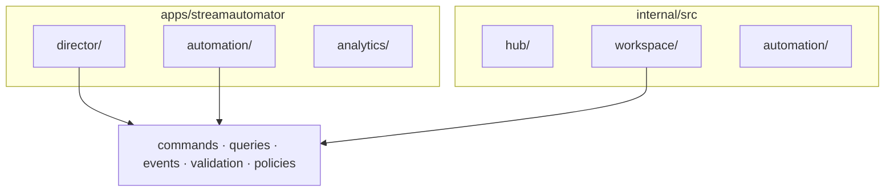

Eje: **agregado**, no `controllers / services / routes` como carpeta raíz.

---

## 8. Criterios de aceptación

| Iniciativa | Done when | Estado |
|------------|-----------|--------|
| `@dakinis/domain` | Invite + AutomationRule con tests; APIs solo adaptan | ✅ invite/director/run/rule |
| Value Objects | No `string` suelto en dominio nuevo | ✅ |
| Policy Engine | `canAcceptInvite(ctx)` en domain | ✅ invite |
| SDK modular | Producto importa `@dakinis/sdk` | ✅ paquetes; adopción productos en curso |
| QueryBus | Solo `execute`; cache vía `CachedQuery` | ✅ + QueryMap |
| CommandBus | Middleware sin editar el bus | ✅ |
| Cache tags | Write timeline → dashboard no stale | ✅ |
| Invite SM | Estados en admin; expired no aceptable | ✅ |
| Rate limit granular | Zones public/bff/admin/events | ✅ código; redeploy GW |
| Automation nodes | Solo cuando exista branch en prod | Diferido |
| OTel | Trace Hub→worker | Diferido |

---

## 9. Anti-objetivos

- No God Object SDK ni God Bus (módulos y middlewares pequeños).
- No reescribir Sequelize completo antes de facades.
- No microservicios Internal el mes 1.
- No Event Consumer como servicio separado (aún).
- No canvas n8n antes de logs + SM.
- No OTel antes de escala real (Sentry suficiente hoy).
- No automation nodes mientras IF/THEN crezca bien.
- No billing E2E como P0 sin cliente (sí dry-run staging).
- No bloquear piloto por Module Federation u OTel.
- **No** añadir más `shared-*` / facades / buses sin necesidad de producto.
- **No** poner lógica de UI/formato en `@dakinis/domain`.

---

## 10. Resumen ejecutivo

**Hecho en código (16 jul 2026):**

| Bloque | Entregables |
|--------|-------------|
| **Fase A** | `@dakinis/domain`, PlatformContext, CommandBus middleware, CachedQuery, invite facade |
| **Fase B** | SDK modular (`sdk-*`), cache tags, DTO gen v1, QueryMap, rate-limit granular Gateway |
| **Fase C (parcial)** | Outbox `invite.*.v1` + consumer→timeline; DirectorSession + AutomationRun SM; invite create |
| **Producto** | Invite Hub live · automation runs UI · SSO 3/3 · Mi día + score 72 |

**Feedback v2.2:** la plataforma *ya está diseñada*. El mayor riesgo **ya no es técnico** — es comercial (clientes que paguen / usen).

**Siguiente impacto (80% producto):**

1. Redeploy Gateway + piloto invite + demo 5 min  
2. Billing dry-run staging; E2E cuando haya cliente  
3. Adopción SDK en un producto más; consolidar Hub/Workspace  
4. DTO gen v2 / tests dominio / background wrapper solo si desbloquean DX  
5. OTel / nodes — solo con demanda real  

El punto de inflexión “app grande → plataforma” **ya ocurrió**. Ahora: validar negocio sin sobre-diseñar.

---

## Anexo A — Patrones de código (referencia breve)

### A.1 CacheService con tags (Redis)

```typescript
async set(key, value, ttlSeconds, tags = []) {
  await redis.setex(key, ttlSeconds, JSON.stringify(value));
  for (const tag of tags) await redis.sAdd(`cache:tag:${tag}`, key);
}
async invalidateTag(tag) {
  const keys = await redis.sMembers(`cache:tag:${tag}`);
  if (keys.length) await redis.del(...keys);
  await redis.del(`cache:tag:${tag}`);
}
```

### A.2 State machine ligera (invite)

```typescript
// packages/domain/src/shared/state-machine.ts — sin XState hasta Fase C si hace falta
transition(event): boolean  // false = transición inválida
can(event): boolean
```

### A.3 Events module (SDK)

```typescript
platform.events.on('invite.accepted.v1', handler);
platform.events.once('director.started.v1', handler);
platform.events.emit(domainEvent);
```

### A.4 Tests de dominio (prioridad máxima)

```typescript
// packages/domain/src/invite/__tests__/workspace-invite.spec.ts
it('rejects accept when email mismatch', () => { … });
it('expires pending invite after TTL', () => { … });
```

---

*Actualizado 16 jul 2026 — v2.2: scores externos, foco 20/80 producto, riesgos de sobre-infra. Próxima revisión: tras piloto invite real o primer cliente de pago.*
