# Dakinis Systems — Arquitectura

> **Estado vigente** · julio 2026 · decisiones de arquitectura y capas.  
> Estado operativo → [`STATUS.md`](./STATUS.md) · Productos → [`archive/PRODUCTS.md`](./archive/PRODUCTS.md) · Ops → [`OPERATIONS.md`](./OPERATIONS.md)

**¿Por qué estas decisiones?** → [`archive/WHY.md`](./archive/WHY.md) · ADRs → [`adr/`](./adr/)  
**Estrategia / competencia** → [`company/STRATEGY.md`](./company/STRATEGY.md)

---

## Arquitectura visual

Diagramas en **Mermaid** — se renderizan en GitHub, Cursor, VS Code y la mayoría de visores Markdown.

| # | Diagrama | Qué explica |
|---|----------|-------------|
| 1 | [Cuatro capas](#1-cuatro-capas) | Foundation → Infra → Platform → Products |
| 2 | [Vista de contexto](#2-vista-de-contexto) | Dominios, Cloudflare, externos |
| 3 | [Flujo de petición](#3-flujo-de-petición) | Usuario → Gateway → servicios → DB |
| 4 | [Experiencia Hub](#4-experiencia-hub) | Mi día, admin, SSO a productos |
| 5 | [Mi día — datos](#5-mi-día--datos) | Hub → Internal API → Supabase |
| 6 | [SSO a producto](#6-sso-a-producto) | Login una vez, abrir Core/LF/… |
| 7 | [Cadena cobrar](#7-cadena-cobrar) | Stripe → Billing → Hub → plan |
| 8 | [Internal API](#8-internal-api) | Orquestación workspace y dashboard |
| 9 | [Knowledge + IA](#9-knowledge--ia) | Ingest → índice → Copilot / Ctrl+K |
| 10 | [Event bus](#10-event-bus) | Redis · BullMQ · workers |
| 11 | [Schemas Supabase](#11-schemas-supabase) | Quién es owner de cada schema |
| 12 | [Despliegue Railway](#12-despliegue-railway) | Gateway y servicios en prod |
| 13 | [Billing E2E](#13-billing-e2e) | Checkout → webhook → plan → degraded → restore |
| 14 | [C4 Contenedores](#14-c4--contenedores) | Vista C4 por producto y platform |

---

### 1. Cuatro capas

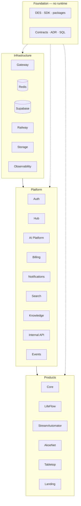

---

### 2. Vista de contexto

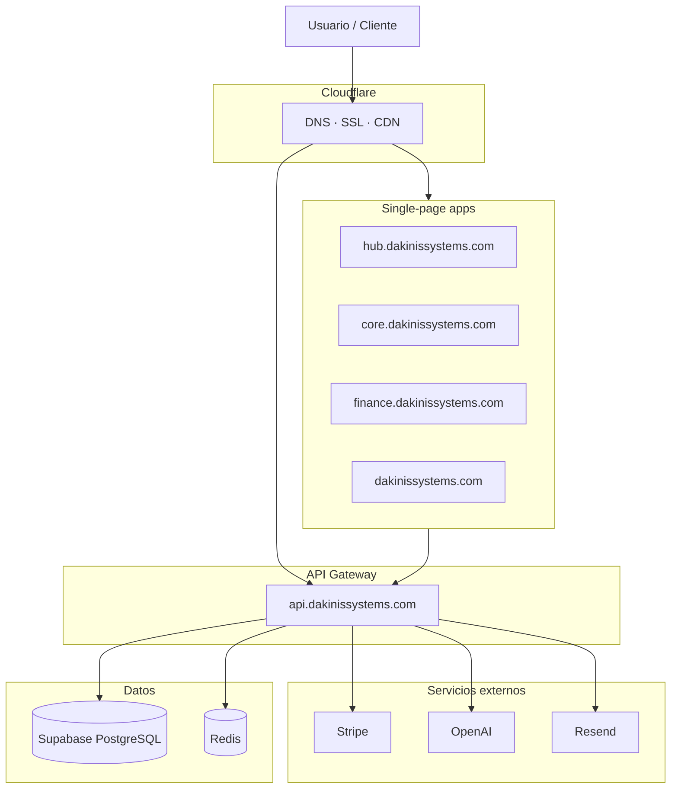

---

### 3. Flujo de petición

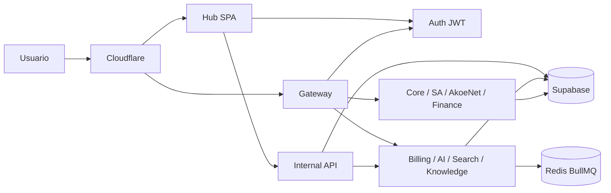

---

### 4. Experiencia Hub

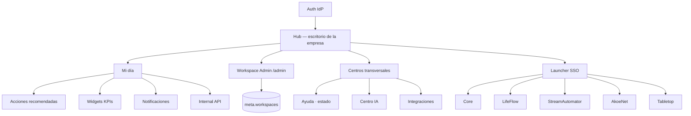

Identidad de **workspace** en `meta` — no en Core ni Billing. Detalle → [`archive/HUB-WORKSPACE.md`](./archive/HUB-WORKSPACE.md).

---

### 5. Mi día — datos

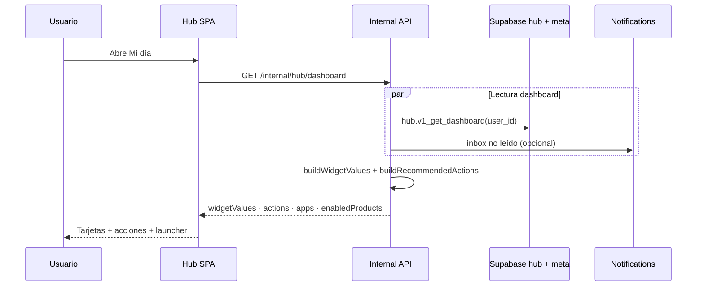

Sin migr. `016`–`029` en prod → `summary.stub: true`. Ver [`STATUS.md`](./STATUS.md).

---

### 6. SSO a producto

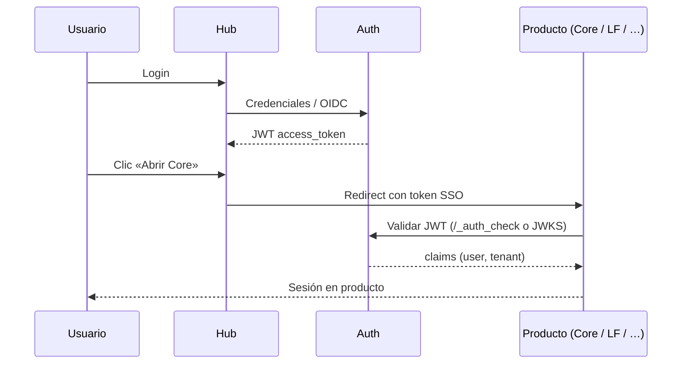

---

### 7. Cadena cobrar

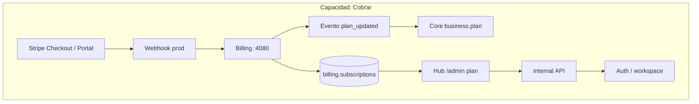

Detalle secuencia E2E (checkout, impago, restore) → [§13 Billing E2E](#13-billing-e2e). Checklist → [`OPERATIONS.md`](./OPERATIONS.md) · smoke `smoke-billing-e2e.ps1`.

---

### 8. Internal API

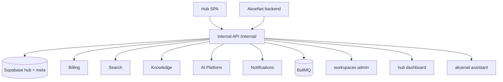

Contrato → [`contracts/internal-api.json`](./contracts/internal-api.json)

---

### 9. Knowledge + IA

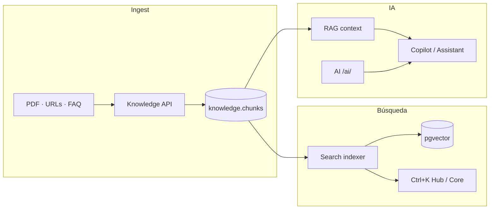

Knowledge **no es** AI — AI lo consume. Mensaje → [`company/MESSAGING.md`](./company/MESSAGING.md).

---

### 10. Event bus

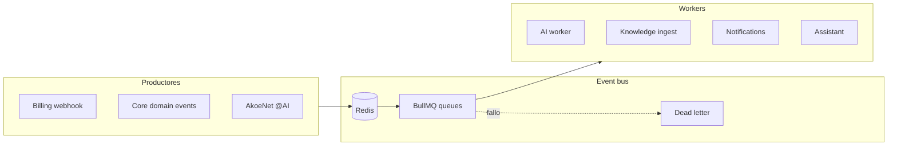

Tipos: `DAKINIS_EVENTS` en `@dakinis/shared-ai`. Runbook `@AI` → [`OPERATIONS.md`](./OPERATIONS.md) · [`AKOENET-ASSISTANT.md`](./AKOENET-ASSISTANT.md).

---

### 11. Schemas Supabase

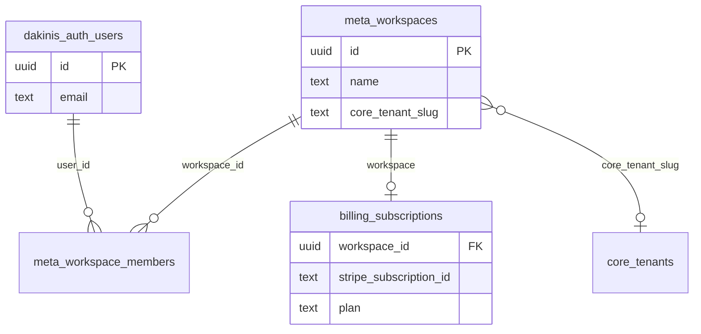

**Regla:** apps producto **no** hacen queries cross-schema — sync vía HTTP + eventos.

| Schema | Capa | Owner |
|--------|------|-------|
| `dakinis_auth` | Platform | Auth |
| `billing` · `ai` · `hub` · `knowledge` | Platform | Platform team |
| `meta` | Governance | Platform |
| `dakinis_core_prod` → `core` | Product | ERP |
| `stream` · `akoenet` · `lifeflow` | Product | Social / Finance / Games |

---

### 12. Despliegue Railway

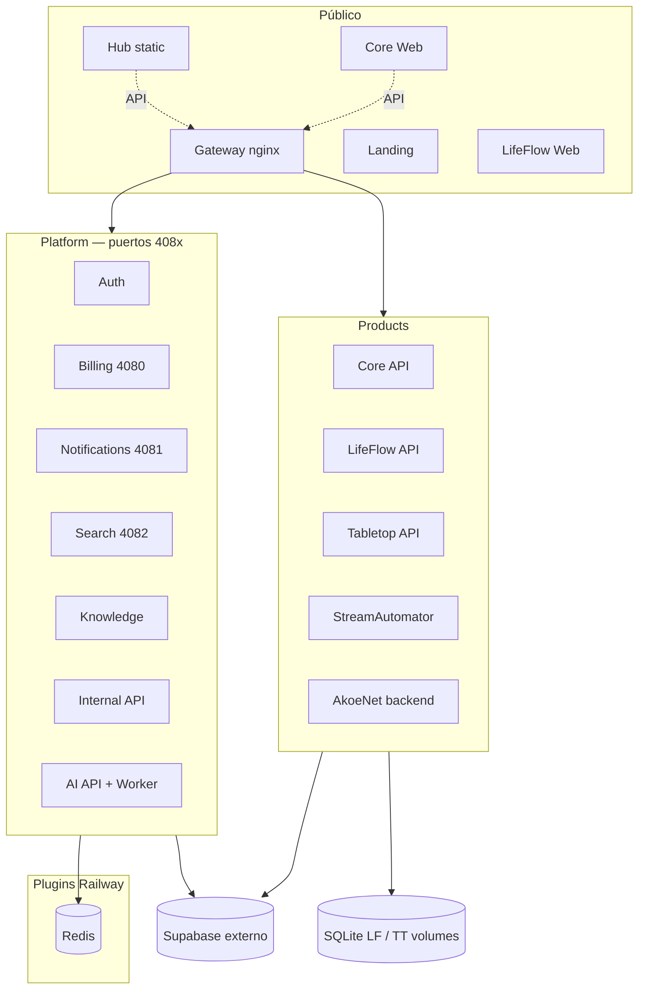

Mapa dominios y variables → [`OPERATIONS.md`](./OPERATIONS.md) · repos → [`archive/GITHUB-ORG.md`](./archive/GITHUB-ORG.md).

---

### 13. Billing E2E

Flujo completo go-live: pago exitoso, propagación de plan e impago con **degraded** y restore.

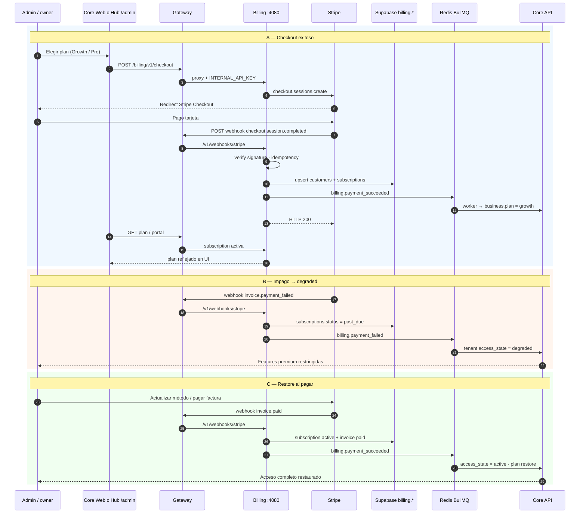

**Eventos Stripe mínimos:** `checkout.session.completed` · `customer.subscription.*` · `invoice.paid` · `invoice.payment_failed`.

Verificación: `.\scripts\smoke-billing-e2e.ps1` · `.\scripts\smoke-billing-degraded.ps1` · [`STATUS.md`](./STATUS.md) § Billing E2E Live.

---

### 14. C4 — Contenedores

Vista [C4 Model](https://c4model.com/) nivel **contenedor**: quién habla con quién (no clases ni tablas).

```mermaid
C4Container
  title Dakinis Systems — contenedores (jul 2026)

  Person(user, "Usuario", "Owner o miembro del workspace PYME")
  Person(ops, "Equipo Dakinis", "Ops · super admin")

  System_Ext(stripe, "Stripe", "Checkout · Customer Portal · webhooks")
  System_Ext(openai, "OpenAI", "LLM API")
  System_Ext(resend, "Resend", "Email transaccional")

  System_Boundary(edge, "Edge") {
    Container(gw, "Gateway", "Nginx", "api.dakinissystems.com · JWT auth_request · rate limit")
  }

  System_Boundary(platform, "Platform") {
    Container(auth, "Auth IdP", "Node.js", "Login · JWT · schema dakinis_auth")
    Container(billing, "Billing", "Node.js", "Stripe SDK · schema billing")
    Container(internal, "Internal API", "Node.js", "Workspace admin · Hub dashboard · Assistant")
    Container(ai, "AI Platform", "Node.js + worker", "Chat · agents · schema ai")
    Container(knowledge, "Knowledge", "Node.js", "Ingest · chunks · RAG")
    Container(search, "Search", "Node.js", "Índice · semantic search")
    Container(notif, "Notifications", "Node.js + worker", "Email · in-app")
  }

  System_Boundary(products, "Products") {
    Container(hub, "Hub", "React SPA", "hub.dakinissystems.com · Mi día · /admin")
    Container(core, "Dakinis One", "Node API + React", "core.* · ERP vertical restaurante")
    Container(lf, "LifeFlow", "Node API + React", "finance.* · planificación financiera")
    Container(sa, "StreamAutomator", "Node + React", "api.streamautomator.com")
    Container(ak, "AkoeNet", "Node + React", "Comunidad · Assistant @AI")
    Container(tt, "Tabletop", "Node + React", "tabletop.* · D&D online")
    Container(land, "Landing", "React", "dakinissystems.com · /empieza")
  }

  ContainerDb(pg, "Supabase", "PostgreSQL multi-schema", "auth · billing · hub · meta · core…")
  ContainerDb(redis, "Redis", "Redis / BullMQ", "billing events · AI · notifications")
  ContainerDb(sqlite, "SQLite volumes", "SQLite", "LifeFlow · Tabletop (cutover pendiente)")

  Rel(user, hub, "Escritorio · SSO", "HTTPS")
  Rel(user, core, "Operar negocio", "HTTPS")
  Rel(user, lf, "Finanzas", "HTTPS")
  Rel(user, land, "Descubrir producto", "HTTPS")
  Rel(ops, internal, "Admin platform", "HTTPS + service key")

  Rel(hub, gw, "API", "HTTPS")
  Rel(core, gw, "API", "HTTPS")
  Rel(lf, gw, "Auth / AI", "HTTPS")
  Rel(ak, gw, "Auth · Internal", "HTTPS")
  Rel(sa, gw, "Auth", "HTTPS")

  Rel(gw, auth, "Proxy /auth/")
  Rel(gw, billing, "Proxy /billing/")
  Rel(gw, internal, "Proxy /internal/")
  Rel(gw, ai, "Proxy /ai/")
  Rel(gw, knowledge, "Proxy /knowledge/")
  Rel(gw, search, "Proxy /search/")
  Rel(gw, notif, "Proxy /notifications/")
  Rel(gw, core, "Proxy /core/")

  Rel(billing, stripe, "API + webhooks", "HTTPS")
  Rel(ai, openai, "Completions", "HTTPS")
  Rel(notif, resend, "Send", "HTTPS")

  Rel(auth, pg, "SQL")
  Rel(billing, pg, "SQL")
  Rel(internal, pg, "SQL hub + meta")
  Rel(core, pg, "SQL dakinis_core_prod")
  Rel(ak, pg, "SQL akoenet")
  Rel(sa, pg, "SQL stream")
  Rel(lf, sqlite, "Read/write")
  Rel(tt, sqlite, "Read/write")

  Rel(billing, redis, "billing.* events")
  Rel(ai, redis, "Jobs")
  Rel(notif, redis, "Dispatch queue")
  Rel(internal, redis, "Assistant events")
  Rel(redis, core, "plan_updated consumer")
```

**Lectura rápida por producto:**

| Producto | Contenedor | BD principal | Platform que consume |
|----------|------------|--------------|----------------------|
| Hub | `hub` | `hub` + `meta` vía Internal API | Auth, Internal, Billing, Search, AI |
| Dakinis One | `core` | `dakinis_core_prod` | Auth, Billing, AI, Notifications |
| LifeFlow | `lf` | SQLite → `lifeflow` | Auth, AI |
| StreamAutomator | `sa` | `stream` | Auth (Stripe propio) |
| AkoeNet | `ak` | `akoenet` | Auth, Notifications, Internal Assistant |
| Tabletop | `tt` | SQLite | Auth, AI (roadmap) |
| Landing | `land` | — | — |

Regla: productos **no** acceden cross-schema — orquestación vía Gateway + Internal API + eventos Redis.

---

## Cuatro capas

**Foundation** (código compartido, no runtime) · **Infrastructure** · **Platform** · **Products**.

Pendientes operativos → [`STATUS.md`](./STATUS.md). No duplicar estado aquí.

No mezclar capas. Diagrama → [§1 Cuatro capas](#1-cuatro-capas).

| **Foundation** | DES, SDK, `packages/`, contracts, ADR, migraciones SQL | Runtime desplegado |
| **Infrastructure** | Gateway, Redis, Supabase, Railway, Storage, Observability | Lógica de negocio de productos |
| **Platform** | Auth, Hub, AI, Billing, Notifications, Search, Knowledge, Events | Core, LifeFlow, SA… |
| **Products** | Core (Business OS), LifeFlow, StreamAutomator, AkoeNet, Tabletop, Landing | Auth, Billing, AI engine |

**Reglas:**

1. **Core es producto**, no plataforma.
2. Los productos **solo consumen** platform vía Gateway o Internal API — nunca cross-DB.
3. **Billing es plataforma en prod** (v0.2.0) — no roadmap.
4. **Knowledge es servicio aparte** — AI lo consume; narrativa comercial: memoria de la empresa ([`company/MESSAGING.md`](./company/MESSAGING.md)).
5. **Hub es la experiencia de entrada** — Core es un producto bajo Hub. Ver [ADR-008](./adr/ADR-008-hub-entry-point.md).

---

## Capacidades platform (vista negocio)

Los productos **consumen** capacidades vía Gateway o Internal API — no las reimplementan.

| Capacidad | Estado | Notas |
|-----------|--------|-------|
| Identity | ✅ Auth · 🔄 workspace | SSO, roles, `meta.workspaces` |
| Billing | ✅ API · 🔴 E2E live | Stripe, degraded |
| AI + Knowledge | ✅ prod | Copilot, RAG, Assistant |
| Search + Notifications | 🟠 MVP | Ctrl+K, Resend |
| Events / Automation | 🔄 BullMQ | Billing→Core, `@AI` |
| Storage, Integrations, Marketplace, Banking | ⬜ Q4+ | Solo bajo demanda cliente |

Detalle Hub → [`archive/HUB-WORKSPACE.md`](./archive/HUB-WORKSPACE.md) · Servicios Railway → [`OPERATIONS.md`](./OPERATIONS.md).

---

## Dependencias

Diagramas de flujo → [Arquitectura visual](#arquitectura-visual) (§3 petición · §7 cobrar · §8 Internal API · §13 Billing E2E · §14 C4).

Catálogo servicios → [`STATUS.md`](./STATUS.md) · deploy → [`OPERATIONS.md`](./OPERATIONS.md) · ADRs → [`adr/README.md`](./adr/README.md)

---

## Infrastructure

### Gateway — ✅

`api.dakinissystems.com` · Nginx · JWT (`/_auth_check`) · rate limit · CORS.

Prefijos: `/auth/` · `/core/` · `/finance/` · `/billing/` · `/notifications/` · `/search/` · `/ai/` · `/internal/` · SA · AkoeNet

Config: [`gateway/routes/default.conf`](../gateway/routes/default.conf) · reglas: [`rules.md`](./rules.md)

### Redis — ✅

Cache · colas · event bus **BullMQ prod** (`DAKINIS_EVENT_BUS=bullmq`). Referencia: `${{Redis.REDIS_URL}}`.

### Supabase — 🔄

PostgreSQL multi-schema · pooler `:6543` · identidad `dakinis_auth`.

Schema `meta`: `function_versions` · `schema_versions` · `migration_history` · `feature_flags` ✅ (024) · **`workspaces`** · `workspace_members` · `audit_logs` ✅ (031 prod jul 2026)

Cutovers pendientes (producto): `dakinis_core_prod`→`core`, `akoenet`, `audit` — ver [`STATUS.md`](./STATUS.md)

Orden SQL: [`supabase/migrations/RUN-ORDER.md`](./supabase/migrations/RUN-ORDER.md)

### Railway — ✅

Contenedores · mapa servicios: [`archive/GITHUB-ORG.md`](./archive/GITHUB-ORG.md) · deploy: [`OPERATIONS.md`](./OPERATIONS.md)

### Storage — ⬜

Diagrama de capas → [§2 Vista de contexto](#2-vista-de-contexto). Prioridad: LifeFlow · Tabletop · Core · Knowledge.

### Observability — 🔄

Logs · metrics · tracing (Sentry) · queue health · costes IA · `/health` por servicio.

---

## Platform

**Experiencia cliente:** Login → **Hub** (escritorio) → productos (Core es uno de ellos). Diagrama → [§4 Experiencia Hub](#4-experiencia-hub) · [§6 SSO](#6-sso-a-producto).

Contrato Internal API: [`contracts/internal-api.json`](./contracts/internal-api.json)

### Hub — centro de experiencia ✅ v0.2.1

`dakinis-hub` · `hub.dakinissystems.com` · schemas `hub` + `meta` (workspace identity).

**Rol:** escritorio de la empresa — identidad de **workspace** (no solo usuario) · Mi día · widgets · launcher SSO · notificaciones · admin · integraciones — **no “solo un menú”**.

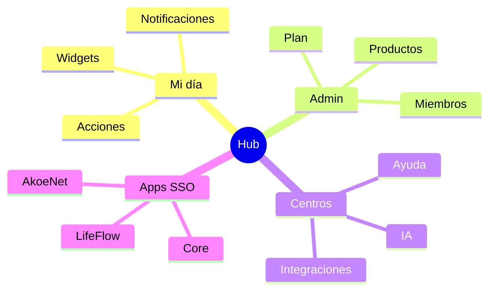

Experiencia **inspirada en** Microsoft 365 / Zoho One (un escritorio, muchas apps); detalle comercial → [`company/STRATEGY.md`](./company/STRATEGY.md).

Mensaje comercial → [`company/MESSAGING.md`](./company/MESSAGING.md)  
Diseño admin → [`archive/HUB-WORKSPACE.md`](./archive/HUB-WORKSPACE.md) · SQL migr. `031` · contrato [`admin-api.json`](./contracts/admin-api.json)

Registries: `HUB_DASHBOARD_SECTIONS` · `HUB_WIDGET_REGISTRY` en `@dakinis/shared-ux`.

Pendiente producto: SSO E2E creds · Hub Admin validación piloto → [`STATUS.md`](./STATUS.md)

### Auth — ✅

`dakinis-auth` · `auth.dakinissystems.com` · schema `dakinis_auth` · JWT central.

### Knowledge + Search — memoria de la empresa ✅ API prod

Servicio **independiente** de AI. **Activo estratégico:** docs, FAQ, RAG → Ctrl+K y copilot. Diagrama → [§9 Knowledge + IA](#9-knowledge--ia).

Repo [`dakinis-knowledge`](https://github.com/dakinissystems/dakinis-knowledge) · schema `knowledge` · contrato [`knowledge.json`](./contracts/knowledge.json)

Pendiente: ingest PDF masivo · pgvector → [`STATUS.md`](./STATUS.md)

### AI Platform — ✅ OpenAI prod (jul 2026)

`dakinis-ai` · `/ai/` · schema `ai` · `gpt-4o-mini`.

**Cliente:** asistente que usa conocimiento del negocio en Core, Hub y productos conectados.

**Ingeniería:** LLM · agents · OCR · embeddings (worker).

Contrato: [`dakinis-ai.json`](./contracts/dakinis-ai.json) · beneficio → [`company/MESSAGING.md`](./company/MESSAGING.md)

### Billing — ✅ prod

`dakinis-billing` · v0.2.0 · `/billing/` · schema `billing` · Stripe Live.

Planes · suscripciones · checkout · portal · webhooks · Redis events → Core `business.plan`.

Core **no** tiene SDK Stripe — proxy `/api/public/stripe/*` hacia Billing.

Contrato: [`contracts/billing.json`](./contracts/billing.json)

### Notifications — ✅ v0.3.1 (pendiente: Resend live test, push VAPID)

`dakinis-notifications` · `/notifications/` · puerto 4081.

Canales objetivo: Email · Push · Discord · Slack · WhatsApp · SMS · In-App.

Catálogo: `NOTIFICATION_CHANNELS` en `@dakinis/shared-ai`. Contrato: [`contracts/notifications.json`](./contracts/notifications.json)

### Search — 🔄 indexer OK (pendiente: pgvector, más índices)

`dakinis-search` · `/search/` · puerto 4082.

Global Search · Index · Autocomplete · Semantic · Knowledge Search · AI Search.

Scopes UI: `SEARCH_SCOPES` en `@dakinis/shared-ux/command-palette.js`.

### Events — 🔄 BullMQ + DLQ ✅ (expandir dominios)

Diagrama → [§10 Event bus](#10-event-bus). Hoy: Redis lists + `event-bus.js` Core · tipos `DAKINIS_EVENTS` en `@dakinis/shared-ai/events.js`.

### DES — ✅

Monorepo [`dakinis-shared`](https://github.com/dakinissystems/dakinis-shared) · mirror `packages/`.

Foundations → Tokens → Components → Patterns → Layouts → Animations · A11y · Icons · Charts · Copywriting.

No se despliega en Railway. Ver [`archive/GITHUB-ORG.md`](./archive/GITHUB-ORG.md).

### SDK — 🔄

`@dakinis/sdk` — Auth · Billing · Notifications · Hub · AI · Storage ⬜ · Search · Knowledge 🔄

Implementado: `ai`, `core`, `lifeflow`, `platform-services` · mirror [`packages/sdk/`](../packages/sdk/)

---

## Products

Detalle funcional por producto: [`archive/PRODUCTS.md`](./archive/PRODUCTS.md).

| Producto | Repo | BD | Consume platform |
|----------|------|-----|------------------|
| **Core** (Business OS) | `dakinis-core` | `dakinis_core_prod` | Auth, AI, Billing, Notifications |
| **LifeFlow** | `lifeflow` | SQLite → `lifeflow` | Auth, AI |
| **StreamAutomator** | `dakinis-streamautomator` | `stream` | Auth (Stripe propio) |
| **AkoeNet** | `akoenet-*` | `akoenet` | Auth, Notifications |
| **Tabletop** | `dakinis-tabletop` | SQLite → ⬜ | Auth, AI (roadmap) |
| **Landing** | `dakinis-landing` | — | — |

**Regla BD:** sin queries cross-schema desde apps producto. Sync vía HTTP + eventos.

---

## Bases de datos por schema

Resumen visual → [§11 Schemas Supabase](#11-schemas-supabase). Tabla completa:

| Schema | Capa | Notas |
|--------|------|-------|
| `dakinis_auth` | Platform | Identidad |
| `billing` | Platform | Billing prod |
| `ai` | Platform | AI + embeddings |
| `hub` | Platform | Hub prefs, widgets |
| `knowledge` | Platform | API prod · ingest masivo ⬜ |
| `meta` | Governance | ✅ 016 + 024 |
| `dakinis_core_prod` → `core` | Product | Core ERP · cutover ⬜ |
| `stream` | Product | StreamAutomator |
| `akoenet` | Product | AkoeNet · schema ⬜ |
| `lifeflow` | Product | sync v1 · cutover SQLite ⬜ |
| `audit` | Platform | Logs, jobs |

Tabletop hoy: SQLite volume · schema Supabase ⬜

---

## LifeFlow Engine (arquitectura)

Motor **independiente de UI** — el producto real de LifeFlow:

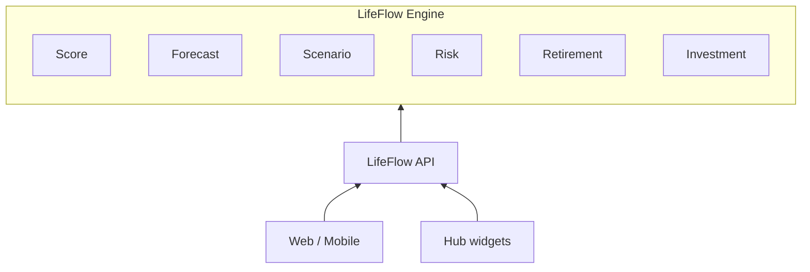

---

## Marketplace (capacidad platform)

Apps · Plugins · Templates · Automations · AI Agents · Themes — UI Hub ⬜

---

## Contratos HTTP

Contratos HTTP: [`contracts/`](./contracts/)

| Contrato | Prefijo | Capa |
|----------|---------|------|
| auth.json | `/auth/` | Platform |
| billing.json | `/billing/` | Platform |
| dakinis-ai.json | `/ai/` | Platform |
| notifications.json | `/notifications/` | Platform |
| search.json | `/search/` | Platform |
| knowledge.json | `/knowledge/` | Platform |
| internal-api.json | `/internal/` | Platform |
| core-api.json | `/core/` | Product |
| finance-api.json | `/finance/` | Product |
| streamautomator-api.json | SA | Product |
| akoenet-backend.json | AkoeNet | Product |

---

## Repos y carpetas locales

| Capa | Repos GitHub | Mirror local (gitignored) |
|------|--------------|---------------------------|
| Orquestación | `dakinis-systems` | — |
| Platform | auth, ai, hub, billing, notifications, search, shared | `platform/`, `billing/`, … |
| Products | core, lifeflow, streamautomator, akoenet-*, tabletop, landing | `platform/core`, `apps/`, `finanzas/`, `DND/` |

Carpeta `DND/` = desarrollo local **Tabletop** (repo `dakinis-tabletop`). En documentación usar siempre **Tabletop**.

---

## Diagrama de despliegue (Railway)

Ver [§12 Despliegue Railway](#12-despliegue-railway) en Arquitectura visual.

Mapa deploy: [`OPERATIONS.md`](./OPERATIONS.md) · repos: [`archive/GITHUB-ORG.md`](./archive/GITHUB-ORG.md)

---

*Actualizar al añadir servicios platform, cambiar gateway o schemas Supabase.*
