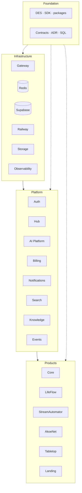

# Dakinis Systems — Arquitectura

> **Estado vigente** · julio 2026 · decisiones de arquitectura y capas.  
> Estado operativo → [`PLATFORM-STATUS.md`](./PLATFORM-STATUS.md) · Productos → [`PRODUCTS.md`](./PRODUCTS.md) · Ops → [`OPERATIONS.md`](./OPERATIONS.md)

---

## Cuatro capas

**Foundation** (código compartido, no runtime) · **Infrastructure** · **Platform** · **Products**.

Pendientes operativos → [`PLATFORM-STATUS.md`](./PLATFORM-STATUS.md). No duplicar estado aquí.

No mezclar capas. Reglas inmutables:



| **Foundation** | DES, SDK, `packages/`, contracts, ADR, migraciones SQL | Runtime desplegado |
| **Infrastructure** | Gateway, Redis, Supabase, Railway, Storage, Observability | Lógica de negocio de productos |
| **Platform** | Auth, Hub, AI, Billing, Notifications, Search, Knowledge, Events | Core, LifeFlow, SA… |
| **Products** | Core (Business OS), LifeFlow, StreamAutomator, AkoeNet, Tabletop, Landing | Auth, Billing, AI engine |

**Reglas:**

1. **Core es producto**, no plataforma.
2. Los productos **solo consumen** platform vía Gateway o Internal API — nunca cross-DB.
3. **Billing es plataforma en prod** (v0.2.0) — no roadmap.
4. **Knowledge es servicio aparte** — AI lo consume; narrativa comercial: memoria de la empresa ([`company/MESSAGING.md`](./company/MESSAGING.md)).
5. **Hub es la experiencia de entrada** — Core es un producto bajo Hub.

---

## Infrastructure

### Gateway — ✅

`api.dakinissystems.com` · Nginx · JWT (`/_auth_check`) · rate limit · CORS.

Prefijos: `/auth/` · `/core/` · `/finance/` · `/billing/` · `/notifications/` · `/search/` · `/ai/` · `/internal/` · SA · AkoeNet

Config: [`gateway/routes/default.conf`](../gateway/routes/default.conf) · reglas: [`rules.md`](./rules.md)

### Redis — ✅

Cache · colas · event bus **BullMQ prod** (`DAKINIS_EVENT_BUS=bullmq`). Referencia: `${{Redis.REDIS_URL}}`.

### Supabase — 🔄

PostgreSQL multi-schema · pooler `:6543` · identidad `dakinis_auth`.

Schema `meta`: `function_versions` · `schema_versions` · `migration_history` · `feature_flags` ✅ (024) · **`workspaces`** · `workspace_members` · `audit_logs` ⬜ (031)

Cutovers pendientes (producto): `dakinis_core_prod`→`core`, `akoenet`, `audit` — ver [`PLATFORM-STATUS.md`](./PLATFORM-STATUS.md)

Orden SQL: [`supabase/migrations/RUN-ORDER.md`](./supabase/migrations/RUN-ORDER.md)

### Railway — ✅

Contenedores · mapa servicios: [`GITHUB-ORG.md`](./GITHUB-ORG.md) · deploy: [`OPERATIONS.md`](./OPERATIONS.md)

### Storage — ⬜

```
Storage → Supabase Storage / Cloudflare R2
         → Assets · Media · Documents · Exports
```

Prioridad: LifeFlow · Tabletop · Core · Knowledge

### Observability — 🔄

Logs · metrics · tracing (Sentry) · queue health · costes IA · `/health` por servicio.

---

## Platform

**Experiencia cliente:** Login → **Hub** (escritorio) → productos (Core es uno de ellos).

```
Usuario → Auth → Hub (Mi día · widgets · apps · SSO)
                    ↓
         Core · LifeFlow · StreamAutomator · AkoeNet …
                    ↓
         Platform: Billing · AI · Knowledge · Search · Notifications
```

Contrato Internal API: [`contracts/internal-api.json`](./contracts/internal-api.json)

### Hub — centro de experiencia ✅ v0.2.1

`dakinis-hub` · `hub.dakinissystems.com` · schemas `hub` + `meta` (workspace identity).

**Rol:** escritorio de la empresa — identidad de **workspace** (no solo usuario) · Mi día · widgets · launcher SSO · notificaciones · admin · integraciones — **no “solo un menú”**.

Comparable a Microsoft 365 Home / Zoho One: el cliente gestiona nombre, plan, miembros, productos y consumo IA desde Hub.

```
Hub
├── Mi día · widgets · SSO productos
├── Workspace Admin (/admin) — miembros, plan, productos, uso
├── Centros (roadmap): notificaciones · ayuda · IA · integraciones · marketplace
└── Super Admin (futuro admin.dakinissystems.com) — ops platform
```

Mensaje comercial → [`company/MESSAGING.md`](./company/MESSAGING.md)  
Diseño admin → [`HUB-WORKSPACE.md`](./HUB-WORKSPACE.md) · SQL migr. `031` · contrato [`admin-api.json`](./contracts/admin-api.json)

Registries: `HUB_DASHBOARD_SECTIONS` · `HUB_WIDGET_REGISTRY` en `@dakinis/shared-ux`.

Pendiente producto: SSO E2E creds · migr. 031 prod · Hub Admin UI → [`PLATFORM-STATUS.md`](./PLATFORM-STATUS.md)

### Auth — ✅

`dakinis-auth` · `auth.dakinissystems.com` · schema `dakinis_auth` · JWT central.

### Knowledge + Search — memoria de la empresa ✅ API prod

Servicio **independiente** de AI. **Activo estratégico:** docs, FAQ, RAG → Ctrl+K y copilot.

```
Knowledge → Chunks → Search index → Ctrl+K (Hub/Core)
                ↓
           AI (consume, no posee)
```

Repo [`dakinis-knowledge`](https://github.com/dakinissystems/dakinis-knowledge) · schema `knowledge` · contrato [`knowledge.json`](./contracts/knowledge.json)

Pendiente: ingest PDF masivo · pgvector → [`PLATFORM-STATUS.md`](./PLATFORM-STATUS.md)

### AI Platform — ✅ OpenAI prod (jul 2026)

`dakinis-ai` · `/ai/` · schema `ai` · `gpt-4o-mini`.

**Cliente:** asistente que usa conocimiento del negocio en Core, Hub y productos conectados.

**Ingeniería:** LLM · agents · OCR · embeddings (worker).

Contrato: [`dakinis-ai.json`](./contracts/dakinis-ai.json) · beneficio → [`company/MESSAGING.md`](./company/MESSAGING.md)

### Billing — ✅ prod

`dakinis-billing` · v0.2.0 · `/billing/` · schema `billing` · Stripe Live.

Planes · suscripciones · checkout · portal · webhooks · Redis events → Core `business.plan`.

Core **no** tiene SDK Stripe — proxy `/api/public/stripe/*` hacia Billing.

Contrato: [`contracts/billing.json`](./contracts/billing.json)

### Notifications — ✅ v0.3.1 (pendiente: Resend live test, push VAPID)

`dakinis-notifications` · `/notifications/` · puerto 4081.

Canales objetivo: Email · Push · Discord · Slack · WhatsApp · SMS · In-App.

Catálogo: `NOTIFICATION_CHANNELS` en `@dakinis/shared-ai`. Contrato: [`contracts/notifications.json`](./contracts/notifications.json)

### Search — 🔄 indexer OK (pendiente: pgvector, más índices)

`dakinis-search` · `/search/` · puerto 4082.

Global Search · Index · Autocomplete · Semantic · Knowledge Search · AI Search.

Scopes UI: `SEARCH_SCOPES` en `@dakinis/shared-ux/command-palette.js`.

### Events — 🔄 BullMQ + DLQ ✅ (expandir dominios)

```
Events → Redis → BullMQ → Queues → Workers → Retries → DLQ
```

Hoy: Redis lists + `event-bus.js` Core · tipos `DAKINIS_EVENTS` en `@dakinis/shared-ai/events.js`.

### DES — ✅

Monorepo [`dakinis-shared`](https://github.com/dakinissystems/dakinis-shared) · mirror `packages/`.

Foundations → Tokens → Components → Patterns → Layouts → Animations · A11y · Icons · Charts · Copywriting.

No se despliega en Railway. Ver [`GITHUB-ORG.md`](./GITHUB-ORG.md).

### SDK — 🔄

`@dakinis/sdk` — Auth · Billing · Notifications · Hub · AI · Storage ⬜ · Search · Knowledge 🔄

Implementado: `ai`, `core`, `lifeflow`, `platform-services` · mirror [`packages/sdk/`](../packages/sdk/)

---

## Products

Detalle funcional por producto: [`PRODUCTS.md`](./PRODUCTS.md).

| Producto | Repo | BD | Consume platform |
|----------|------|-----|------------------|
| **Core** (Business OS) | `dakinis-core` | `dakinis_core_prod` | Auth, AI, Billing, Notifications |
| **LifeFlow** | `lifeflow` | SQLite → `lifeflow` | Auth, AI |
| **StreamAutomator** | `dakinis-streamautomator` | `stream` | Auth (Stripe propio) |
| **AkoeNet** | `akoenet-*` | `akoenet` | Auth, Notifications |
| **Tabletop** | `dakinis-tabletop` | SQLite → ⬜ | Auth, AI (roadmap) |
| **Landing** | `dakinis-landing` | — | — |

**Regla BD:** sin queries cross-schema desde apps producto. Sync vía HTTP + eventos.

---

## Bases de datos por schema

| Schema | Capa | Notas |
|--------|------|-------|
| `dakinis_auth` | Platform | Identidad |
| `billing` | Platform | Billing prod |
| `ai` | Platform | AI + embeddings |
| `hub` | Platform | Hub prefs, widgets |
| `knowledge` | Platform | API prod · ingest masivo ⬜ |
| `meta` | Governance | ✅ 016 + 024 |
| `dakinis_core_prod` → `core` | Product | Core ERP · cutover ⬜ |
| `stream` | Product | StreamAutomator |
| `akoenet` | Product | AkoeNet · schema ⬜ |
| `lifeflow` | Product | sync v1 · cutover SQLite ⬜ |
| `audit` | Platform | Logs, jobs |

Tabletop hoy: SQLite volume · schema Supabase ⬜

---

## LifeFlow Engine (arquitectura)

Motor **independiente de UI** — el producto real de LifeFlow:

```
Engine (Score · Forecast · Scenario · Risk · Retirement · Investment)
    ↑
API · Web · Mobile · Hub widgets
```

---

## Marketplace (capacidad platform)

Apps · Plugins · Templates · Automations · AI Agents · Themes — UI Hub ⬜

---

## Contratos HTTP

Índice: [`contracts/README.md`](./contracts/README.md)

| Contrato | Prefijo | Capa |
|----------|---------|------|
| auth.json | `/auth/` | Platform |
| billing.json | `/billing/` | Platform |
| dakinis-ai.json | `/ai/` | Platform |
| notifications.json | `/notifications/` | Platform |
| search.json | `/search/` | Platform |
| knowledge.json | `/knowledge/` | Platform |
| internal-api.json | `/internal/` | Platform |
| core-api.json | `/core/` | Product |
| finance-api.json | `/finance/` | Product |
| streamautomator-api.json | SA | Product |
| akoenet-backend.json | AkoeNet | Product |

---

## Repos y carpetas locales

| Capa | Repos GitHub | Mirror local (gitignored) |
|------|--------------|---------------------------|
| Orquestación | `dakinis-systems` | — |
| Platform | auth, ai, hub, billing, notifications, search, shared | `platform/`, `billing/`, … |
| Products | core, lifeflow, streamautomator, akoenet-*, tabletop, landing | `platform/core`, `apps/`, `finanzas/`, `DND/` |

Carpeta `DND/` = desarrollo local **Tabletop** (repo `dakinis-tabletop`). En documentación usar siempre **Tabletop**.

---

## Diagrama de despliegue (Railway)

```
Gateway → Auth → AI (+ Worker) → Hub → Core (API + Web)
              → Billing · Notifications · Search (platform)
              → LifeFlow · Tabletop · SA (+ workers) · AkoeNet · Landing
              → Redis · Supabase (externo)
```

Mapa deploy: [`OPERATIONS.md`](./OPERATIONS.md) · repos: [`GITHUB-ORG.md`](./GITHUB-ORG.md)

---

*Actualizar al añadir servicios platform, cambiar gateway o schemas Supabase.*
