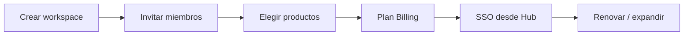

# Hub — Workspace identity y administración

> **Julio 2026** · El Hub es el sistema operativo de Dakinis, no un launcher.  
> Arquitectura → [`ARCHITECTURE.md`](./ARCHITECTURE.md#arquitectura-visual) · Estado → [`STATUS.md`](./STATUS.md) · SQL → [`supabase/migrations/031_workspace_super_admin.sql`](./supabase/migrations/031_workspace_super_admin.sql)

---

## Visión

**Inspirado en** la experiencia de Microsoft 365, Zoho One y Atlassian Cloud: el usuario entra al Hub y desde ahí gestiona su empresa, no solo abre apps.

Arquitectónicamente el patrón es similar; comercialmente Dakinis es plataforma PYME en fase piloto — ver [`company/STRATEGY.md`](./company/STRATEGY.md).

### Ciclo del workspace



SQL y admin UI → migr. `031` · journey → [`company/CUSTOMER-JOURNEY.md`](./company/CUSTOMER-JOURNEY.md).

### UX Hub (prioridades)

1. **Mi día** primero — widgets con datos reales del Internal API.
2. **Acciones recomendadas** — tareas (pedidos, stock, notificaciones), no solo KPIs.
3. **Copilot global** + Ctrl+K — búsqueda unificada.
4. El Hub es **sistema operativo**, no launcher de apps.

Diagrama completo → [`ARCHITECTURE.md` §4–5](./ARCHITECTURE.md#4-experiencia-hub).

**Regla:** identidad de workspace vive en **Hub + schema `meta`**, no en Core, Billing ni Auth.

Core sigue siendo producto ERP; `core.tenants` se enlaza vía `meta.workspaces.core_tenant_slug` hasta cutover.

---

## Dos niveles de administración

| Nivel | Quién | Dónde | Para qué |
|-------|-------|-------|----------|
| **Workspace Admin** | Owner/admin del cliente | `hub.dakinissystems.com/admin` | Miembros, roles, plan, productos, uso |
| **Super Admin** | Equipo Dakinis (`is_super_admin`) | `admin.dakinissystems.com` (futuro) | Todos los workspaces, revenue, ops, flags |

---

## Hub Workspace Admin — Nivel 1 (piloto)

Rutas UI propuestas en Hub (`/admin`):

```
/hub/admin
├── /dashboard      # Usuarios activos, productos usados, storage, IA
├── /members        # Lista · invitar · cambiar rol · eliminar
├── /plan           # Plan actual · portal Billing · facturas
├── /products       # Activar/desactivar Core, LifeFlow, SA, etc.
├── /integrations   # Coming soon (Slack, Calendar, Zapier…)
├── /api-keys       # Nivel 2
├── /webhooks       # Nivel 2
├── /ai-usage       # Consumo y coste IA del workspace
├── /audit          # Timeline acciones del workspace
└── /settings       # Nombre, logo, danger zone
```

### API (Internal API — migr. 031)

Contrato: [`contracts/admin-api.json`](./contracts/admin-api.json)

| Método | Ruta | Función |
|--------|------|---------|
| GET | `/internal/workspaces/:id` | Detalle workspace |
| GET | `/internal/workspaces/:id/members` | Miembros |
| POST | `/internal/workspaces/:id/members/invite` | Invitar por email |
| PATCH | `/internal/workspaces/:id/members/:userId/role` | Cambiar rol |
| GET | `/internal/workspaces/:id/usage` | Métricas uso |
| GET/PUT | `/internal/workspaces/:id/products` | Productos activos |

### Roles

| Rol | Permisos |
|-----|----------|
| `owner` | Todo + transferir ownership |
| `admin` | Miembros, productos, plan (no eliminar workspace) |
| `member` | Usar productos contratados |
| `viewer` | Solo lectura |

### Diferenciador vs competencia

**Productos a la carta:** el admin activa solo lo que contrata. El copilot conoce qué productos tiene el workspace.

---

## Hub — Centros transversales (post-piloto)

Estos módulos viven en Hub, no dispersos en productos:

| Centro | Contenido | Prioridad |
|--------|-----------|-----------|
| **Notificaciones** | Facturación, invitaciones, errores, copilot, sistema | 🟠 |
| **Ayuda** | Docs, tutoriales, estado sistema, reportar error, roadmap | 🟠 |
| **Workspace Health** | Backup, usuarios, facturación, dominio, API, IA, storage | 🟡 |
| **Centro IA** | Conversaciones, prompts, agentes, conocimiento, consumo | 🟡 |
| **Integraciones** | Slack, Teams, Discord, Zapier, Calendar, GitHub… (Coming Soon) | 🟡 |
| **Marketplace** | Apps, plantillas, automatizaciones, conectores, temas | 🔵 |

---

## Super Admin — Panel de operaciones

UI futura: `admin.dakinissystems.com` · Auth: `is_super_admin` o `role = platform_admin`.

### Nivel 1 — Operacional (5+ clientes)

| Módulo | Funciones |
|--------|-----------|
| **Panorama** | Workspaces totales, usuarios, trials, alertas |
| **Workspaces** | Listar, filtrar, detalle, suspender/activar |
| **Billing global** | MRR, facturas, webhooks fallidos (sync Stripe) |
| **Sistema** | Health servicios, Redis/BullMQ, DLQ |
| **Auditoría** | Timeline global (`meta.audit_logs`) |
| **Feature flags** | Global + por workspace + por plan |

### Nivel 2 — Ops avanzadas

| Módulo | Funciones adicionales |
|--------|----------------------|
| **Customer Success** | Health scores, tickets, riesgo churn, onboarding |
| **Revenue** | ARR, churn, ARPU, trials, renovaciones |
| **Jobs** | Colas BullMQ, retry, DLQ, tiempo medio |
| **API Explorer** | Últimas llamadas, errores, rate limits |
| **Costes** | Railway, Supabase, OpenAI, coste por workspace/producto |
| **Incidents** | Crear incidencia, timeline, comunicar a clientes |
| **Usuarios globales** | Buscar, impersonar, reset password, suspender |

### Nivel 3 — Escala empresarial

- Onboarding tenants (manual/aprobación/plantillas)
- RBAC custom para equipo ops
- White-label / branding por workspace enterprise
- Partner/reseller dashboard
- GDPR export jobs

### API Super Admin (Internal API)

| Método | Ruta |
|--------|------|
| GET | `/internal/admin/v1/overview` |
| GET | `/internal/admin/v1/workspaces` |
| GET | `/internal/admin/v1/workspaces/:id` |
| POST | `/internal/admin/v1/workspaces/:id/suspend` |
| POST | `/internal/admin/v1/workspaces/:id/activate` |
| GET | `/internal/admin/v1/billing/dashboard` |
| GET | `/internal/admin/v1/audit` |
| GET/PATCH | `/internal/admin/v1/features/:key` |

Pendiente: impersonación JWT, refund manual, simular webhook Stripe, flush cache Redis.

---

## Schema `meta` (migr. 031)

| Tabla | Uso |
|-------|-----|
| `workspaces` | Identidad Hub (enlaza `core_tenant_slug`) |
| `workspace_members` | Miembros y roles |
| `workspace_invites` | Invitaciones con token |
| `workspace_products` | Productos activos por workspace |
| `audit_logs` | Timeline platform |
| `feature_flags` | Rollout global/tenant/plan (extiende 024) |
| `subscriptions` / `invoices` | Cache Stripe para dashboard |
| `incidents` / `incident_updates` | Gestión incidencias |
| `customer_contacts` / `customer_health_scores` | Customer success |
| `api_keys` / `webhooks` / `webhook_logs` | Integraciones |
| `export_jobs` | GDPR / backup |
| `ai_usage` | Coste IA por workspace |

Funciones: `meta.is_super_admin`, `meta.is_workspace_admin`, `meta.log_audit`, `meta.get_active_workspace`.

---

## Priorización estratégica (ambos feedbacks)

### 🔴 Antes del piloto (no UI nueva masiva)

1. Billing E2E live
2. Hub SSO E2E
3. Primer cliente piloto

### 🟠 Con piloto (semana 2–4)

4. ~~Aplicar migr. **031**~~ ✅ prod jul 2026
5. **Validar Hub Admin Nivel 1** con piloto (miembros + plan + productos + portal Billing)
6. Centro notificaciones unificado

### 🟡 Post-piloto (5+ clientes)

7. Super Admin Nivel 1 (overview, workspaces, billing, audit)
8. Feature flags por workspace
9. Workspace Health + Centro IA
10. Integraciones (Coming Soon UI)

### 🔵 Con ingresos recurrentes

11. Marketplace
12. Revenue dashboard completo (MRR/ARR/churn)
13. Costes por workspace
14. Customer Success cockpit

---

## Comparativa mercado

| Plataforma | Similitud con Dakinis Hub |
|------------|---------------------------|
| Microsoft 365 | ⭐⭐⭐⭐⭐ |
| Zoho One | ⭐⭐⭐⭐⭐ |
| Atlassian Cloud | ⭐⭐⭐⭐ |
| HubSpot | ⭐⭐⭐⭐ |
| Salesforce | ⭐⭐⭐⭐ |
| Odoo | ⭐⭐⭐ (ERP clásico, no ecosistema) |

**Conclusión:** Dakinis se posiciona como ecosistema multi-producto con IA integrada, orientado a PYMEs españolas — no como ERP monolítico ni como "el nuevo Microsoft 365".

Integraciones y Marketplace → Q4+ bajo demanda · ver [`ROADMAP.md`](./ROADMAP.md).

---

## Pregunta guía

*¿Qué necesita un cliente para pagar este mes?*

→ Billing E2E + Hub demo fluido + Dakinis One vendible.  
Hub Admin Nivel 1 es **condición necesaria** para que un negocio use la plataforma con equipo.  
Super Admin puede esperar hasta 5 clientes (Supabase Studio + Stripe Dashboard bastan para el piloto).

---

*Actualizar al lanzar UI admin en Hub o al cerrar hitos de workspace.*
