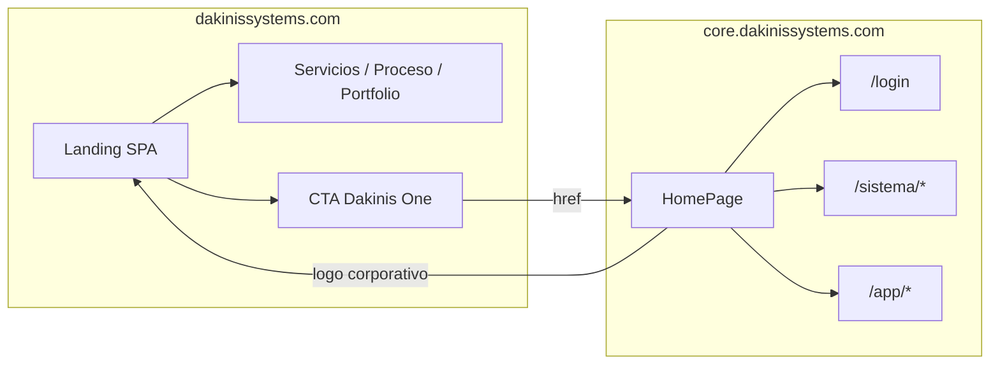

# Estructura Landing vs Core — unificación

> **Actualizado:** 19 mayo 2026  
> Comparativa de `apps/landing` (corporativo) y `platform/core/web` (Dakinis One) para decidir si conviene unificar y cómo.

Referencias: [`ARCHITECTURE.md`](./ARCHITECTURE.md) · [`docs/legal/README.md`](./legal/README.md) · [`DAKINIS-HUB-VISION.md`](./DAKINIS-HUB-VISION.md)

---

## Resumen ejecutivo

| | **Landing** | **Core (web)** |
|---|-------------|----------------|
| **Repo** | `dakinis-landing` | `dakinis-core` (workspace `@dakinis/web`) |
| **Carpeta** | `apps/landing/` | `platform/core/web/` |
| **Dominio prod** | `https://dakinissystems.com/` | `https://core.dakinissystems.com/` |
| **Propósito** | Agencia / desarrollo a medida (marca **Dakinis Systems**) | Producto **Dakinis One** (SaaS, demos, tenant, API) |
| **Router** | Sin librería; `popstate` + mapa legal | `react-router-dom` v7 |
| **Estilos** | Tailwind CSS v4 | `styles.css` (CSS propio, sin Tailwind) |
| **API / sesión** | No | Sí (`SessionContext`, proxy `/api`, JWT) |
| **Dependencias** | Solo React 19 | React + `@dakinis/shared`, Sentry, Quagga, ZXing, router |

Hoy son **dos SPAs independientes** enlazadas por URL (`VITE_CORE_APP_URL` ↔ `VITE_MARKETING_SITE_URL`), no por código compartido en runtime.

---

## Estructura Landing (`apps/landing`)

### Árbol relevante

```
apps/landing/
├── public/                    # estáticos auxiliares
├── src/
│   ├── main.jsx               # entrada (LanguageProvider en App)
│   ├── App.jsx                # router manual: legal vs LandingPage
│   ├── LandingPage.jsx        # ~una página, todas las secciones
│   ├── index.css              # @import "tailwindcss"
│   ├── config/
│   │   └── product-urls.js    # URLs Core, SA, AkoeNet
│   ├── context/
│   │   └── LanguageContext.jsx
│   ├── i18n/
│   │   ├── translations.js    # ES/EN marketing
│   │   └── legal-content.js   # textos legales landing
│   └── pages/
│       └── LegalDocumentPage.jsx
├── Logo *.jpeg / *.png        # assets en raíz del repo (import en Vite)
├── index.html
├── vite.config.js             # mínimo (solo plugin React)
├── tailwind.config.js
├── postcss.config.js
└── package.json               # name: dakinis-systems-landing
```

### Rutas (comportamiento)

| Path | Componente |
|------|------------|
| `/` | `LandingPage` (scroll por anclas `#servicios`, `#contacto`, …) |
| `/privacidad`, `/privacy` | Legal → `privacy` |
| `/aviso-legal`, `/legal` | Legal → `notice` |
| `/cookies` | Legal → `cookies` |

No hay `/login`, `/faq` ni rutas de producto.

### Secciones de contenido (`LandingPage`)

1. Header sticky + i18n ES/EN  
2. Hero (CTA contacto / servicios)  
3. `#no-desde-cero` — ventaja (rápido, ecosistema, escala)  
4. `#dakinis-one` — enlace externo a **Core** (`DAKINIS_URL_CORE`)  
5. `#servicios` — web, backend, automatización, DevOps  
6. `#proceso` — descubrimiento, construcción, escalado  
7. `#trabajos` — AkoeNet, StreamAutomator (logos + URLs)  
8. `#contacto` — email / WhatsApp  

**Audiencia:** cliente que busca **desarrollo custom** y conoce el portfolio.

### Build y deploy

- `npm run build` → `dist/` estático.  
- Variables: `VITE_LANDING_SITE_URL`, `VITE_CORE_APP_URL`, `VITE_STREAMAUTOMATOR_SITE_URL`, `VITE_AKOENET_SITE_URL` (`.env.example`).  
- Sin proxy API; despliegue típico: dominio raíz corporativo.

---

## Estructura Core web (`platform/core/web`)

### Árbol relevante (simplificado)

```
platform/core/                 # monorepo npm workspaces
├── shared/                    # @dakinis/shared (catálogos, adapters, plan-modules)
├── api/                       # Core API (no es parte del bundle Vite)
└── web/                       # @dakinis/web
    ├── public/
    ├── styles.css             # ~2500 líneas, tema Dakinis One
    ├── serve-production.mjs   # sirve dist + opcional proxy API
    ├── vite.config.js         # alias @dakinis/shared, proxy /api
    └── src/
        ├── main.jsx           # Locale + Session + Sentry
        ├── App.jsx            → AppRouter
        ├── router/
        │   ├── AppRouter.jsx      # rutas declarativas + Shell (TopBar/Footer)
        │   └── LegacyPathRoutes.jsx  # /sistema/*, /vista/*, /alergenos/*
        ├── pages/
        │   ├── HomePage.jsx       # marketing PRODUCTO (solapamiento con landing)
        │   ├── LoginPage.jsx
        │   ├── SystemPage.jsx     # Mi negocio
        │   ├── VistaMockupPage.jsx
        │   ├── PlatformAdminPage.jsx
        │   ├── PublicAllergiesPage.jsx
        │   └── StaticInfoPages.jsx  # faq, privacy, terms, legal
        ├── app/                   # /app/dashboard, crm, messages, settings
        ├── components/            # restaurante, supply, topbar, …
        ├── mockups/               # paneles por vertical
        ├── config/                # brand, contact, product-urls, marketing
        ├── context/               # LocaleContext, SessionContext
        ├── locales/               # es.js, en.js, legal-core.js, systemPages.*
        └── services/              # api, auth, crm, appointments, …
```

### Rutas (`AppRouter` + `LegacyPathRoutes`)

| Grupo | Rutas | Uso |
|-------|--------|-----|
| **Marketing / producto** | `/` | `HomePage` — hero Dakinis One, precios, módulos, demos |
| **Auth** | `/login` | Login tenant / admin |
| **App** | `/app/dashboard`, `/app/crm`, `/app/messages`, `/app/settings` | Módulos JWT |
| **Tenant** | `/sistema/:vertical` | Mi negocio |
| **Mockup** | `/vista/:vertical` | Maquetas panel |
| **Público** | `/alergenos/:slug` | Cartel alérgenos |
| **Plataforma** | `/admin` | Platform admin |
| **Legal / info** | `/privacy`, `/terms`, `/legal`, `/faq` | `StaticInfoPages` (estilos Core) |
| **Fallback** | `*` | `LegacyPathRoutes` repite lógica vertical/alérgenos |

Shell común: `AppTopBar` + `AppFooter` en casi todas las rutas (incluido home).

### Secciones de `HomePage` (marketing dentro de Core)

1. Hero — Dakinis One, citas, CRM, WhatsApp; CTA presupuesto + **login** + ver demos  
2. `#modulos` — switcher verticales → `/sistema/*` y `/vista/*`  
3. `#precios` — packs MVP / Pro / Advanced + mantenimiento (`pricingCatalog.js`)  
4. `#contact` — contacto producto  
5. Ribbon demo tenant (si sesión seed)  

**Audiencia:** usuario que evalúa **el producto SaaS** o entra como tenant demo.

### Enlace con Landing

En `AppTopBar`, el logo corporativo apunta a **`DAKINIS_MARKETING_SITE_URL`** (`https://dakinissystems.com/`). El título «Dakinis One» navega a **`/`** de Core.

Landing enlaza a Core solo en la sección **Dakinis One** (`DAKINIS_URL_CORE`).

### Build y deploy

- Parte de `dakinis-core`: `npm run build` en raíz del monorepo → `web/dist/`.  
- `VITE_*` para Sentry, API, marketing URL; proxy dev `/api` → puerto API.  
- CORS API: `https://core.dakinissystems.com` (ver `railway.env.example`).

---

## Solapamientos y diferencias

### Contenido duplicado (conceptual)

| Tema | Landing | Core `HomePage` |
|------|---------|-----------------|
| Marca / hero | Dakinis Systems, software a medida | Dakinis One, scheduler + CRM + WhatsApp |
| Dakinis One | Bloque corto + link a Core | Producto central + demos + precios |
| Proyectos | AkoeNet, StreamAutomator | Verticales + mockups (clínica, restaurante, …) |
| Contacto | Email / WhatsApp | Email / WhatsApp + formulario producto |
| i18n ES/EN | `LanguageContext` propio | `LocaleContext` + `locales/es|en.js` |
| Legal | Rutas `/privacidad`, `/cookies`, … | Rutas `/privacy`, `/terms`, … |

### Diferencias que impiden “copiar y pegar”

| Aspecto | Landing | Core |
|---------|---------|------|
| **CSS** | Tailwind utility | Clases `.hero`, `.modules`, `.btn`, … |
| **Legal** | `i18n/legal-content.js` | `locales/legal-core.js` + fuente `docs/legal/*` |
| **Rutas legales** | ES + EN aliases (`/aviso-legal`) | Inglés canónico (`/legal`, `/privacy`) |
| **Estado** | Stateless | JWT en `localStorage`, guards admin |
| **Peso bundle** | ~ligero | + shared, Sentry, escáner, mockups |

### Fuente de verdad legal (ya documentada)

[`docs/legal/README.md`](./legal/README.md): plantillas en `docs/legal/*.md` y `company.json`; cada app tiene su **copia** en JS (no importan el markdown en build).

---

## Diagrama de flujo actual (usuario)



- **SEO / marca:** dominio raíz = agencia.  
- **Producto / tenant:** subdominio Core.  
- **Riesgo:** dos homes con mensajes distintos; el usuario puede no entender la relación Systems vs One.

---

## ¿Se pueden unificar?

**Sí, de varias formas**; ninguna es obligatoria. La arquitectura multi-repo actual **no lo impide**.

### Opción A — Mantener dos dominios (recomendado a corto plazo)

**Qué hacer:** paquete compartido (p. ej. en `@dakinis/shared` o nuevo `@dakinis/marketing`):

- `product-urls.js` (una sola implementación)  
- textos legales generados o importados desde `docs/legal/`  
- logos / `company.json`  

**Pros:** cero riesgo en prod; despliegues independientes; Landing sigue ultraligera.  
**Contras:** dos builds; hay que sincronizar copy manualmente hasta extraer el paquete.

### Opción B — Un solo SPA en Core (Landing absorbida)

**Qué hacer:**

1. Mover secciones de `LandingPage.jsx` a `web/src/pages/CorporatePage.jsx` (o rutas `/empresa`, `/servicios`).  
2. En `dakinissystems.com`, **redirigir** a Core (`/` corporativo) o servir el **mismo** `dist` de Core con `VITE_APP_MODE=corporate`.  
3. Opcional: Tailwind solo en rutas corporativas (`@tailwindcss/vite`) o reescribir secciones con `styles.css`.

**Pros:** un router, un i18n, un deploy front si se desea.  
**Contras:** bundle Core más pesado en la home corporativa; mezcla audiencia agencia vs tenant; CORS y cookies solo en un origen si unificas dominio.

### Opción C — Un solo dominio, paths separados (gateway o CDN)

| URL | Sirve |
|-----|--------|
| `dakinissystems.com/` | `dist` landing (estático) |
| `dakinissystems.com/app/` o `one.` | `dist` Core |

Configuración en **Cloudflare / nginx / Railway** (dos servicios, un dominio). Código puede seguir en dos repos.

**Pros:** una marca URL; Landing ligera en `/`.  
**Contras:** dos artefactos y reglas de routing; paths `/login` no colisionen.

### Opción D — Landing como única home; Core solo subdominio producto

Invertir narrativa: `dakinissystems.com` = solo corporativo (como ahora); **quitar** marketing largo de `HomePage` y dejar en Core solo login + redirect a Hub/`/sistema` (home mínima).

**Pros:** mensajes claros; Core más enfocado en producto.  
**Contras:** pierdes precios/demos en Core sin login (hay que moverlos a Landing o Hub).

---

## Matriz de decisión

| Criterio | A (separados + shared pkg) | B (un SPA Core) | C (un dominio, dos dist) | D (Core sin marketing) |
|----------|----------------------------|-----------------|--------------------------|-------------------------|
| Esfuerzo inicial | Bajo | Alto | Medio (infra) | Medio |
| Riesgo prod | Mínimo | Medio-alto | Bajo | Medio |
| Bundle landing | Mínimo | N/A | Mínimo | Mínimo |
| SEO corporativo | Excelente en raíz | Depende redirect | Excelente | Excelente |
| Hub / SaaS futuro | Core sigue siendo app | Natural en un repo | Igual que A | Muy alineado con Hub |
| Duplicación copy | Media → baja con pkg | Baja | Media | Baja en producto |

**Recomendación práctica (mayo 2026):**

1. **Corto plazo:** Opción **A** + alinear rutas legales (redirects `/privacidad` → `/privacy` en gateway si unificas dominio más tarde).  
2. **Si avanzas Dakinis Hub:** Opción **D** o **B** parcial — home de Core = login/Hub, corporativo solo en Landing o en `/empresa` dentro de Core.  
3. **No fusionar repos** hasta tener paquete compartido de URLs + legal; evita arrastrar Tailwind a todo Core sin plan.

---

## Pasos concretos si unificas (checklist técnico)

### Fase 1 — Sin mover dominios

- [ ] Extraer `product-urls.js` a `@dakinis/shared` (o copia única exportada).  
- [ ] Script que valide que `company.json` y textos legales coinciden entre `legal-content.js` y `legal-core.js`.  
- [ ] Documentar en README landing y core el rol de cada dominio (este doc).

### Fase 2 — UX coherente

- [ ] Misma nomenclatura: «Dakinis Systems» vs «Dakinis One» en ambos heroes.  
- [ ] CTA landing → `https://core.dakinissystems.com/login` (opcional) además de home.  
- [ ] Footer Core: enlaces a legal **corporativo** en dominio raíz o mismas rutas con redirects.

### Fase 3 — Unificación (solo si eliges B o C)

- [ ] Decidir: ¿Tailwind en Core o reescribir landing a `styles.css`?  
- [ ] Migrar `LandingPage` → componentes bajo `web/src/marketing/`.  
- [ ] Ajustar `AppRouter`: ruta pública sin `SessionProvider` pesado en `/` corporativo (opcional split).  
- [ ] Un build o dos con `VITE_ENTRY` / multi-page Vite.  
- [ ] Actualizar `CORS_ORIGIN`, Sentry, uptime (dos URLs → una).

---

## Referencias rápidas

| Archivo | Rol |
|---------|-----|
| `apps/landing/src/LandingPage.jsx` | UI corporativa completa |
| `apps/landing/src/App.jsx` | Router legal manual |
| `platform/core/web/src/pages/HomePage.jsx` | UI producto + precios + demos |
| `platform/core/web/src/router/AppRouter.jsx` | Router principal |
| `platform/core/web/src/components/AppTopBar.jsx` | Enlace → landing |
| `apps/landing/src/config/product-urls.js` | URLs salientes |
| `platform/core/web/src/config/product-urls.js` | `DAKINIS_MARKETING_SITE_URL` |
| `docs/legal/company.json` | URLs oficiales prod |
