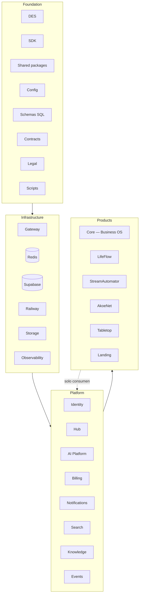
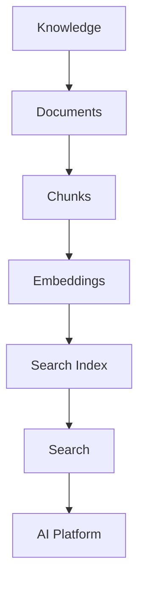

# Dakinis Systems — Platform Status & Roadmap

> **Documentación v2** · julio 2026 · sustituye `ROADMAP.md` y los `*-TEMP.md`.  
> Referencia estable: [ARCHITECTURE.md](./ARCHITECTURE.md) · [PRODUCTS.md](./PRODUCTS.md) · [OPERATIONS.md](./OPERATIONS.md) · [GITHUB-ORG.md](./GITHUB-ORG.md) · [adr/](./adr/) · [legal/](./legal/) (cliente)

**Leyenda:** ✅ hecho · 🔄 en progreso · ⬜ pendiente · 🟢 activo · 🟡 beta/MVP

**Gobernanza:** este documento concentra estado, roadmap, ops y checklists. Cuando supere ~800 líneas útiles, extraer **solo** checklists Railway/Stripe a `OPERATIONS.md` y dejar aquí estado + roadmap. La [tabla de ecosistema](#estado-del-ecosistema) es el punto de entrada obligatorio.

### Valoración arquitectura (jul 2026)

| Área | Nota |
|------|------|
| Arquitectura | 10/10 |
| Separación Platform / Products | 10/10 |
| Railway | 10/10 |
| Supabase | 9.9/10 |
| Documentación | 10/10 |
| Escalabilidad | 10/10 |
| IA | 9.8/10 |
| UX / DES | 9.8/10 |

**Conclusión:** la arquitectura está **prácticamente consolidada**. A partir de aquí el foco es **ejecución del roadmap** (cerrar hitos), no ampliar capas salvo necesidad real. Ver [§ Enfoque estratégico](#enfoque-estratégico).

---

## Estado del ecosistema

Vista en <1 min antes de entrar en detalle.

| Producto / servicio | Estado | Prod | BD | Responsable | Próximo hito |
|---------------------|--------|------|-----|-------------|--------------|
| **Core** (Business OS) | 🟢 Activo | Sí | Supabase `dakinis_core_prod` | Christian | E2E billing · redeploy `efbe6ee` |
| **LifeFlow** | 🟡 Beta | Sí | SQLite + `lifeflow` PG | Christian | Cutover SQLite completo ⬜ |
| **Tabletop** | 🟡 MVP | Sí | SQLite (volume) | Christian | Migración Supabase |
| **StreamAutomator** | 🟢 Activo | Sí | Supabase `stream` | Christian | Métricas · event bus |
| **AkoeNet** | 🟡 Desarrollo | Sí | Supabase / legacy | Christian | Schema `akoenet` completo |
| **Hub** | 🟢 Activo | Sí | Supabase `hub` | Christian | SSO smoke live (3 productos) |
| **AI Platform** | 🟡 Beta | Sí | Supabase `ai` | Christian | `OPENAI_API_KEY` prod · advisor Live |
| **Billing** | 🟢 Activo | Sí | Supabase `billing` | Christian | Webhook Stripe 200 · checkout live |
| **Identity** (Auth) | 🟢 Activo | Sí | Supabase `dakinis_auth` | Christian | — |
| **Notifications** | 🟡 Scaffold | Sí | Redis + Supabase `hub` | Christian | email Resend · inbox v1 |
| **Search** | 🟡 Scaffold | Sí | Redis (+ pgvector ⬜) | Christian | pgvector · index productos |
| **Knowledge** | 🟢 Activo | Sí | Supabase `knowledge` | Christian | RAG PDF masivo · Ctrl+K JWT smoke ⬜ |
| **Landing** | 🟢 Activo | Sí | — | Christian | Funnel One-first |

**Prioridad plataforma (julio 2026):** Billing E2E Live · Core redeploy Ctrl+K (`efbe6ee`) · Hub SSO smoke · LifeFlow cutover SQLite.

---

## Modelo de capas

**Cuatro capas** — no mezclar Foundation con Infrastructure ni Platform con Products.



| Capa | Qué es | Ejemplos |
|------|--------|----------|
| **Foundation** | Código y artefactos compartidos — no runtime | DES, `@dakinis/sdk`, `packages/shared-*`, `docs/contracts/`, `docs/supabase/`, `docs/adr/`, `scripts/` |
| **Infrastructure** | Runtime, datos, red, observabilidad | Gateway, Redis, Supabase, Railway, Storage, Sentry |
| **Platform** | Servicios compartidos que consumen los productos | Identity, Hub, AI, Billing, Notifications, Search, Knowledge, Events |
| **Products** | Aplicaciones de negocio con BD aislada | Core, LifeFlow, StreamAutomator, AkoeNet, Tabletop, Landing |

### Foundation (detalle)

```
Foundation
├── DES (@dakinis/shared-brand · shared-ux · shared-layouts)
├── SDK (@dakinis/sdk)
├── Shared (shared-ai · shared-icons · shared-charts)
├── Config (railway.env.example · product-urls)
├── Schemas (docs/supabase/migrations/)
├── Contracts (docs/contracts/*.json)
├── Legal (docs/legal/)
├── ADR (docs/adr/)
└── Scripts (sync-hub-des.ps1 · push-dakinis-shared.ps1)
```

Sync DES: `node scripts/sync-des-packages.mjs` · Hub: `.\scripts\sync-hub-des.ps1` · push: `.\scripts\push-dakinis-shared.ps1`

---

## Infrastructure

Componentes transversales — **no** son productos.

| Componente | Rol | Estado |
|------------|-----|--------|
| **Gateway** | Proxy único · JWT (`/_auth_check`) · rate limit · CORS | ✅ `api.dakinissystems.com` |
| **Redis** | Cache · colas · event bus BullMQ | ✅ Railway plugin · `DAKINIS_EVENT_BUS=bullmq` |
| **Supabase** | PostgreSQL multi-schema · pooler `:6543` | 🔄 ver [§ Supabase](#supabase) |
| **Railway** | Contenedores · 22+ servicios | ✅ Fase 1 |
| **Storage** | Assets · media · documentos · exports | ⬜ Supabase Storage / R2 |
| **Observability** | Logs · metrics · tracing · health | 🔄 Sentry cableado · ⬜ alertas |

### Gateway (prefijos)

`/auth/` · `/core/` · `/finance/` · `/billing/` · `/notifications/` · `/search/` · `/ai/` · `/internal/` · StreamAutomator · AkoeNet

Config: [`gateway/routes/default.conf`](../gateway/routes/default.conf)

### Storage

```
Storage
├── Assets (DES, Landing, Hub logos)
├── Media (SA, AkoeNet, Core)
├── Documents (LifeFlow, Knowledge, Core)
├── Exports (LifeFlow, Core, Tabletop)
├── Backups (roadmap)
├── Temporary (uploads, OCR staging)
├── Public (CDN, favicons)
└── Private (tenant-scoped)
```

Consumidores prioritarios: **LifeFlow** · **Tabletop** · **Core** · **Knowledge**

### Observability

```
Observability
├── Logs (Railway · structured JSON)
├── Metrics (roadmap)
├── Tracing (Sentry traces)
├── Queues (Redis monitoring)
├── Costs (IA metering · Railway)
└── Health checks (/health por servicio)
```

---

## Platform

Los **productos solo consumen** la plataforma vía Gateway o Internal API. No duplican Auth, Billing ni AI.

### Internal services (consumo)

```
Products
    ↓
Gateway (api.dakinissystems.com)
    ↓
┌─────────┬─────────┬───────────────┬────────┬───────────┬──────────┐
│Identity │ Billing │ Notifications │ Search │ Knowledge │ Storage  │
└─────────┴─────────┴───────────────┴────────┴───────────┴──────────┘
    ↓
Internal API (/internal/) — ✅ Railway dakinis-internal-api · Hub usa DNS privado :4083
```

Mirror local Internal API: [`internal/`](../internal/) · contratos: [`contracts/`](./contracts/)

---

### Identity

> Auth evoluciona a **Identity** — login es solo una faceta.

```
Identity
├── Auth (login · JWT · refresh)
├── Sessions
├── RBAC
├── Organizations
├── Invitations
├── API Keys
├── Service Accounts
├── OAuth / IdP
└── Audit Login
```

| | |
|---|---|
| **Repo** | `dakinis-auth` |
| **Dominio** | `auth.dakinissystems.com` |
| **Schema** | `dakinis_auth` (owner: Identity) |
| **Estado** | ✅ prod |

Multi-tenant · JWT · refresh · RBAC · `/_auth_check` para gateway · hub-sso para productos.

**Ops / Sentry:** `JAVASCRIPT-REACT-7` — JSON inválido → **400** (`87faa63`). `JAVASCRIPT-REACT-5` — `auth_login_failed` 401 (credenciales incorrectas) ya no se envía a Sentry; solo log estructurado + excepciones 5xx.

### Checklist revisión arquitectura v2

Mapa de las 17 mejoras documentadas en este archivo:

| # | Mejora | Sección |
|---|--------|---------|
| 1 | Capa **Foundation** | [Modelo de capas](#modelo-de-capas) · [Foundation (detalle)](#foundation-detalle) |
| 2 | **Identity** (evolución Auth) | [Identity](#identity) |
| 3 | Diagrama Knowledge → Search → AI | [Knowledge](#knowledge) |
| 4 | Árbol Billing ampliado | [Billing](#billing) |
| 5 | Árbol Hub ampliado | [Hub](#hub) |
| 6 | AI Runtime multi-provider | [AI Platform](#ai-platform) |
| 7 | Storage ampliado | [Storage](#storage) |
| 8 | Events ampliado | [Events (Event bus)](#events-event-bus) |
| 9 | Railway + columna **Lifecycle** | [Railway — mapa de servicios](#railway--mapa-de-servicios) |
| 10 | Supabase **Ownership** | [Schemas — ownership](#schemas--ownership) |
| 11 | **ADRs** | [`docs/adr/`](./adr/) |
| 12 | Matriz dependencias | [Matriz de dependencias](#matriz-de-dependencias-platform) |
| 13 | Release strategy | [Release strategy](#release-strategy) |
| 14 | Quality | [Quality](#quality) |
| 15 | Security | [Security](#security) |
| 16 | API versioning | [API versioning](#api-versioning) |
| 17 | Roadmap + prioridad | [Prioridad ejecutiva](#prioridad-ejecutiva-julio-2026) · [Enfoque estratégico](#enfoque-estratégico) |

---

### Hub

| | |
|---|---|
| **Repo** | [`dakinis-hub`](https://github.com/dakinissystems/dakinis-hub) |
| **Dominio** | `hub.dakinissystems.com` |
| **Schema** | `hub` · `hub.v1_get_dashboard` · `hub.v1_get_user_hub_products` |
| **Versión prod** | **v0.2.1** (`83c9c75`) — ver desglose abajo |
| **Internal API** | v0.3.1 — dashboard widgets · acceso tenant · **DLQ monitor BullMQ** |

**Estado:** ✅ «Mi día» prod · IdP login · launcher con **logos reales por producto** · widgets «Ver» · filtro apps/widgets por tenant · Supabase `028`/`029` ✅ prod.

Orden UX (objetivo):

```
Hub
├── My Day
├── Notifications
├── Timeline
├── Command Palette
├── Quick Actions
├── Widgets
├── Apps
└── Marketplace (roadmap)
```

Hoy en prod: Mi día → Agenda → Notificaciones → Actividad → IA → Salud → Widgets → Apps.

#### v0.2.1 — entregado (jul 2026)

| Área | Commit / artefacto | Qué hace |
|------|-------------------|----------|
| Launcher Tabletop | `0ac2090` · `dakinisBuildHubAppLaunchUrl` | URL `tabletop.dakinissystems.com` (ya no rebota al Hub) |
| Widgets «Ver» | `825c364` · `hub-widget-actions.js` | Scroll a sección o abrir producto |
| Widgets con datos | `a03bf1a` · migr. `028` | `hub.v1_get_dashboard` ampliado · `buildWidgetValues` |
| Acceso por tenant | `579f0e0` · `d92ed96` · migr. `029` | `hub.tenant_product_access` · super-admin plataforma |
| Panel Core admin | `6bdcd94` · `PlatformHubAccessPanel` | PATCH `/api/platform/businesses/:id/hub-products` |
| Logos apps | `83c9c75`+ · `hub-product-logos` | PNG oficiales por producto en `HubProductIcon` |

**Regla deploy Hub:** `.\scripts\sync-hub-des.ps1` → `npm run build` → commit `packages/` + `src/` juntos (Dockerfile copia `hub/packages/`, no el monorepo).

#### App launcher (SSO por producto)

| App | Logo | Estrategia | Comportamiento |
|-----|------|------------|----------------|
| Dakinis One | `core.png` | `core-session` | Login en Core (sesión propia) |
| LifeFlow | `lifeflow.png` | `idp-exchange` + `/auth/hub-sso` | ✅ Entrada logueada (provisiona usuario) |
| StreamAutomator | `streamautomator.png` | `idp-exchange` + `/api/auth/hub-sso` | ✅ código `f18725b` · smoke live ⬜ |
| AkoeNet | `akoenet.png` | `idp-exchange` + `/auth/hub-sso` | ✅ código · smoke live ⬜ |
| Tabletop | `tabletop.png` | `sso: none` → URL directa | `tabletop.dakinissystems.com` |

Assets: [`packages/shared-brand/assets/hub-logos/`](../packages/shared-brand/assets/hub-logos/) · mapa en `hub-product-logos.js`.

#### Acceso Hub por tenant

- Nuevos tenants: solo **Core** en launcher hasta que platform admin habilite más.
- Super-admin plataforma: `christiandvillar@gmail.com` o `role = platform_admin` → todos los productos.
- Core: **Platform → negocio → Hub products** (`PlatformHubAccessPanel`).
- Internal API filtra `apps` y widgets según `enabledProducts` del dashboard.

#### Ops pendientes Hub

| Tarea | Estado |
|-------|--------|
| SQL Editor: migr. `028` + `029` | ✅ prod |
| Core Back: `DAKINIS_INTERNAL_API_URL` + `DAKINIS_INTERNAL_SERVICE_KEY` | ⬜ verificar prod |

---

### AI Platform

**Principio:** motores **deterministas** (LifeFlow Engine, Core analytics) + **LLM** (narrativa, síntesis). El LLM no calcula score ni patrimonio; usa tools con números verificables.

```
AI Platform
├── AI Runtime (roadmap multi-provider)
│   ├── OpenAI (hoy)
│   ├── Gemini · Claude · Ollama · Azure · Custom
├── LLM (gateway /v1/chat)
├── Agents (registry: Core, LifeFlow, SA, AkoeNet, Hub)
├── Knowledge ← consume RAG sources (servicio aparte)
├── Vision · Speech · Transcription
├── OCR (LifeFlow, Core, batch worker)
├── Forecast · Recommendations
├── Automation · Planner
└── Embeddings (pgvector · AI Worker batch)
```

| Capacidad | Estado |
|-----------|--------|
| Chat / Agents | ✅ API prod · 🔄 **provider stub** sin `OPENAI_API_KEY` |
| Core advisor (`/v1/core/advisor`) | ✅ · Core copilot consume vía `DAKINIS_AI_SERVICE_KEY` |
| OCR | ✅ parcial |
| RAG query | 🔄 vía `ai.*` · Knowledge ⬜ |
| Embeddings batch | ⬜ AI Worker |
| Vision / Speech / Planner | ⬜ roadmap |

**Prod (jul 2026):** `/ai/health` reporta `aiProvider: "stub"` hasta configurar `OPENAI_API_KEY` en **dakinis-ai**. Core Back necesita `DAKINIS_AI_SERVICE_KEY` + `DAKINIS_AI_BASE_URL` (privado Railway).

Smoke: `.\scripts\smoke-whatsapp-ai.ps1` (health + copilot + WhatsApp send con JWT).

Contrato: [`contracts/dakinis-ai.json`](./contracts/dakinis-ai.json)

---

### Knowledge

**Servicio independiente** de Search y AI. AI **consume** Knowledge; no al revés.



```
Knowledge
├── Documents · Policies · FAQ · Wiki
├── Product docs · User docs
├── RAG sources (por producto/tenant)
└── Chunks → Embeddings → Search Index
```

| | |
|---|---|
| **Repo** | [`dakinis-knowledge`](https://github.com/dakinissystems/dakinis-knowledge) |
| **Gateway** | `/knowledge/` · puerto **4084** |
| **Schema** | Supabase `knowledge` ✅ `025` + `026` RLS |
| **Estado** | ✅ API prod · **Search index sync** · gateway + dominio |
| **Railway** | `dakinis-knowledge` (API) + `dakinis-knowledge-worker` |

Contrato: [`contracts/knowledge.json`](./contracts/knowledge.json)

Sync Search: `POST /knowledge/v1/sync/search` (service key) · worker Search aplica jobs BullMQ/list · smoke `.\scripts\smoke-knowledge-search-sync.ps1`

Hub Ctrl+K: Core `efbe6ee` (`70ace78` API) · `GET /core/api/search/query` → Search · paleta `@dakinis/shared-ux` · smoke `.\scripts\smoke-hub-search-query.ps1` ✅ gateway · JWT ⬜

**Regla deploy Core:** cambios en `packages/shared-ux` del monorepo deben copiarse al repo `dakinis-core` (workspace local duplicado).

---

### Billing

**Plataforma en producción** — no es roadmap.

| | |
|---|---|
| **Repo** | [`dakinis-billing`](https://github.com/dakinissystems/dakinis-billing) |
| **Gateway** | `/billing/` · puerto Railway **4080** |
| **Versión** | v0.2.0 · Stripe Live |
| **Schema** | `billing` |

Stripe, checkout, portal, webhooks, planes, Redis events → Core `business.plan`.

```
Billing
├── Plans
├── Subscriptions
├── Invoices
├── Credits (roadmap)
├── Marketplace (roadmap)
├── Usage (roadmap)
└── Licenses (roadmap)
```

#### Go-live pendiente (ops, no arquitectura)

| # | Tarea | Estado |
|---|-------|--------|
| 1 | Redeploy Core Back (proxy `/api/public/stripe/*`) | ✅ prod (`billingReachable`) |
| 2 | Supabase `022` + `023` + `024` + `12-tenant-access.sql` | ✅ |
| 3 | E2E Live: `/precios` → plan BD + `business.plan` | 🔄 código ✅ · smoke live ⬜ |
| 4 | Webhook Live test → **200** | 🔄 probe script ✅ · Stripe Dashboard ⬜ |
| 5 | Impago → `access_state=degraded` → restore | 🔄 sync + banner UI ✅ · smoke live ⬜ |

Contrato: [`contracts/billing.json`](./contracts/billing.json)

---

### Notifications

```
Notifications
├── Email (Resend)
├── Push (VAPID — AkoeNet)
├── Discord · Slack
├── WhatsApp (Core Meta)
├── SMS
└── In-App (Hub)
```

| | |
|---|---|
| **Repo** | `dakinis-notifications` |
| **Gateway** | `/notifications/` · puerto **4081** |
| **Estado** | 🔄 v0.3.0 · API + worker · **inbox persist** ✅ `hub.notifications` · enqueue smoke ✅ |

---

### Search

```
Search
├── Global Search (Hub Ctrl+K)
├── Index · Autocomplete
├── Semantic Search (pgvector)
├── Knowledge Search
└── AI Search (agent-assisted)
```

| | |
|---|---|
| **Repo** | `dakinis-search` |
| **Gateway** | `/search/` · puerto **4082** |
| **Estado** | 🔄 scaffold API + **indexer funcional** · **Hub Ctrl+K v1** ✅ Core `efbe6ee` · health ✅ |

---

### Events (Event bus)

Visible como capacidad de plataforma — no solo nota en roadmap.

```
Events
├── Domain Events (negocio)
├── Integration Events (platform)
├── Scheduled Jobs
├── Redis (lists legacy + BullMQ prod)
├── BullMQ ✅ (`packages/shared-ai/bullmq-bus.js`)
├── Queues (dakinis.events · notifications · search · **dakinis.dlq**)
├── Workers (Billing · Notifications · Search · Core events)
├── Retries + exponential backoff
└── Dead Letter Queue ✅ monitor Internal API (`GET /events/dlq` · replay/discard)
```

Smoke BullMQ: `.\scripts\smoke-bullmq.ps1` · DLQ: `.\scripts\smoke-dlq.ps1`

---

### SDK (`@dakinis/sdk`)

Clientes HTTP tipados hacia platform services:

```
SDK
├── Auth
├── Billing
├── Notifications
├── Hub
├── AI
├── Storage (⬜)
├── Search
└── Knowledge (⬜)
```

Mirror: [`packages/sdk/`](../packages/sdk/) · publicar vía `dakinis-shared`

---

## DES — Dakinis Experience System

Parte de **Foundation** — no es infra ni platform runtime.

Repo canónico: [dakinis-shared](https://github.com/dakinissystems/dakinis-shared) · mirror local [`packages/`](../packages/)

```
DES
├── Foundations (tokens, surfaces, spacing, motion)
├── Tokens (@dakinis/shared-brand)
├── Components (@dakinis/shared-ux)
├── Patterns (Hub dashboard, empty states, IA UI)
├── Layouts (AppShell, HubShell)
├── Animations · Accessibility · Icons · Charts · Copywriting
└── Hub logos → packages/shared-brand/assets/hub-logos/
```

---

## Products

Cada producto tiene **BD aislada** (o SQLite con volume hasta cutover). Consumen Platform; no comparten tablas.

### Core — Business OS

No «ERP genérico». **Business Operating System** multi-tenant.

```
Business OS (Core)
├── CRM
├── Inventory
├── Bookings / Appointments
├── Restaurant (vertical)
├── Messages / WhatsApp
├── Invoices
├── Analytics
├── AI Copilot (→ AI Platform)
└── Marketplace plugins (⬜)
```

| | |
|---|---|
| **Repo** | `dakinis-core` |
| **Web** | `core.dakinissystems.com` |
| **API** | `/core/` vía gateway |
| **Schema** | `dakinis_core_prod` → cutover `core` |
| **Hub admin** | ✅ `PlatformHubAccessPanel` — habilitar productos Hub por tenant (`6bdcd94`) |
| **Command Palette (Ctrl+K)** | ✅ `efbe6ee` · proxy `/api/search/query` · hits Knowledge/Search · redeploy Railway ⬜ |
| **Billing UX** | ✅ `c7bf4c5` · banner degraded · portal · sync `access_state` en sesión |

#### WhatsApp (Meta Cloud API)

Módulo Pro en Core Web (`/app/whatsapp`): inbox local + envío Cloud API cuando hay credenciales.

| Pieza | Estado |
|-------|--------|
| Inbox API (`/api/v1/whatsapp/*`) | ✅ conversaciones · contactos · send |
| Meta Cloud API send | ✅ `f3766ac` · 🔄 redeploy Core · vars `WHATSAPP_*` Railway |
| Webhook inbound | ✅ `f3766ac` · `GET/POST /core/api/webhooks/whatsapp` |
| Plantillas (confirmación, recordatorio) | ✅ `@dakinis/shared` · evento `message.sent` |
| IA en canal WhatsApp | ⬜ tab UI placeholder · copilot vía `/api/v1/tenant/copilot` |

**Variables Core Back:** `WHATSAPP_ACCESS_TOKEN` · `WHATSAPP_PHONE_NUMBER_ID` · `WHATSAPP_VERIFY_TOKEN` · `WHATSAPP_APP_SECRET` · `WHATSAPP_DEFAULT_BUSINESS_ID`

**Webhook Meta:** `https://api.dakinissystems.com/core/api/webhooks/whatsapp`

**Health:** `/core/api/health` → `data.whatsapp.configured`

Smoke con JWT tenant: `.\scripts\smoke-whatsapp-ai.ps1 -Phone "34637169174"`

---

### LifeFlow

El **Engine** es el producto; API/Web/Mobile son capas.

```
LifeFlow
├── Engine (Score · Forecast · Scenario · Risk · Retirement · Investment)
├── API (finance-api.dakinissystems.com)
├── Web (finance.dakinissystems.com)
├── Mobile (roadmap)
└── Widgets (Hub)
```

| | |
|---|---|
| **Repo** | `lifeflow` (`finanzas/`) |
| **BD hoy** | SQLite volume `/data` + **sync PG v1** (`score_history`, `app_user_links`) |
| **Supabase** | Schema `lifeflow` · migr. **`030`** ✅ `app_user_links` |
| **BD objetivo** | Cutover completo SQLite → Supabase ⬜ |
| **Coach IA** | ✅ Pro · tools deterministas + AI |
| **Engine v1** | ✅ `POST /v1/score` · `/v1/forecast` · `/v1/risk` · `/v1/scenario` · `/v1/cities/compare` |
| **Deploy prod** | ✅ API `finance-api…` · Web `finance…` · `/health` postgres ok |
| **Commits recientes** | `9f45bc2` hub-sso import fix · `076aa0f` Railpack cache · `c93d39f` pg lockfile |

Auth server-to-server: `Authorization: Bearer $DAKINIS_SERVICE_KEY` + header `X-Dakinis-User-Id`.

Smoke: `.\scripts\smoke-lifeflow-engine.ps1 -UserId <uuid>` · `.\scripts\smoke-lifeflow-pg-sync.ps1` · `.\scripts\smoke-hub-sso-products.ps1 -Product lifeflow`

**Hub SSO:** Web `/auth/hub-sso` · API `POST /api/auth/hub-sso` (Bearer IdP JWT) · auto-provisiona usuario por email IdP · enlace `app_user_links` en PG.

---

### Tabletop

Documentación: **Tabletop** (repo `dakinis-tabletop`). Carpeta local legacy `DND/` — no usar «DND» en docs.

```
Tabletop
├── Characters · Campaigns · Compendium
├── Dice · Maps · Inventory · Combat
├── AI GM (→ AI Platform)
└── Offline (PWA roadmap)
```

| | |
|---|---|
| **Repo** | `dakinis-tabletop` |
| **API** | `tabletop-api.dakinissystems.com` |
| **BD** | SQLite volume → Supabase ⬜ |

---

### StreamAutomator · AkoeNet · Landing

| Producto | Repo | API | Estado clave |
|----------|------|-----|--------------|
| **StreamAutomator** | `dakinis-streamautomator` | `api.streamautomator.com` | OAuth · Stripe **propio** · workers ✅ |
| **AkoeNet** | `akoenet-*` | `api.akoenet.dakinissystems.com` | WebRTC · IdP ✅ |
| **Landing** | `dakinis-landing` | — | GA4 + Meta · funnel One |

Detalle módulos: [PRODUCTS.md](./PRODUCTS.md)

---

## Marketplace (platform capability)

```
Marketplace
├── Apps (integraciones completas)
├── Plugins (módulos Core)
├── Templates (workflows)
├── Automations (triggers + acciones)
├── AI Agents (publicables)
└── Themes (SA · AkoeNet)
```

Estado: ⬜ UI Hub · registry en roadmap

---

## Supabase

Proyecto **Dakinis Production** · pooler `:6543` · identidad `dakinis_auth` (no `auth`).

### Schemas — ownership

| Schema | Owner | Estado |
|--------|-------|--------|
| `dakinis_auth` | Identity | 🔄 |
| `billing` | Billing | 🔄 prod |
| `ai` | AI Platform | 🔄 |
| `knowledge` | Knowledge | 🔄 |
| `hub` | Hub | ✅ 016–019 + 027–029 |
| `stream` | StreamAutomator | 🔄 |
| `akoenet` | AkoeNet | ⬜ |
| `lifeflow` | LifeFlow | ✅ sync v1 · migr. **030** |
| `dakinis_core_prod` → `core` | Core | ⬜ cutover |
| `audit` | Platform | ⬜ |
| `meta` | Platform | 🔄 function_versions ✅ |

### Schema `meta` (gobernanza)

```
meta
├── function_versions      ✅ (016)
├── schema_versions        ⬜ roadmap
├── migration_history      ⬜ roadmap
└── feature_flags          ⬜ roadmap
```

### Migraciones pendientes prod

Orden: [`supabase/migrations/RUN-ORDER.md`](./supabase/migrations/RUN-ORDER.md)

| Fase | Scripts | Estado |
|------|---------|--------|
| A | `000`–`013` | ✅ |
| B | `014`–`015` | ✅ |
| C | `016`–`019` | ✅ Hub dashboard |
| C+ | `027` hub.mi_dia | ✅ |
| C+ | `028` hub dashboard widgets | ✅ |
| C+ | `029` hub tenant product access | ✅ |
| C+ | `030` lifeflow app_user_links | ✅ |
| D | `020`–`021` | 🔄 (`021` ✅) |
| D | `022`–`023` | ⬜ Security Advisor + billing funcs |
| Ops | `12-tenant-access.sql` | ⬜ |

---

## Railway — mapa de servicios

| Service | Repo | Schema | Domain | Worker | Redis | Lifecycle | Health |
|---------|------|--------|--------|--------|-------|-----------|--------|
| Gateway | dakinis-systems | — | api.dakinissystems.com | — | — | Stable | ✅ |
| Identity (Auth) | dakinis-auth | dakinis_auth | auth.dakinissystems.com | — | ✅ | Stable | ✅ |
| Core Back | dakinis-core | dakinis_core_prod | /core/ | — | ✅ | Stable | 🔄 redeploy `efbe6ee` |
| Core Front | dakinis-core | — | core.dakinissystems.com | — | — | Stable | 🔄 redeploy `efbe6ee` |
| Hub | dakinis-hub | hub | hub.dakinissystems.com | — | ⬜ | Stable | ✅ v0.2.1 |
| AI | dakinis-ai | ai | ai.dakinissystems.com | — | ✅ | Active | ✅ |
| AI Worker | dakinis-ai | ai | interno | ✅ | ✅ | Active | — |
| **Billing** | dakinis-billing | billing | /billing/ | — | ✅ | Stable | ✅ v0.2.0 |
| Notifications | dakinis-notifications | — | /notifications/ | ✅ | ✅ | Scaffold | ✅ v0.2.0 |
| Search | dakinis-search | — | /search/ | ✅ | ✅ | Scaffold | ✅ v0.2.0 |
| Knowledge | dakinis-knowledge | knowledge | knowledge.dakinissystems.com | ✅ | ✅ | Active | ✅ prod |
| Knowledge Worker | dakinis-knowledge-worker | knowledge | interno | ✅ | ✅ | Active | ✅ |
| Internal API | dakinis-internal-api | hub + platform | /internal/ · `:4083` | — | ✅ | Stable | ✅ v0.3.1 + DLQ |
| Landing | dakinis-landing | — | dakinissystems.com | — | — | Stable | ✅ |
| LifeFlow API | lifeflow | SQLite + PG | finance-api… | — | — | Beta | ✅ `9f45bc2` |
| LifeFlow Web | lifeflow | — | finance… | — | — | Beta | ✅ |
| Tabletop API | dakinis-tabletop | SQLite | tabletop-api… | — | — | MVP | ✅ |
| Tabletop Web | dakinis-tabletop | — | tabletop… | — | — | MVP | ✅ |
| StreamAutomator API | dakinis-streamautomator | stream | api.streamautomator.com | — | ✅ | Stable | ✅ |
| SA Worker | dakinis-streamautomator | stream | interno | ✅ | ✅ | Stable | — |
| SA Scheduler | dakinis-streamautomator | stream | interno | ✅ | ✅ | Stable | — |
| AkoeNet API | akoenet-backend | akoenet | api.akoenet… | — | ✅ | Beta | ✅ |
| AkoeNet Client | akoenet-client | — | akoenet… | — | — | Beta | ✅ |
| Redis | plugin | — | interno | — | — | Stable | ✅ |

### Workers — roadmap (no crear todos ahora)

| Worker | Rol | Estado |
|--------|-----|--------|
| AI Worker | OCR, embeddings, RAG batch | ✅ deploy · 🔄 batch prod |
| Notifications Worker | email, push, in-app | 🔄 scaffold |
| Search Worker | index, reindex | 🔄 scaffold |
| Media Worker | resize, transcode | ⬜ roadmap |
| Storage Worker | uploads, exports | ⬜ roadmap |
| Scheduler Worker | cron (SA ✅) | ✅ SA |

Variables detalladas: [§ Railway variables](#railway--variables-por-servicio) · [`railway.env.example`](./railway.env.example)

---

## Matriz de dependencias (platform)

Consumo de servicios platform por producto (jul 2026):

| Servicio | Identity | Billing | AI | Knowledge | Search | Hub |
|----------|----------|---------|-----|-----------|--------|-----|
| **Core** | ✅ | ✅ | ✅ | ✅ | ✅ | ✅ |
| **LifeFlow** | ✅ | ✅ | ✅ | ⬜ | ⬜ | ✅ |
| **Tabletop** | ✅ | ⬜ | ✅ | ⬜ | ⬜ | ✅ |
| **StreamAutomator** | ✅ | ⬜* | ⬜ | ⬜ | ⬜ | ⬜ |
| **AkoeNet** | ✅ | ⬜ | ⬜ | ⬜ | ⬜ | ⬜ |
| **Landing** | ⬜ | ⬜ | ⬜ | ⬜ | ⬜ | ⬜ |

\* StreamAutomator usa Stripe **propio**, no Billing platform.

---

## Release strategy

```
Development (local)
        ↓
Staging (roadmap — entorno Railway dedicado)
        ↓
Production
```

**Regla prod:** `main` → push GitHub → Railway auto-deploy → Production.

Excepciones documentadas: migraciones Supabase (SQL Editor manual) · secrets Railway.

---

## Quality

```
Quality
├── ESLint (por repo)
├── Prettier (roadmap unificado)
├── Vitest (unit — parcial)
├── Playwright (E2E — roadmap)
├── GitHub Actions (CI por repo)
└── CodeQL (roadmap)
```

---

## Security

```
Security
├── JWT (Identity)
├── RBAC (Identity + producto)
├── API Keys (roadmap Identity)
├── Service Keys (Internal API · AI · Hub proxy)
├── Rate Limits (Gateway)
├── RLS (Supabase por schema)
├── Secrets (Railway · no en repos)
└── Audit (login · platform roadmap)
```

---

## API versioning

Política objetivo (en adopción):

| Regla | Acción |
|-------|--------|
| Cambio **compatible** | Misma versión (`/v1/…`) |
| Cambio **incompatible** | Nueva versión (`/v2/…`) |

Ejemplos: `/api/v1/core` · `/ai/v1/…` · SQL `hub.v1_get_dashboard` (precedente).

Contratos JSON en `docs/contracts/` — versionar junto a ADR cuando cambie semántica.

---

## Enfoque estratégico

La arquitectura ya define Foundation → Infrastructure → Platform → Products, dominios delimitados, despliegue coherente y roadmap razonable.

**No ampliar arquitectura** salvo necesidad real. Priorizar **cerrar hitos**:

1. Billing E2E Live  
2. Knowledge index sync ✅
3. Event bus BullMQ  
4. LifeFlow Engine + cutover Supabase  
5. SSO Hub → productos  

Documentar decisiones nuevas en [`docs/adr/`](./adr/) — no solo en este archivo.

---

## Roadmap

### Prioridad ejecutiva (julio 2026)

| Hito | Prioridad | Estado |
|------|-----------|--------|
| Billing E2E Live | 🔴 Alta | 🔄 checkout UI + sync + banner · smoke gateway ✅ · checkout live ⬜ |
| Knowledge index sync | 🔴 Alta | ✅ worker + `POST /v1/sync/search` |
| Knowledge Hub query (Ctrl+K) | 🔴 Alta | ✅ Core `efbe6ee` · build fix shared-ux · redeploy ⬜ · smoke JWT ⬜ |
| Event bus BullMQ | 🟠 Media | ✅ prod · DLQ monitor Internal API |
| LifeFlow Engine + PostgreSQL | 🟡 Media | ✅ Engine v1 · PG sync v1 · migr. **030** ✅ · API prod `9f45bc2` · cutover SQLite ⬜ |
| Hub SSO → productos | 🟠 Media | ✅ LifeFlow prod · SA `f18725b` · AkoeNet código · `smoke-hub-sso-products.ps1` ⬜ |
| Notifications v1 inbox | 🟠 Media | ✅ persist `63684f9` · GET/PATCH inbox · redeploy + `DATABASE_URL` worker ⬜ |
| WhatsApp Meta go-live | 🟠 Media | 🔄 `f3766ac` pushed · redeploy + vars Railway ⬜ |
| AI OpenAI prod (`OPENAI_API_KEY`) | 🔴 Alta | ⬜ stub hoy |
| Supabase `022`/`023` | 🟠 Media | ⬜ |
| Marketplace Hub UI | 🔵 Baja | ⬜ |
| Hub v0.2.1 | — | ✅ desplegado · migr. 028/029 ✅ |

### Lista ejecutiva (referencia)

1. **Billing E2E Live** — `smoke-billing-e2e.ps1` ✅ gateway · webhook Stripe Dashboard ⬜ · checkout JWT ⬜
2. **Knowledge** — ✅ index sync · ✅ Hub query `efbe6ee` · redeploy Core · smoke JWT ⬜
3. **Hub** — ✅ v0.2.1 · SSO LifeFlow ✅ · SA/AkoeNet hub-sso · smoke 3 productos ⬜
4. **Event bus BullMQ** — ✅ workers · DLQ ✅ · activar `DAKINIS_EVENT_BUS=bullmq` en prod
5. **LifeFlow** — ✅ API/Web prod · PG sync · migr. **030** ✅ · cutover SQLite ⬜
6. **Notifications v1** — ✅ inbox persist `63684f9` · smoke enqueue+inbox · `DATABASE_URL` worker ⬜

### Fases (referencia)

| Fase | Tema | Estado |
|------|------|--------|
| 1 | Railway servicios base | ✅ |
| 2 | Supabase multi-schema | 🔄 |
| 3 | AI Platform completa | 🔄 |
| 4 | Hub «Mi día» + launcher | ✅ v0.2.1 — logos · widgets · acceso tenant |
| 5 | Events + Notifications v1 | 🔄 BullMQ ✅ · **inbox persist** ✅ · email Resend ⬜ |
| 6 | Search + Knowledge | ✅ Search v0.2.0 · Knowledge prod · **Hub Ctrl+K** ✅ `efbe6ee` |
| 7 | LifeFlow Engine + PostgreSQL | 🔄 Engine v1 ✅ · migr. 030 ✅ · API prod ✅ · cutover SQLite ⬜ |
| 8 | ~~Billing separado~~ | ✅ **plataforma prod** · E2E webhook/checkout ⬜ |
| 9 | Async platform (no HTTP largo) | ⬜ |

### Calendario 6 semanas (referencia)

| Semana | Entregables |
|--------|-------------|
| S1 | Supabase stream/core cutover · LifeFlow ✅ |
| S2 | AI Worker batch · BullMQ |
| S3 | Hub «Mi día» · widgets reales | ✅ v0.2.1 |
| S4 | LifeFlow Engine API v1 · schema `lifeflow` | ✅ v1 + PG sync |
| S5 | Billing E2E · Notifications v1 | 🔄 billing smoke ✅ |
| S6 | Knowledge ingest · Observability baseline |

### Post-pilotos

RAG PDF masivo · Calendario global Core · SSO Hub→productos (smoke live) · Customer Portal wiring Core · Event bus SA/AkoeNet · LifeFlow cutover SQLite

---

## Railway — variables por servicio

> Audit julio 2026 · sin secretos · [`railway.env.example`](./railway.env.example)

**Secretos compartidos:** `JWT_SECRET` · `DATABASE_URL` (pooler 6543) · `REDIS_URL` · `DAKINIS_AI_SERVICE_KEY` · `INTERNAL_API_KEY` · `OPENAI_API_KEY` · `RESEND_API_KEY` · `SENTRY_DSN`

**URLs prod:** `DAKINIS_GATEWAY_URL=https://api.dakinissystems.com` · Auth `https://auth.dakinissystems.com/auth` · Billing `/billing` · AI `/ai`

**Core Back:** `DAKINIS_BILLING_URL` · `DAKINIS_GATEWAY_URL` (Search proxy) · `DAKINIS_EVENTS_QUEUE` · sin `STRIPE_*`  
**Core Front:** proxy `/api` · build incluye `@dakinis/shared-ux` del repo Core (sync manual desde monorepo)  
**Billing:** `PORT=4080` · `STRIPE_*` Live · `POSTGRES_SCHEMA=billing`  
**LifeFlow API:** `DATABASE_URL` · `POSTGRES_SCHEMA=lifeflow` · `DATABASE_SSL=true` · `FINANZAS_DB_PATH` (volume)  
**Notifications:** `PORT=4081` · `REDIS_URL` · **`DATABASE_URL`** · `DATABASE_SSL=true` · worker mismo schema `hub`

### Checklist go-live Stripe

- [x] Webhook Live · Stripe en billing · Gateway v0.2.0 · Push GitHub · Supabase `021`–`024` · Knowledge scaffold local
- [x] Core proxy `/api/public/stripe/plans` · billing health prod
- [ ] Webhook 200 · E2E checkout → `business.plan` · impago degraded

---

## Documentación canónica

| Documento | Para qué |
|-----------|----------|
| **PLATFORM-STATUS.md** (este) | Estado ecosistema · capas · roadmap · Railway |
| [ARCHITECTURE.md](./ARCHITECTURE.md) | Decisiones arquitectura · Internal API |
| [adr/](./adr/) | Architecture Decision Records (ADR-001…) |
| [PRODUCTS.md](./PRODUCTS.md) | Módulos por producto |
| [OPERATIONS.md](./OPERATIONS.md) | Comandos · deploy · health |
| [GITHUB-ORG.md](./GITHUB-ORG.md) | Repos · DES |
| [contracts/](./contracts/) | Contratos HTTP |
| [legal/](./legal/) | Cliente ES/EN |
| [supabase/migrations/RUN-ORDER.md](./supabase/migrations/RUN-ORDER.md) | SQL |

---

*Documentación v2 — actualizar [Estado del ecosistema](#estado-del-ecosistema) al cerrar cada hito. Decisiones nuevas → [ADR](./adr/).*
