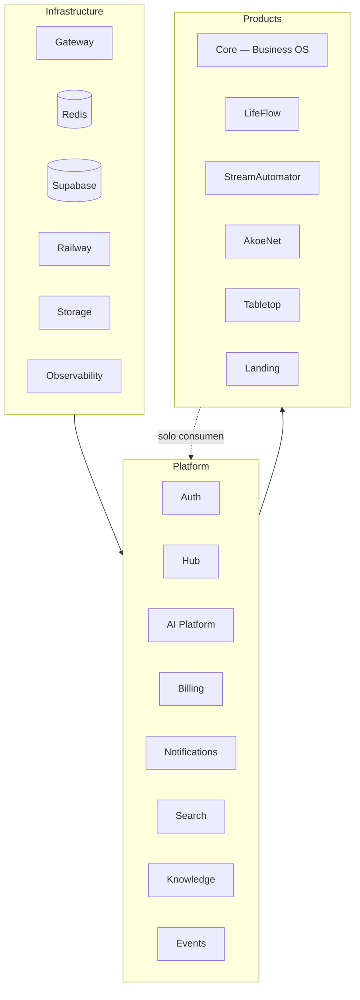

# Dakinis Systems — Platform Status & Roadmap

> **Documentación v1** · julio 2026 · sustituye `ROADMAP.md` y los `*-TEMP.md`.  
> Referencia estable: [ARCHITECTURE.md](./ARCHITECTURE.md) · [PRODUCTS.md](./PRODUCTS.md) · [OPERATIONS.md](./OPERATIONS.md) · [GITHUB-ORG.md](./GITHUB-ORG.md) · [legal/](./legal/) (cliente)

**Leyenda:** ✅ hecho · 🔄 en progreso · ⬜ pendiente · 🟢 activo · 🟡 beta/MVP

**Gobernanza:** este documento concentra estado, roadmap, ops y checklists. Cuando supere ~600 líneas útiles, extraer **solo** checklists Railway/Stripe a `OPERATIONS.md` y dejar aquí estado + roadmap. La [tabla de ecosistema](#estado-del-ecosistema) es el punto de entrada obligatorio.

---

## Estado del ecosistema

Vista en <1 min antes de entrar en detalle.

| Producto / servicio | Estado | Prod | BD | Responsable | Próximo hito |
|---------------------|--------|------|-----|-------------|--------------|
| **Core** (Business OS) | 🟢 Activo | Sí | Supabase `dakinis_core_prod` | Christian | Cutover → `core` · E2E billing |
| **LifeFlow** | 🟡 Beta | Sí | SQLite → Supabase | Christian | Engine v1 · schema `lifeflow` |
| **Tabletop** | 🟡 MVP | Sí | SQLite (volume) | Christian | Migración Supabase |
| **StreamAutomator** | 🟢 Activo | Sí | Supabase `stream` | Christian | Métricas · event bus |
| **AkoeNet** | 🟡 Desarrollo | Sí | Supabase / legacy | Christian | Schema `akoenet` completo |
| **Hub** | 🟢 Activo | Sí | Supabase `hub` | Christian | Launcher icons + Tabletop URL · deploy v0.2.1 |
| **AI Platform** | 🟢 Activo | Sí | Supabase `ai` | Christian | Embeddings batch · Knowledge |
| **Billing** | 🟢 Activo | Sí | Supabase `billing` | Christian | E2E checkout Live |
| **Auth** | 🟢 Activo | Sí | Supabase `dakinis_auth` | Christian | — |
| **Notifications** | 🟡 Scaffold | Sí | Redis (+ Supabase ⬜) | Christian | v1 email/push |
| **Search** | 🟡 Scaffold | Sí | Redis (+ pgvector ⬜) | Christian | Index + semantic |
| **Knowledge** | 🟢 Activo | Sí | Supabase `knowledge` ✅ persist | Christian | Search index sync |
| **Landing** | 🟢 Activo | Sí | — | Christian | Funnel One-first |

**Prioridad plataforma (julio 2026):** Billing E2E Live · Hub v0.2.1 deploy (launcher) · Widgets reales · Knowledge index sync · Event bus BullMQ.

---

## Modelo de capas

Tres capas distintas — no mezclar **Infrastructure** con **Platform**.



| Capa | Qué es | Ejemplos |
|------|--------|----------|
| **Infrastructure** | Runtime, datos, red, observabilidad | Gateway, Redis, Supabase, Railway, Storage, Sentry |
| **Platform** | Servicios compartidos que consumen los productos | Auth, Hub, AI, Billing, Notifications, Search, Knowledge, Events |
| **Products** | Aplicaciones de negocio con BD aislada | Core, LifeFlow, StreamAutomator, AkoeNet, Tabletop, Landing |

---

## Infrastructure

Componentes transversales — **no** son productos.

| Componente | Rol | Estado |
|------------|-----|--------|
| **Gateway** | Proxy único · JWT (`/_auth_check`) · rate limit · CORS | ✅ `api.dakinissystems.com` |
| **Redis** | Cache · colas · event bus (list → BullMQ roadmap) | ✅ Railway plugin |
| **Supabase** | PostgreSQL multi-schema · pooler `:6543` | 🔄 ver [§ Supabase](#supabase) |
| **Railway** | Contenedores · 22+ servicios | ✅ Fase 1 |
| **Storage** | Assets · media · documentos · exports | ⬜ Supabase Storage / R2 |
| **Observability** | Logs · metrics · tracing · health | 🔄 Sentry cableado · ⬜ alertas |

### Gateway (prefijos)

`/auth/` · `/core/` · `/finance/` · `/billing/` · `/notifications/` · `/search/` · `/ai/` · `/internal/` · StreamAutomator · AkoeNet

Config: [`gateway/routes/default.conf`](../gateway/routes/default.conf)

### Storage (roadmap)

```
Storage
├── Supabase Storage
├── Cloudflare R2 (alternativa)
├── Assets (DES, Landing, Hub)
├── Media (SA, AkoeNet, Core)
├── Documents (LifeFlow, Knowledge, Core)
└── Exports (LifeFlow, Core, Tabletop)
```

Consumidores prioritarios: **LifeFlow** · **Tabletop** · **Core** · **Knowledge**

### Observability

```
Observability
├── Logs (Railway · structured JSON)
├── Metrics (roadmap)
├── Tracing (Sentry traces)
├── Queues (Redis monitoring)
├── Costs (IA metering · Railway)
└── Health checks (/health por servicio)
```

---

## Platform

Los **productos solo consumen** la plataforma vía Gateway o Internal API. No duplican Auth, Billing ni AI.

### Internal services (consumo)

```
Products
    ↓
Gateway (api.dakinissystems.com)
    ↓
┌─────────┬─────────┬───────────────┬────────┬───────────┬──────────┐
│  Auth   │ Billing │ Notifications │ Search │ Knowledge │ Storage  │
└─────────┴─────────┴───────────────┴────────┴───────────┴──────────┘
    ↓
Internal API (/internal/) — ✅ Railway dakinis-internal-api · Hub usa DNS privado :4083
```

Mirror local Internal API: [`internal/`](../internal/) · contratos: [`contracts/`](./contracts/)

---

### Auth

| | |
|---|---|
| **Repo** | `dakinis-auth` |
| **Dominio** | `auth.dakinissystems.com` |
| **Schema** | `dakinis_auth` |
| **Estado** | ✅ prod |

Multi-tenant · JWT · refresh · RBAC · `/_auth_check` para gateway.

---

### Hub

| | |
|---|---|
| **Repo** | [`dakinis-hub`](https://github.com/dakinissystems/dakinis-hub) |
| **Dominio** | `hub.dakinissystems.com` |
| **Schema** | `hub` · `hub.v1_get_dashboard` |
| **Versión prod** | v0.2 (`af23284`) — IdP login · `/api/hub/me/dashboard` · logout |
| **Versión local** | v0.2.1 — iconos por plataforma · fix launcher Tabletop · `dakinisBuildHubAppLaunchUrl` |

**Estado:** ✅ «Mi día» prod · Internal API v0.3.0 · Supabase migr. 016–019 + 027 · 🔄 **push pendiente** v0.2.1 (launcher UX).

Orden UX: Mi día → Timeline → Notificaciones → Apps (secundario) → Widgets → Command Palette

#### App launcher (SSO por producto)

| App | Estrategia | Comportamiento |
|-----|------------|----------------|
| LifeFlow · AkoeNet | `idp-exchange` + `/auth/hub-sso` | Entrada logueada |
| StreamAutomator | `idp-exchange` + hub-sso | Login si no hay sesión en dominio |
| Core (Dakinis One) | `core-session` | Login en Core (sesión propia) |
| Tabletop | `sso: none` → URL directa | `tabletop.dakinissystems.com` (sin puente hub-sso) |

#### Deploy git pendiente (v0.2.1)

| Repo | Qué incluye | Antes de push |
|------|-------------|---------------|
| **`dakinis-hub`** | `DashboardPage.jsx` · paquetes DES | `.\scripts\sync-hub-des.ps1` |
| **`dakinis-internal-api`** | `hub-data.js` — campo `icon` en apps | — |
| **`dakinis-systems`** | mirror `packages/` · `internal/` · `docs/` | commit monorepo control |
| **`dakinis-shared`** | opcional — DES para otros consumidores | `.\scripts\push-dakinis-shared.ps1` |

**No requieren push** por este cambio: `dakinis-core`, `dakinis-tabletop`, LifeFlow, StreamAutomator, AkoeNet.

---

### AI Platform

**Principio:** motores **deterministas** (LifeFlow Engine, Core analytics) + **LLM** (narrativa, síntesis). El LLM no calcula score ni patrimonio; usa tools con números verificables.

```
AI Platform
├── LLM (OpenAI · gateway /v1/chat)
├── Agents (registry: Core, LifeFlow, SA, AkoeNet, Hub)
├── Knowledge ← consume RAG sources (servicio aparte)
├── Vision · Speech · Transcription
├── OCR (LifeFlow, Core, batch worker)
├── Forecast · Recommendations
├── Automation · Planner
└── Embeddings (pgvector · AI Worker batch)
```

| Capacidad | Estado |
|-----------|--------|
| Chat / Agents | ✅ |
| OCR | ✅ parcial |
| RAG query | 🔄 vía `ai.*` · Knowledge ⬜ |
| Embeddings batch | ⬜ AI Worker |
| Vision / Speech / Planner | ⬜ roadmap |

Contrato: [`contracts/dakinis-ai.json`](./contracts/dakinis-ai.json)

---

### Knowledge

**Servicio independiente** de Search y AI. AI **consume** Knowledge; no al revés.

```
Knowledge
├── Documents · Policies · FAQ · Wiki
├── Product docs · User docs
├── RAG sources (por producto/tenant)
└── Embeddings (indexados → Search semantic)
```

| | |
|---|---|
| **Repo** | [`dakinis-knowledge`](https://github.com/dakinissystems/dakinis-knowledge) |
| **Gateway** | `/knowledge/` · puerto **4084** |
| **Schema** | Supabase `knowledge` ✅ `025` + `026` RLS |
| **Estado** | ✅ API prod · gateway + dominio |
| **Railway** | `dakinis-knowledge` (API) + `dakinis-knowledge-worker` |

Contrato: [`contracts/knowledge.json`](./contracts/knowledge.json)

---

### Billing

**Plataforma en producción** — no es roadmap.

| | |
|---|---|
| **Repo** | [`dakinis-billing`](https://github.com/dakinissystems/dakinis-billing) |
| **Gateway** | `/billing/` · puerto Railway **4080** |
| **Versión** | v0.2.0 · Stripe Live |
| **Schema** | `billing` |

Stripe, checkout, portal, webhooks, planes, Redis events → Core `business.plan`.

#### Go-live pendiente (ops, no arquitectura)

| # | Tarea | Estado |
|---|-------|--------|
| 1 | Redeploy Core Back (proxy `/api/public/stripe/*`) | ✅ prod (`billingReachable`) |
| 2 | Supabase `022` + `023` + `024` + `12-tenant-access.sql` | ✅ |
| 3 | E2E Live: `/precios` → plan BD + `business.plan` | ⬜ |
| 4 | Webhook Live test → **200** | ⬜ |
| 5 | Impago → `access_state=degraded` → restore | ⬜ |

Contrato: [`contracts/billing.json`](./contracts/billing.json)

---

### Notifications

```
Notifications
├── Email (Resend)
├── Push (VAPID — AkoeNet)
├── Discord · Slack
├── WhatsApp (Core Meta)
├── SMS
└── In-App (Hub)
```

| | |
|---|---|
| **Repo** | `dakinis-notifications` |
| **Gateway** | `/notifications/` · puerto **4081** |
| **Estado** | 🔄 scaffold API + worker · health ✅ |

---

### Search

```
Search
├── Global Search (Hub Ctrl+K)
├── Index · Autocomplete
├── Semantic Search (pgvector)
├── Knowledge Search
└── AI Search (agent-assisted)
```

| | |
|---|---|
| **Repo** | `dakinis-search` |
| **Gateway** | `/search/` · puerto **4082** |
| **Estado** | 🔄 scaffold API + indexer Redis · health ✅ |

---

### Events (Event bus)

Visible como capacidad de plataforma — no solo nota en roadmap.

```
Platform → Events
├── Redis (lists hoy)
├── BullMQ (roadmap)
├── Queues (DAKINIS_EVENTS · NOTIFICATIONS · SEARCH_INDEX)
├── Workers (AI · Notifications · Search · Media · Storage)
├── Retries
└── Dead Letter Queue
```

Publicación: Core · Billing · AI · productos  
Consumo: Notifications · Search · Hub timeline · Analytics

---

### SDK (`@dakinis/sdk`)

Clientes HTTP tipados hacia platform services:

```
SDK
├── Auth
├── Billing
├── Notifications
├── Hub
├── AI
├── Storage (⬜)
├── Search
└── Knowledge (⬜)
```

Mirror: [`packages/sdk/`](../packages/sdk/) · publicar vía `dakinis-shared`

---

## DES — Dakinis Experience System

Repo canónico: [dakinis-shared](https://github.com/dakinissystems/dakinis-shared) · mirror local [`packages/`](../packages/)

```
DES
├── Foundations (tokens, surfaces, spacing, motion)
├── Tokens (@dakinis/shared-brand)
├── Components (@dakinis/shared-ux)
├── Patterns (Hub dashboard, empty states, IA UI)
├── Layouts (AppShell, HubShell)
├── Animations
├── Accessibility
├── Icons · Illustrations
├── Charts (KpiCard, sparklines)
└── Copywriting (tono producto)
```

Sync: `node scripts/sync-des-packages.mjs` · push: `.\scripts\push-dakinis-shared.ps1`

---

## Products

Cada producto tiene **BD aislada** (o SQLite con volume hasta cutover). Consumen Platform; no comparten tablas.

### Core — Business OS

No «ERP genérico». **Business Operating System** multi-tenant.

```
Business OS (Core)
├── CRM
├── Inventory
├── Bookings / Appointments
├── Restaurant (vertical)
├── Messages / WhatsApp
├── Invoices
├── Analytics
├── AI Copilot (→ AI Platform)
└── Marketplace plugins (⬜)
```

| | |
|---|---|
| **Repo** | `dakinis-core` |
| **Web** | `core.dakinissystems.com` |
| **API** | `/core/` vía gateway |
| **Schema** | `dakinis_core_prod` → cutover `core` |

---

### LifeFlow

El **Engine** es el producto; API/Web/Mobile son capas.

```
LifeFlow
├── Engine (Score · Forecast · Scenario · Risk · Retirement · Investment)
├── API (finance-api.dakinissystems.com)
├── Web (finance.dakinissystems.com)
├── Mobile (roadmap)
└── Widgets (Hub)
```

| | |
|---|---|
| **Repo** | `lifeflow` |
| **BD hoy** | SQLite volume `/data` |
| **BD objetivo** | Supabase schema `lifeflow` |
| **Coach IA** | ✅ Pro · tools deterministas + AI |

---

### Tabletop

Documentación: **Tabletop** (repo `dakinis-tabletop`). Carpeta local legacy `DND/` — no usar «DND» en docs.

```
Tabletop
├── Characters · Campaigns · Compendium
├── Dice · Maps · Inventory · Combat
├── AI GM (→ AI Platform)
└── Offline (PWA roadmap)
```

| | |
|---|---|
| **Repo** | `dakinis-tabletop` |
| **API** | `tabletop-api.dakinissystems.com` |
| **BD** | SQLite volume → Supabase ⬜ |

---

### StreamAutomator · AkoeNet · Landing

| Producto | Repo | API | Estado clave |
|----------|------|-----|--------------|
| **StreamAutomator** | `dakinis-streamautomator` | `api.streamautomator.com` | OAuth · Stripe **propio** · workers ✅ |
| **AkoeNet** | `akoenet-*` | `api.akoenet.dakinissystems.com` | WebRTC · IdP ✅ |
| **Landing** | `dakinis-landing` | — | GA4 + Meta · funnel One |

Detalle módulos: [PRODUCTS.md](./PRODUCTS.md)

---

## Marketplace (platform capability)

```
Marketplace
├── Apps (integraciones completas)
├── Plugins (módulos Core)
├── Templates (workflows)
├── Automations (triggers + acciones)
├── AI Agents (publicables)
└── Themes (SA · AkoeNet)
```

Estado: ⬜ UI Hub · registry en roadmap

---

## Supabase

Proyecto **Dakinis Production** · pooler `:6543` · identidad `dakinis_auth` (no `auth`).

### Schemas de producto

| Schema | Producto / rol | Estado |
|--------|----------------|--------|
| `dakinis_auth` | Identidad | 🔄 |
| `dakinis_core_prod` → `core` | Core ERP | ⬜ cutover |
| `billing` | Billing platform | 🔄 prod |
| `stream` | StreamAutomator | 🔄 |
| `akoenet` | AkoeNet | ⬜ |
| `lifeflow` | LifeFlow | ⬜ |
| `ai` | AI Platform | 🔄 |
| `hub` | Hub · `v1_get_dashboard` | ✅ 016–019 + 027 |
| `audit` | Audit / logs | ⬜ |
| `knowledge` | Knowledge | ⬜ |

### Schema `meta` (gobernanza)

```
meta
├── function_versions      ✅ (016)
├── schema_versions        ⬜ roadmap
├── migration_history      ⬜ roadmap
└── feature_flags          ⬜ roadmap
```

### Migraciones pendientes prod

Orden: [`supabase/migrations/RUN-ORDER.md`](./supabase/migrations/RUN-ORDER.md)

| Fase | Scripts | Estado |
|------|---------|--------|
| A | `000`–`013` | ✅ |
| B | `014`–`015` | ✅ |
| C | `016`–`019` | ✅ Hub dashboard |
| C+ | `027` hub.mi_dia | ✅ |
| D | `020`–`021` | 🔄 (`021` ✅) |
| D | `022`–`023` | ⬜ Security Advisor + billing funcs |
| Ops | `12-tenant-access.sql` | ⬜ |

---

## Railway — mapa de servicios

| Service | Repo | Schema | Domain | Worker | Redis | Health |
|---------|------|--------|--------|--------|-------|--------|
| Gateway | dakinis-systems | — | api.dakinissystems.com | — | — | ✅ |
| Auth | dakinis-auth | dakinis_auth | auth.dakinissystems.com | — | ✅ | ✅ |
| Core Back | dakinis-core | dakinis_core_prod | /core/ | — | ✅ | ✅ |
| Core Front | dakinis-core | — | core.dakinissystems.com | — | — | ✅ |
| Hub | dakinis-hub | hub | hub.dakinissystems.com | — | ⬜ | ✅ v0.2 · 🔄 v0.2.1 |
| AI | dakinis-ai | ai | ai.dakinissystems.com | — | ✅ | ✅ |
| AI Worker | dakinis-ai | ai | interno | ✅ | ✅ | — |
| **Billing** | dakinis-billing | billing | /billing/ | — | ✅ | ✅ v0.2.0 |
| Notifications | dakinis-notifications | — | /notifications/ | ✅ worker | ✅ | ✅ v0.2.0 |
| Search | dakinis-search | — | /search/ | ✅ worker | ✅ | ✅ v0.2.0 |
| Knowledge | dakinis-knowledge | knowledge | knowledge.dakinissystems.com | ✅ ingest | ✅ | ✅ prod |
| Knowledge Worker | dakinis-knowledge-worker | knowledge | interno | ✅ ingest | ✅ | ✅ |
| Internal API | dakinis-internal-api | hub + platform | /internal/ · `:4083` privado | — | ⬜ | ✅ v0.3.0 · 🔄 icons |
| Landing | dakinis-landing | — | dakinissystems.com | — | — | ✅ |
| LifeFlow API | lifeflow | SQLite | finance-api… | — | — | ✅ |
| LifeFlow Web | lifeflow | — | finance… | — | — | ✅ |
| Tabletop API | dakinis-tabletop | SQLite | tabletop-api… | — | — | ✅ |
| Tabletop Web | dakinis-tabletop | — | tabletop… | — | — | ✅ |
| StreamAutomator API | dakinis-streamautomator | stream | api.streamautomator.com | — | ✅ | ✅ |
| SA Worker | dakinis-streamautomator | stream | interno | ✅ | ✅ | — |
| SA Scheduler | dakinis-streamautomator | stream | interno | ✅ | ✅ | — |
| AkoeNet API | akoenet-backend | akoenet | api.akoenet… | — | ✅ | ✅ |
| AkoeNet Client | akoenet-client | — | akoenet… | — | — | ✅ |
| Redis | plugin | — | interno | — | — | ✅ |

### Workers — roadmap (no crear todos ahora)

| Worker | Rol | Estado |
|--------|-----|--------|
| AI Worker | OCR, embeddings, RAG batch | ✅ deploy · 🔄 batch prod |
| Notifications Worker | email, push, in-app | 🔄 scaffold |
| Search Worker | index, reindex | 🔄 scaffold |
| Media Worker | resize, transcode | ⬜ roadmap |
| Storage Worker | uploads, exports | ⬜ roadmap |
| Scheduler Worker | cron (SA ✅) | ✅ SA |

Variables detalladas: [§ Railway variables](#railway--variables-por-servicio) · [`railway.env.example`](./railway.env.example)

---

## Roadmap

### Prioridad ejecutiva (julio 2026)

1. **Billing E2E Live** — redeploy Core · checkout · webhook 200
2. **Supabase** — `022`/`023` · tenant access · luego `016`–`019`
3. **Hub v0.2.1** — push `dakinis-hub` + `dakinis-internal-api` · redeploy Railway · widgets reales
4. **Knowledge** — ✅ API + worker prod · ✅ persist documents (v0.3.0)
5. **Event bus BullMQ** — DLQ · workers Notifications/Search prod

### Fases (referencia)

| Fase | Tema | Estado |
|------|------|--------|
| 1 | Railway servicios base | ✅ |
| 2 | Supabase multi-schema | 🔄 |
| 3 | AI Platform completa | 🔄 |
| 4 | Hub «Mi día» + launcher | ✅ v0.2 prod · 🔄 v0.2.1 icons/Tabletop |
| 5 | Events + Notifications v1 | 🔄 |
| 6 | Search + Knowledge | ✅ Search v0.2.0 · Knowledge prod |
| 7 | LifeFlow Engine + PostgreSQL | ⬜ |
| 8 | ~~Billing separado~~ | ✅ **plataforma prod** · E2E ⬜ |
| 9 | Async platform (no HTTP largo) | ⬜ |

### Calendario 6 semanas (referencia)

| Semana | Entregables |
|--------|-------------|
| S1 | Supabase stream/core cutover · LifeFlow ✅ |
| S2 | AI Worker batch · BullMQ |
| S3 | Hub «Mi día» · widgets reales |
| S4 | LifeFlow Engine API v1 · schema `lifeflow` |
| S5 | Billing E2E ✅ · Notifications v1 |
| S6 | Knowledge ingest · Observability baseline |

### Post-pilotos

RAG PDF masivo · Calendario global Core · SSO Hub→productos · Customer Portal wiring Core · Event bus SA/AkoeNet

---

## Railway — variables por servicio

> Audit julio 2026 · sin secretos · [`railway.env.example`](./railway.env.example)

**Secretos compartidos:** `JWT_SECRET` · `DATABASE_URL` (pooler 6543) · `REDIS_URL` · `DAKINIS_AI_SERVICE_KEY` · `INTERNAL_API_KEY` · `OPENAI_API_KEY` · `RESEND_API_KEY` · `SENTRY_DSN`

**URLs prod:** `DAKINIS_GATEWAY_URL=https://api.dakinissystems.com` · Auth `https://auth.dakinissystems.com/auth` · Billing `/billing` · AI `/ai`

**Core Back:** `DAKINIS_BILLING_URL` · `DAKINIS_EVENTS_QUEUE` · sin `STRIPE_*`  
**Billing:** `PORT=4080` · `STRIPE_*` Live · `POSTGRES_SCHEMA=billing`  
**Knowledge:** `PORT=4084` · `DAKINIS_SEARCH_URL` · `REDIS_URL`

### Checklist go-live Stripe

- [x] Webhook Live · Stripe en billing · Gateway v0.2.0 · Push GitHub · Supabase `021`–`024` · Knowledge scaffold local
- [x] Core proxy `/api/public/stripe/plans` · billing health prod
- [ ] Webhook 200 · E2E checkout → `business.plan` · impago degraded

---

## Documentación canónica

| Documento | Para qué |
|-----------|----------|
| **PLATFORM-STATUS.md** (este) | Estado ecosistema · capas · roadmap · Railway |
| [ARCHITECTURE.md](./ARCHITECTURE.md) | Decisiones arquitectura · Internal API |
| [PRODUCTS.md](./PRODUCTS.md) | Módulos por producto |
| [OPERATIONS.md](./OPERATIONS.md) | Comandos · deploy · health |
| [GITHUB-ORG.md](./GITHUB-ORG.md) | Repos · DES |
| [contracts/](./contracts/) | Contratos HTTP |
| [legal/](./legal/) | Cliente ES/EN |
| [supabase/migrations/RUN-ORDER.md](./supabase/migrations/RUN-ORDER.md) | SQL |

---

*Documentación v1 — actualizar tabla [Estado del ecosistema](#estado-del-ecosistema) al cerrar cada hito.*
