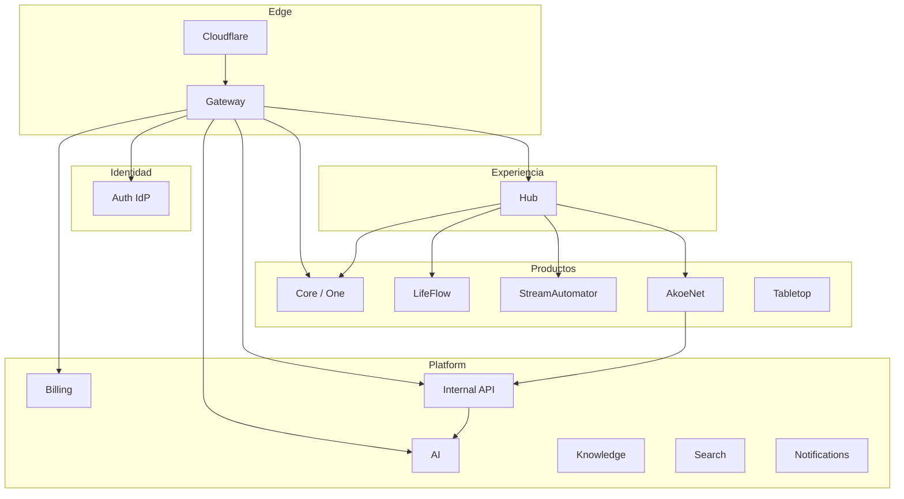
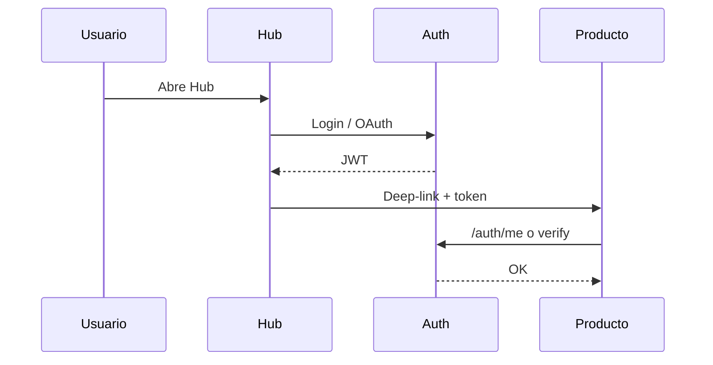
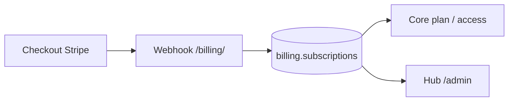

# Sistemas — mapa Dakinis

> Una pantalla · detalle → [`ARCHITECTURE.md`](./ARCHITECTURE.md) · deploy → [`OPERATIONS.md`](./OPERATIONS.md)

## Vista rápida

### Login (SSO)

### Billing (alto nivel)

---

## Catálogo

| Sistema | Rol | Dominio / ruta |
|---------|-----|----------------|
| **Hub** | Escritorio workspace · Mi día · admin | `hub.dakinissystems.com` |
| **Core** (Dakinis One) | ERP verticales (restaurante, …) | `core.dakinissystems.com` · `/core/` |
| **LifeFlow** | Finanzas personales | `finance.dakinissystems.com` · `finance-api…` |
| **AkoeNet** | Comunidad / chat · `@AI` | `api.akoenet.dakinissystems.com` |
| **StreamAutomator** (SA) | Automatización streams | `api.streamautomator.com` |
| **Tabletop** | Juegos de mesa | `tabletop.dakinissystems.com` |
| **Billing** | Stripe · suscripciones | `/billing/` vía Gateway |
| **Internal API** | Orquestación Hub / invites / eventos | `/internal/` |
| **Gateway** | Edge nginx · routing · rate limits | `api.dakinissystems.com` |
| **Auth** | IdP · OAuth · JWT | `auth.dakinissystems.com` |
| **AI** | Copilot / inferencia | `ai.dakinissystems.com` · `/ai/` |
| **Knowledge** | RAG / documentos tenant | `/knowledge/` |
| **Search** | Índice / pgvector | `/search/` |
| **Notifications** | Email / in-app | `/notifications/` |
| **Landing** | Marketing | `dakinissystems.com` |

**Datos:** Supabase (Postgres multi-schema) · Redis/BullMQ (colas).  
**AkoeNet Assistant (módulos):** [`AKOENET-ASSISTANT.md`](./AKOENET-ASSISTANT.md)  
**Estado hoy:** [`STATUS.md`](./STATUS.md) · **Plan:** [`ROADMAP.md`](./ROADMAP.md).
