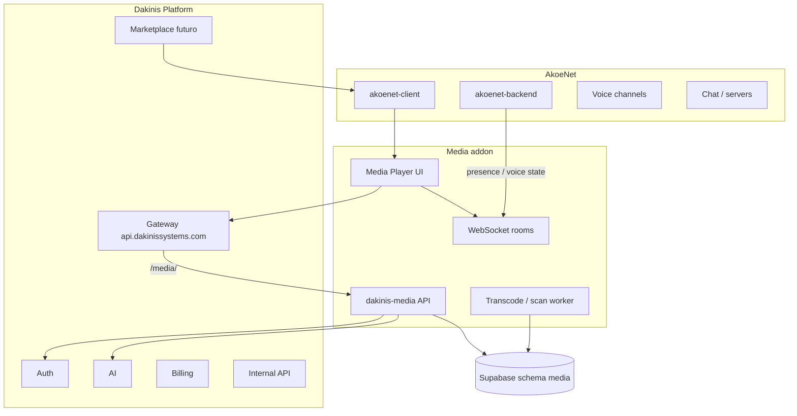
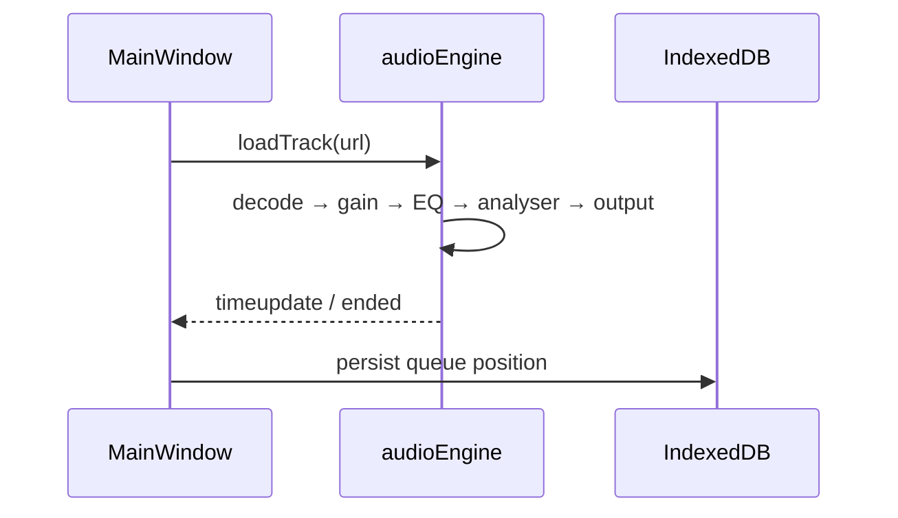
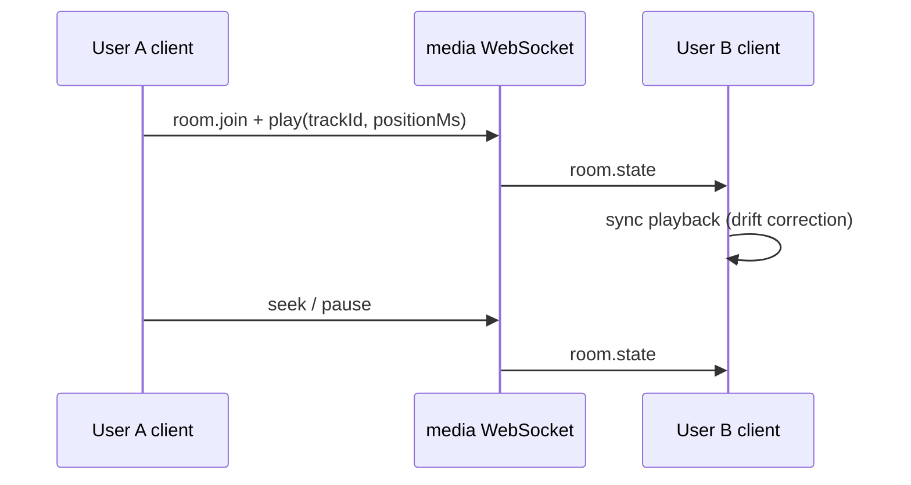

# Arquitectura — Dakinis Media Player

> Addon de AkoeNet · ventanas flotantes · motor Web Audio · salas sincronizadas

---

## Posición en el ecosistema



| Capa | Responsabilidad |
|------|-----------------|
| **UI (Client)** | Ventanas, skins, ecualizador, visualizer, mini player |
| **dakinis-media** | Playlists, tracks metadata, salas, streams, skins registry |
| **akoenet-backend** | Presencia “now playing”, permisos en servidor, hooks voz |
| **Auth** | JWT IdP, mismo usuario AkoeNet |
| **AI** | Playlists generadas, letras, recomendaciones (fase 3) |
| **Gateway** | Prefijo `/media/` → servicio media |

---

## No es una “página más”

El módulo se monta como **mini-app**:

- Ruta lazy `/media/*` o launcher desde Assistant / sidebar.
- **Window Manager** (DWM) gestiona ventanas independientes (player, playlist, EQ, library…).
- Estado en `store/` + persistencia local (IndexedDB) para cola y preferencias.
- Opcional: ventana Tauri/Electron desacoplada en desktop (mismo bundle).

---

## Servicios

### Frontend — `akoenet-client`

```
apps/akoenet/Client/src/modules/media-player/
```

Ver árbol completo en [../scaffold/frontend/README.md](../scaffold/frontend/README.md).

### Backend — `dakinis-media` (repo nuevo)

```
services/media/          # repo GitHub: dakinis-media
├── src/
│   ├── routes/
│   ├── services/
│   ├── websocket/
│   └── workers/
├── Dockerfile
└── railway.toml
```

**Railway:** `media-api.dakinissystems.com` + gateway `/media/`  
**Private DNS:** `dakinis-media.railway.internal:4090` (puerto reservado)

### Integración Assistant existente

El módulo **Music** del [AkoeNet Assistant](../../docs/AKOENET-ASSISTANT.md) hoy es “solo status”.  
Este addon **sustituye/evoluciona** esa capacidad cuando el tenant instala “Media Player” desde marketplace — sin bots externos.

---

## Flujos clave

### Reproducción local



### Escuchar juntos (listening room)



Sincronización: reloj del servidor + offset RTT; líder = `owner_id` o DJ role.

### Addon en canal de voz

- Panel en canal: “🎵 Sincronizado — *Artist – Title* [Unirse]”.
- Backend AkoeNet publica `voice_channel.media_room_id` (opcional).
- No mezcla audio en el SFU de voz en v1 — cada cliente reproduce localmente sincronizado.

---

## API surface (resumen)

Prefijo gateway: **`/media/`** → contrato [../contracts/media-api.json](../contracts/media-api.json).

| Área | Ejemplos |
|------|----------|
| Biblioteca | `GET /v1/tracks`, `POST /v1/tracks/import` |
| Playlists | CRUD playlists + reorder |
| Salas | `POST /v1/rooms`, WS `/v1/rooms/:id/sync` |
| Streams | `GET /v1/streams/radio?url=` (proxy metadata) |
| Skins | `GET /v1/skins`, `POST /v1/skins/install` |
| Plugins | manifest registry (fase 4) |

---

## Seguridad

- JWT AkoeNet / IdP en todas las rutas mutables.
- URLs de audio: signed URLs (R2/S3) o blob local-only en v1 desktop.
- Salas: ACL por `server_id` + roles AkoeNet.
- Rate limit en proxy de streams de radio.

---

## Decisiones (ADR light)

| Decisión | Motivo |
|----------|--------|
| Web Audio API, no `<audio>` solo | EQ, visualizer, effects chain |
| Ventanas flotantes (DWM) | UX Winamp-like reutilizable en otros módulos Dakinis |
| Repo `dakinis-media` separado | Dominio acotado, deploy independiente |
| Schema `media` en Supabase | Mismo patrón que `akoenet`, RLS por user |
| Skins propias (.dskin) | Evitar .wsz propietario; inspiración compatible |

---

## Referencias internas

- [WINDOW-MANAGER.md](./WINDOW-MANAGER.md)
- [AUDIO-ENGINE.md](./AUDIO-ENGINE.md)
- [INTEGRATION-AKOENET.md](./INTEGRATION-AKOENET.md)
- [ROADMAP.md](./ROADMAP.md)
