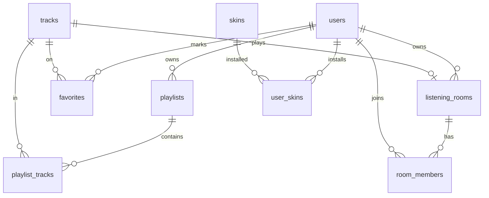

# Base de datos — schema `media`

> Supabase Postgres · RLS por `user_id` · migración [../schemas/001_media.sql](../schemas/001_media.sql)

---

## ER (resumen)



`users` referencia `dakinis_auth.users` o `akoenet.users` según cutover — usar UUID IdP.

---

## Tablas

### `media.tracks`

Metadata; el binario vive en R2/local (no en PG).

| Columna | Tipo | Notas |
|---------|------|-------|
| id | uuid PK | |
| owner_id | uuid FK | quien importó |
| title | text | |
| artist | text | |
| album | text | |
| duration_ms | int | |
| source | enum | `local`, `upload`, `radio`, `plugin` |
| storage_key | text | R2 path nullable |
| cover_url | text | |
| created_at | timestamptz | |

### `media.playlists` / `media.playlist_tracks`

Playlists ordenadas; `position` int.

### `media.favorites`

`(user_id, track_id)` PK compuesta.

### `media.skins` / `media.user_skins`

Registry de skins marketplace + instaladas por usuario.

### `media.listening_rooms` / `media.room_members`

Estado de sala sincronizada:

| listening_rooms | |
|-----------------|---|
| current_track_id | uuid nullable |
| position_ms | bigint |
| playing | boolean |
| server_id | uuid nullable | AkoeNet server |
| voice_channel_id | uuid nullable |

---

## Índices

- `playlist_tracks(playlist_id, position)`
- `tracks(owner_id, created_at desc)`
- `listening_rooms(server_id) where server_id is not null`

---

## RLS (política)

- `tracks`: SELECT own + tracks en salas públicas del servidor si miembro.
- `playlists`: CRUD solo `owner_id = auth.uid()`.
- `listening_rooms`: UPDATE solo owner o rol DJ; SELECT miembros.

---

## Eventos (opcional)

`media.play_events` para scrobble / analytics / Last.fm plugin:

```
user_id, track_id, played_at, duration_ms, source
```
