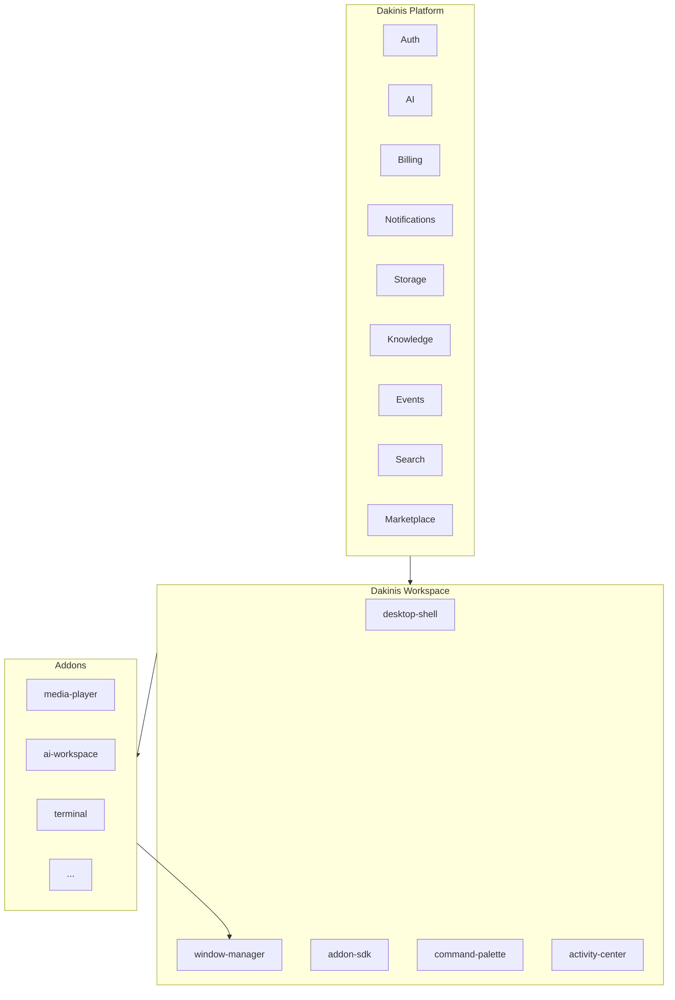

# Dakinis Workspace — Architecture

## Vision

**Dakinis Desktop** is not a launcher of unrelated apps. It is a **workspace shell** where every addon:

- Shares Auth, AI, Storage, Notifications and Billing from Platform
- Uses the same **Window Manager** (floating windows, snap, z-index, persistence)
- Exposes **widgets** to the Hub, dock and other addons
- Installs via **Marketplace** without breaking siblings

## Layers



## Directory layout

```
projects/workspace/
├── desktop/           # Shell UX (not installable addons)
├── addons/            # Installable mini-apps (uniform tree)
├── packages/          # Shared libs (@dakinis/window-manager, addon-sdk)
├── services/          # desktop-api, sync, storage
├── catalog/           # workspace-addons.json, widgets.json
└── docs/
```

## Addon categories

| Category | Examples |
|----------|----------|
| **system** | dashboard, marketplace, command-palette, file-explorer |
| **productivity** | ai-workspace, notes, kanban, calendar, whiteboard |
| **developer** | terminal, code-editor, devops, automation-builder |
| **stream** | stream-deck, obs-companion, clip-studio |
| **media** | media-player |
| **entertainment** | soundboard, game-launcher |

## Database (Supabase `meta`)

| Table | Purpose |
|-------|---------|
| `meta.workspace_addons` | Global catalog (synced from JSON) |
| `meta.workspace_addon_installs` | Per-workspace enabled addons + config |

## Exclusives (Dakinis differentiation)

1. **Command Center** (`Ctrl+K`) — cross-product search and actions
2. **Activity Center** — streams, deploys, invoices, AI in one feed
3. **Live Dashboard** — meeting mode (voice + notes + AI summary)
4. **Widgets** — addons expose tiles without opening full windows

## Avoid

Full browser, email client, professional image editor, Word/Excel clones, torrent client — high complexity, weak identity fit.

## 5-year hub map

```
Dakinis Desktop
├── File Explorer    ├── AI Workspace    ├── AkoeNet Chat
├── Media Player     ├── CRM / Core      ├── LifeFlow
├── Calendar         ├── Kanban          ├── Notes
├── Terminal         ├── Dashboard       ├── Stream Studio
├── Tabletop         ├── Marketplace     └── Settings
```

Reuse: Window Manager + Addon SDK + Marketplace + Platform services → each new mini-app is cheaper than a standalone product.
