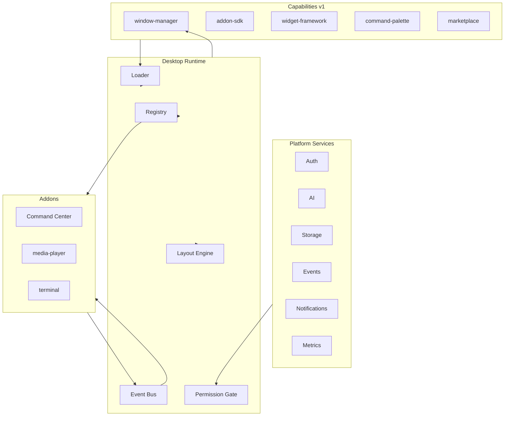

# Dakinis Workspace — Architecture

## Vision

**Dakinis Desktop** is a modular desktop OS — not a plugin marketplace. Addons are assembled from **capabilities** and orchestrated by the **Desktop Runtime**.

Read first: [`CAPABILITIES.md`](./CAPABILITIES.md) · Kernel: [`DESKTOP-RUNTIME.md`](./DESKTOP-RUNTIME.md)

```
Platform Services → Capabilities → Desktop Runtime → Addons → Widgets
```

Media Player is the **Hello World** — proof that Window Manager + Runtime + SDK work. The real product is the runtime stack.

---

## Three layers (do not mix)

| Layer | What | Example |
|-------|------|---------|
| **Platform Services** | Shared backend | `auth`, `storage`, `ai` |
| **Capabilities** | Versioned desktop APIs | `window-manager@v1` |
| **Addons** | Installable mini-apps | `media-player`, `terminal` |

Terminal needs Platform `auth` + Capability `window-manager` — different concepts.

---

## Stack diagram



---

## Naming: Command Palette vs Command Center

| Term | Meaning |
|------|---------|
| **Command Palette** | Capability — global `Ctrl+K` action system |
| **Command Center** | Core addon (`id: command-palette`) that implements the capability |

Use consistently in docs, catalog and UI copy.

---

## Directory layout

```
projects/workspace/
├── desktop/
│   └── desktop-shell/       # Runtime entry
├── packages/
│   ├── desktop-runtime/     # Kernel (planned)
│   ├── window-manager/
│   ├── addon-sdk/           # WorkspaceAddon contract
│   └── widgets/
├── catalog/
│   ├── workspace-addons.json
│   ├── addon-dependencies.json   # platform + capabilities + required/optional/conflicts
│   ├── capability-versions.json
│   ├── event-bus.json
│   ├── desktop-layouts.json
│   └── widgets.json
└── docs/
    ├── DESKTOP-RUNTIME.md     # Kernel spec
    ├── CAPABILITIES.md
    ├── ARCHITECTURE.md
    └── ADDON-SDK.md
```

---

## Event Bus

Runtime-owned in-process bus — addons communicate without direct imports.

Examples: `workspace.loaded` · `layout.changed` · `media.play` · `stream.started` · `voice.connected`

→ [`catalog/event-bus.json`](../catalog/event-bus.json)

---

## Capability versioning

`window-manager` v1 today → v2 later with `supported: ["1","2"]`. Addons declare `{ id, version }` in manifest.

→ [`catalog/capability-versions.json`](../catalog/capability-versions.json)

---

## Database (Supabase `meta`)

| Table | Purpose |
|-------|---------|
| `meta.workspace_addons` | Global catalog |
| `meta.workspace_addon_installs` | Per-workspace ON/OFF |
| `meta.workspace_desktop_profiles` | Saved layouts |

---

## Implementation status

| Layer | Status |
|-------|--------|
| Docs: Runtime, contract, event bus, deps | ✅ |
| `@dakinis/desktop-runtime` code | 📅 |
| Media Player Hello World | 🚧 live AkoeNet |
| Layout persistence API | 📅 |

---

## Related

- [`DESKTOP-RUNTIME.md`](./DESKTOP-RUNTIME.md)
- [`../../../docs/DAKINIS-WORKSPACE.md`](../../../docs/DAKINIS-WORKSPACE.md)
