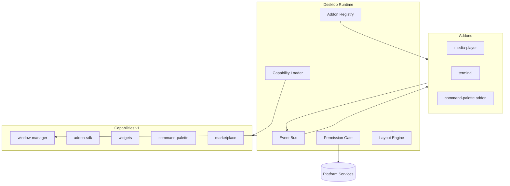

# Dakinis Desktop Runtime

> **Julio 2026** — El «kernel» de Dakinis Desktop. Orquesta capabilities, addons, eventos, layouts y permisos.  
> Capabilities → [`CAPABILITIES.md`](./CAPABILITIES.md) · Contrato addon → [`ADDON-SDK.md`](./ADDON-SDK.md)

---

## Modelo completo

```
Platform Services          ← infra compartida (Auth, AI, Storage…)
        ↓
Capabilities               ← APIs estables del escritorio (Window Manager, Widgets…)
        ↓
Desktop Runtime            ← kernel: ciclo de vida, event bus, permisos, layouts
        ↓
Addons                     ← mini-apps ensambladas sobre el runtime
        ↓
Widgets                    ← tiles embebibles cross-product
```

**Un Platform Service no es una Capability.**  
**Una Capability no es un Addon.**

| Capa | Qué es | Ejemplo |
|------|--------|---------|
| Platform Service | Servicio backend compartido por toda Dakinis | `auth`, `storage`, `ai` |
| Capability | API de escritorio versionada y reutilizable | `window-manager@v1` |
| Desktop Runtime | Orquestador que carga capabilities y addons | `WorkspaceRuntime` |
| Addon | Aplicación instalable | Media Player, Terminal |
| Widget | Vista ligera de un addon o producto | LifeFlow Score |

---

## Platform Services vs Capabilities

### Platform Services

Servicios de **Dakinis Platform** — disponibles vía Internal API / SDK de producto:

| Service | Uso típico |
|---------|------------|
| `auth` | Identidad, sesión, OAuth |
| `ai` | Modelos, prompts, tokens |
| `storage` | Archivos, uploads, workspace files |
| `billing` | Suscripciones, Stripe |
| `search` | Búsqueda cross-product |
| `knowledge` | RAG, documentos |
| `events` | Eventos de dominio (Redis) |
| `notifications` | Push, in-app, email |
| `metrics` | CPU, Railway, Supabase health |

Los addons declaran **permissions** (Platform Services) en el manifest. El Runtime valida antes de conceder acceso.

### Capabilities

APIs de **Dakinis Desktop** — implementadas en `projects/workspace/packages/`:

| Capability | Paquete | Versión actual |
|------------|---------|----------------|
| Window Manager | `@dakinis/window-manager` | **v1** |
| Addon SDK | `@dakinis/addon-sdk` | **v1** |
| Widget Framework | `@dakinis/widgets` | **v1** |
| Command Palette | `@dakinis/command-palette` | **v1** |
| Marketplace | `@dakinis/marketplace` | **v1** |

Versionado → [`catalog/capability-versions.json`](../catalog/capability-versions.json)

**Naming:** la capability se llama **Command Palette**. El addon Core que la implementa se llama **Command Center** (`id: command-palette`).

---

## Responsabilidades del Runtime

El Desktop Runtime (`@dakinis/desktop-runtime` / `desktop/desktop-shell`) es quien:

| Responsabilidad | Detalle |
|-----------------|---------|
| Cargar capabilities | Resuelve versiones soportadas (`window-manager@v1`) |
| Registrar addons | Valida contrato `WorkspaceAddon`, tier, admission |
| Abrir ventanas | Delega en Window Manager |
| Restaurar layouts | Lee `meta.workspace_desktop_profiles` + presets |
| Sincronizar widgets | Registra tiles por surface (Hub, AkoeNet, Core…) |
| Permisos | Platform Services solicitados vs concedidos |
| Ciclo de vida | `onInstall` → `onStart` → `onStop` |
| Event Bus | Pub/sub entre addons sin acoplamiento directo |



---

## Ciclo de vida del Workspace

### 1. Boot

```
1. Runtime inicia
2. Carga capability-versions.json → window-manager@v1, addon-sdk@v1…
3. Resuelve addons instalados (meta.workspace_addon_installs)
4. Core tier siempre ON — no desinstalable
5. Emite workspace.loading
```

### 2. Register addons

Por cada addon habilitado:

```
1. Validar contrato WorkspaceAddon (manifest + exports)
2. Comprobar admission rules
3. Resolver dependencias (required / optional / conflicts)
4. Conceder permissions (Platform Services)
5. Llamar lifecycle.onStart()
6. Registrar windows, widgets, commands, routes
```

### 3. Restore layout

```
1. Leer perfil activo (Morning, Coding, Streaming…)
2. O aplicar preset (gaming, developer, office)
3. Abrir ventanas vía Window Manager
4. Restaurar dock pins + widget grid
5. Emitir layout.restored
6. Emitir workspace.loaded
```

### 4. Shutdown

```
1. lifecycle.onWorkspaceClosed() en cada addon activo
2. lifecycle.onStop()
3. Persistir layout si dirty
4. Emitir workspace.closed
```

---

## Event Bus

Bus interno del Runtime — **no confundir** con Platform `events` (Redis).

```
Desktop Runtime
      ↓
  Event Bus (in-process)
      ↓
 Addon · Addon · Addon · Addon
```

Catálogo: [`catalog/event-bus.json`](../catalog/event-bus.json)

| Evento | Emisor | Consumidores típicos |
|--------|--------|----------------------|
| `workspace.loaded` | Runtime | Dashboard, Activity Center |
| `workspace.closed` | Runtime | Todos |
| `layout.changed` | Layout Engine | Settings, Dashboard |
| `layout.restored` | Layout Engine | Addons con ventanas abiertas |
| `theme.changed` | Settings addon | Todos (re-render) |
| `media.play` | media-player | Widgets, Command Center |
| `media.pause` | media-player | Widgets |
| `stream.started` | obs-companion / StreamAutomator | Activity Center, AkoeNet |
| `voice.connected` | AkoeNet | soundboard, live-dashboard |
| `addon.enabled` | Runtime | Marketplace |
| `addon.disabled` | Runtime | Marketplace |
| `command.executed` | Command Palette | Activity Center (audit) |

### API (addon)

```javascript
// Suscribirse
ctx.events.on('media.play', ({ trackId }) => { ... });

// Emitir (solo si el addon tiene permiso)
ctx.events.emit('media.play', { trackId, source: 'media-player' });

// Una vez
ctx.events.once('workspace.loaded', () => { ... });
```

Los addons **no se importan entre sí**. Se comunican por eventos o widgets compartidos.

---

## Contrato WorkspaceAddon

Contrato estricto — ver [`ADDON-SDK.md`](./ADDON-SDK.md) y [`packages/addon-sdk/src/workspace-addon.contract.js`](../packages/addon-sdk/src/workspace-addon.contract.js).

```typescript
interface WorkspaceAddon {
  id: string
  version: string
  tier: 'core' | 'productivity' | 'developer' | 'stream' | 'media' | 'entertainment' | 'system'
  permissions: PlatformService[]      // Platform Services
  capabilities: CapabilityRef[]       // ej. { id: 'window-manager', version: '1' }
  widgets: Record<string, WidgetDef>
  commands: CommandDef[]                // registradas en Command Palette
  windows: Record<string, WindowDef>
  routes: RouteDef[]
  settings?: SettingsSchema
  lifecycle: AddonLifecycle
  dependencies?: {
    required?: string[]
    optional?: string[]
    conflicts?: string[]
  }
}
```

El Runtime **rechaza** addons que no cumplan el contrato en build o registro.

---

## Lifecycle hooks

| Hook | Cuándo |
|------|--------|
| `onInstall()` | Primera instalación en workspace |
| `onEnable()` | Admin activa addon en Hub |
| `onDisable()` | Admin desactiva addon |
| `onStart(ctx)` | Runtime carga addon (sesión) |
| `onStop(ctx)` | Runtime descarga addon |
| `onWorkspaceLoaded(ctx)` | Tras `workspace.loaded` — restaurar estado UI |
| `onWorkspaceClosed(ctx)` | Antes de `workspace.closed` — persistir estado |

```javascript
export const lifecycle = {
  onStart(ctx) {
    ctx.windows.register('player', PlayerWindow);
    ctx.widgets.register('media.now-playing', NowPlayingTile);
    ctx.commands.register({ id: 'media.open', title: 'Open Media Player', run: () => ... });
  },
  onWorkspaceLoaded(ctx) {
    // re-abrir última ventana si el layout lo incluye
  },
  onStop(ctx) {
    ctx.events.offAll();
  },
};
```

---

## Permisos

Flujo:

```
1. Addon declara permissions[] en manifest (Platform Services)
2. Runtime consulta workspace policy + user role
3. Permission Gate concede o deniega
4. ctx.platform.auth, ctx.platform.storage… solo expone lo concedido
5. Intento no autorizado → error + log Activity Center
```

Capabilities no requieren permiso Platform — el Runtime las inyecta según `capabilities[]` del manifest.

---

## Layouts y persistencia

| Fuente | Uso |
|--------|-----|
| Presets | `catalog/desktop-layouts.json` — Gaming, Streaming, Developer, Office |
| Perfiles | `meta.workspace_desktop_profiles` — Morning, Coding, Music… |
| API | `desktop-api/v1/layouts` |

Layout Engine (parte del Runtime):

1. Resuelve preset o perfil
2. Para cada `{ addonId, windows[] }` → Window Manager.open
3. Aplica widget grid por surface
4. Emite `layout.restored`

Cambios manuales del usuario → debounce → `layout.changed` → persist.

---

## Widget sync

1. Addon registra widgets en `onStart`
2. Runtime publica en **Widget Registry** por surface
3. Hub / AkoeNet / Core consumen registry vía Internal API o embed SDK
4. Actualizaciones → Event Bus (`widget.updated`)

Media Player es el **Hello World**: demuestra windows + widgets + events. El producto real es Runtime + capabilities.

---

## Dependencias entre addons

Tres tipos — [`catalog/addon-dependencies.json`](../catalog/addon-dependencies.json):

| Tipo | Comportamiento |
|------|----------------|
| `required` | Runtime no activa addon sin dependencia instalada |
| `optional` | Features extra si está presente |
| `conflicts` | No pueden estar activos a la vez |

Ejemplo **OBS Companion**:

```json
"required": ["stream-deck"],
"optional": ["media-player", "soundboard"],
"conflicts": []
```

---

## Versionado de capabilities

Cuando Window Manager pase a v2:

```json
"window-manager": {
  "current": "2",
  "supported": ["1", "2"],
  "deprecated": ["1"]
}
```

Addons declaran `capabilities: [{ "id": "window-manager", "version": "1" }]`.  
Runtime carga adapter v1 o v2. Addons legacy siguen en v1 hasta migración.

---

## Estructura en repo

```
projects/workspace/
├── desktop/
│   └── desktop-shell/     # WorkspaceRuntime entry
├── packages/
│   ├── desktop-runtime/   # Kernel (loader, bus, permissions, layout)
│   ├── window-manager/
│   ├── addon-sdk/
│   └── widgets/
├── catalog/
│   ├── capability-versions.json
│   ├── event-bus.json
│   └── addon-dependencies.json
└── docs/
    └── DESKTOP-RUNTIME.md   ← este documento
```

---

## Estado de implementación

| Componente | Estado |
|------------|--------|
| Documento kernel + contrato | ✅ |
| Event bus catalog + lifecycle spec | ✅ |
| Capability versioning catalog | ✅ |
| `@dakinis/desktop-runtime` package | 📅 scaffold |
| Layout Engine wired | 📅 |
| Permission Gate E2E | 📅 |
| Media Player como Hello World | 🚧 live en AkoeNet |

---

## Relacionado

- [`CAPABILITIES.md`](./CAPABILITIES.md) — las cinco capabilities
- [`ARCHITECTURE.md`](./ARCHITECTURE.md) — vista de capas
- [`ADDON-SDK.md`](./ADDON-SDK.md) — contrato y scaffold
- [`../../../docs/DAKINIS-WORKSPACE.md`](../../../docs/DAKINIS-WORKSPACE.md) — doc producto
